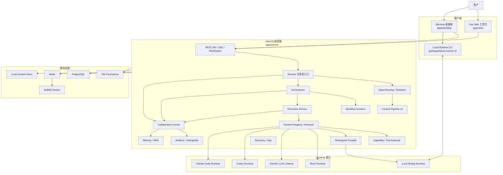
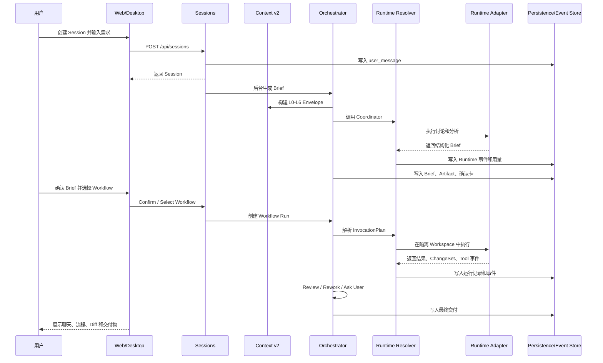

# Agent Cluster 当前项目架构

> 更新时间：2026-09-21  
> 适用版本：`agent-cluster@0.1.0` 当前工作树  
> 说明：本文以当前代码为主要依据，并结合产品、设计、合同和质量文档校准。旧版架构文档中的目标态描述不自动等同于当前实现。

## 1. 架构结论

Agent Cluster 当前是一个“模块化单体后端 + 可选队列 Worker + Web 工作台 + Electron 桌面端 + 本地 Runtime CLI”的多 Agent 协作平台。

系统的核心特征是：

- NestJS 后端承载会话、意图路由、WorkItem、编排、工作流、Runtime、Workspace、记忆、RAG、事件、产物和持久化。
- 协作事件流是前端和过程视图的事实来源。
- Agent 身份与 Runtime/Model 解耦，每次 Invocation 动态解析执行目标。
- Context Pipeline v2 使用 L0-L6 分层上下文，按任务和预算选择证据。
- 代码执行先进入 Git worktree 或 staging copy，再以 ChangeSet 形式受控写回。
- 执行可以在当前进程内完成，也可以通过 Redis/BullMQ 交给 Worker。
- Web 和 Desktop 共用 Vue 领域 UI；Desktop 额外提供本机 Runtime、通知、更新和 API 代理。

这不是微服务架构。核心业务模块运行在同一个 NestJS 进程内，队列 Worker 和本地 Runtime 是外部执行边界。

## 2. 总体拓扑



## 3. 仓库分层

```text
.
├── apps
│   ├── server/                  NestJS 后端和编排运行时
│   ├── web/                     Vue 3 Web 工作台
│   └── desktop/                 Electron Windows 客户端
├── packages
│   ├── shared/                  共享合同、事件、Agent、Runtime、Fixture
│   └── local-runtime-cli/       本地 Runtime 和工作区 CLI
├── docs/                        产品、设计、合同、质量、运维和 Harness 文档
├── tests/                       合同、Harness、e2e 和 smoke 测试
├── scripts/                     开发、迁移、性能和发布脚本
├── docker-compose.yml           PostgreSQL、Redis 本地依赖
└── package.json                 npm workspace 和验证入口
```

Monorepo 由根目录 `package.json` 管理，workspace 为 `packages/*` 和 `apps/*`。

## 4. 后端架构

后端入口是 [`apps/server/src/main.ts`](../../apps/server/src/main.ts)，模块装配位于 [`apps/server/src/app.module.ts`](../../apps/server/src/app.module.ts)。启动层负责：

- 环境变量加载和启动策略检查。
- `/api` 全局前缀。
- CORS、请求体上限和安全响应头。
- Local Runtime WebSocket 连接。
- 持久化、Runtime、BullMQ 和恢复状态日志。

### 4.1 会话、消息与需求上下文

相关目录：

- `apps/server/src/modules/sessions/`
- `apps/server/src/modules/message-routing/`
- `apps/server/src/modules/intent-recognition/`
- `apps/server/src/modules/context-management/`

这一层负责创建 Session、接收用户消息、处理 `@Agent` 和回复目标、执行意图识别、管理确认卡、暂停/恢复/取消、删除和恢复。

当前的需求隔离单位是 `WorkItem`。一个 Session 可以包含多个逻辑需求，每个 WorkItem 有自己的：

- 决策账本。
- Context Snapshot。
- Intent Routing Record。
- Follow-up Message。
- Task 和 Artifact 关联。

这使同一会话中的连续需求可以保持边界，同时通过显式决策和产物引用继承必要上下文。

### 4.2 Orchestrator 与 Workflow

相关目录：

- `apps/server/src/modules/orchestrator/`
- `apps/server/src/modules/workflows/`
- `apps/server/src/modules/tasks/`

Orchestrator 负责：

1. 分析工作区和用户目标。
2. 组织多 Agent 讨论。
3. 由 Coordinator 生成 Task Brief。
4. 将 Brief 拆分为建议任务和正式任务。
5. 解析任务依赖并选择 ready task。
6. 为每个任务组装 Invocation。
7. 处理 Runtime 输出、失败、改派、阻塞和返工。
8. 执行 Post Review。
9. 生成最终交付和通知草稿。

执行管线的结果类型包括：

```text
delivered
rework
ask_user
approval_required
workspace_conflict
work_item_budget_exhausted
cancelled
failed
```

Workflow Runtime 管理工作流草稿、不可变发布版本、Workflow Run、Node Run，以及 Agent、人工确认和机器人确认节点。当前实现以线性 v1 为主，复杂分支、汇聚和自动能力匹配仍有限。

### 4.3 Context Pipeline v2

相关目录：

- `apps/server/src/modules/context-v2/`
- `apps/server/src/modules/context-management/`
- `packages/shared/src/contracts.ts`

每个 Runtime Invocation 都会生成 `ContextEnvelopeV2`。上下文分为：

| 层 | 内容 |
| --- | --- |
| L0 | 系统规则、Agent 身份、Profile Hash、Tool Catalog、Workspace 身份 |
| L1 | 当前调用、当前任务、当前用户消息和导航清单 |
| L2 | 项目地图和模块结构 |
| L3 | 选中的源码证据和文件修订证据 |
| L4 | 工具调用结果 |
| L5 | 摘要记忆和有限历史信息 |
| L6 | ChangeSet、报告和最终交付引用 |

Context v2 的执行原则是：先通过 Workspace Index 和项目地图定位范围，再按预算选择最小证据。缺少必要源码证据时返回 `CONTEXT_INSUFFICIENT`，补读后重新构建 Invocation，而不是把不完整上下文交给 Runtime。

### 4.4 Runtime 注册与路由

相关目录：

- `apps/server/src/modules/runtimes/`
- `apps/server/src/modules/runtime-routing/`
- `apps/server/src/modules/agent-profile/`

当前 Runtime Registry 中注册的主要适配器包括：

- `mock`
- `generic_llm`
- `codex`
- `claude_code`
- `code_reader`
- `test_runner`

Runtime 选择由以下输入共同决定：

```text
Agent Profile
+ 当前阶段
+ 任务类型
+ Workspace Provider
+ Capability 要求
+ Tool 要求
+ Runtime 可用性
+ Model Preference
        ↓
InvocationPlan
        ↓
ResolvedExecutionTarget
```

`InvocationResolverService` 会解析工具需求、Workspace 能力、Runtime 候选、写入模式、模型和上下文。如果没有满足条件的 Runtime，系统 fail closed。

### 4.5 Capability、Tool 和 Skill

相关目录：

- `apps/server/src/modules/capabilities/`
- `apps/server/src/modules/tools/`
- `apps/server/src/modules/skills/`
- `apps/server/src/modules/agent-profile/`

当前内置工具包括文件读取、文件写入、代码搜索和测试运行。调用路径为：

```text
Agent Profile
    ↓
Capability
    ↓
Tool Mapping
    ↓
Tool Authority
    ↓
Phase / Approval Policy
    ↓
Tool Invocation Audit
```

高风险工具默认需要用户审批。Skill 通过 Agent Profile 引用，并在 Profile Compiler 中编译成身份快照和版本化注入内容。

### 4.6 Workspace、Worktree 与 ChangeSet

相关目录：

- `apps/server/src/modules/workspaces/`
- `apps/server/src/modules/worktree-execution/`
- `apps/server/src/modules/local-runtime/`

当前主要 Workspace Provider：

| 类型 | 用途 |
| --- | --- |
| `server_local` | 服务端可访问的本地目录 |
| `local_bridge` | 用户机器上的本地工作区和 Runtime |

任务执行时：

- Git 项目使用独立 worktree。
- 非 Git 项目使用 staging copy。
- Runtime 不直接改写用户源目录。
- 执行结果被捕获为 ChangeSet。
- 写回前执行 Workspace Hash/CAS 检查。
- 同一目录的写回按 FIFO 串行化。
- 文本冲突尝试三方合并，无法合并时进入可恢复冲突状态。

### 4.7 Execution、Queue 与 Recovery

相关目录：

- `apps/server/src/modules/execution/`
- `apps/server/src/modules/queue/`
- `apps/server/src/modules/recovery/`

执行支持两种模式：

```text
ENABLE_BULLMQ=false
  → NestJS 进程内后台 pipeline

ENABLE_BULLMQ=true
  → Redis
  → BullMQ agent-task-queue
  → ExecutionWorker
```

队列任务带有 Session Generation 和 Data Epoch，用于阻止旧任务在 Session 删除、恢复代次变化或数据切换后继续写入。

RecoveryService 启动时会检查上一个进程留下的执行、文件修订、Intent Routing 和 Workspace Lease。可能产生副作用的 Runtime 不会被无条件自动重放，而是转换为可唤醒的中断状态。

### 4.8 事件、Memory、RAG 和 Artifact

相关目录：

- `apps/server/src/modules/events/`
- `apps/server/src/modules/memory/`
- `apps/server/src/modules/rag/`
- `apps/server/src/modules/artifacts/`

协作事件是系统事实源，覆盖用户消息、Agent 消息、Task、Runtime、Tool、RAG、Memory、Artifact、Review、Delivery 和确认事件。

服务端事件接口：

```text
GET /api/sessions/:sessionId/events
GET /api/sessions/:sessionId/events/stream
```

事件支持分页、`afterEventId` 增量读取、SSE、心跳和公共事件过滤。前端聊天、任务卡、Agent 状态、确认卡和交付卡都由同一事件流派生。

RAG 当前支持 Knowledge Base、Document、Chunk 和关键词检索；embedding/pgvector 仍属于后续增强。Artifact 支持 Brief、执行结果、Review、最终交付、文件变更和 Feishu Draft。

## 5. 前端架构

### 5.1 Web 工作台

入口：

- `apps/web/src/main.ts`
- `apps/web/src/App.vue`
- `apps/web/src/router/index.ts`

技术栈为 Vue 3、Vite、TypeScript、Pinia、Vue Router、Element Plus、Vue Flow、REST 和 SSE。

主要页面包括：

- `/workspace`
- `/local-runtime`
- `/workflows`
- `/agents`
- `/skills`
- `/knowledge`
- `/settings`
- `/models`
- `/tools`
- `/notifications`

核心组件包括 `SessionWorkspace`、`SessionSidebar`、`ChatTimeline`、`UserInputBox`、`AgentStatusPanel`、`CollaborationGraphView`、`WorkflowRuntimeView`、`DebugRuntimeView`、`SkillManager`、`RuntimeModelManager` 和 `ConfirmationCard`。

主要 Pinia Store 包括：

- `session`
- `event`
- `agent`
- `knowledge`
- `runtimeModel`
- `localRuntime`
- `taskWorkspace`
- `workflow`
- `historyDiff`

### 5.2 Electron 桌面端

入口：

- `apps/desktop/src/main.ts`
- `apps/desktop/src/preload.ts`
- `apps/desktop/renderer/`

Desktop 通过 Vite alias 复用 Web 的 Vue 组件、路由和领域 Store。Electron 主进程负责：

- 窗口和 renderer 生命周期。
- `agent-cluster://` 自定义协议。
- Server API 代理。
- 本地 Runtime 管理。
- 桌面完成通知。
- 自动更新。
- CSP 和权限策略。

### 5.3 Local Runtime CLI

入口：`packages/local-runtime-cli/src/`。

CLI 负责本地 Codex/Claude 进程、工作区注册、密钥和状态、Runtime stream、会话恢复、能力心跳以及与 Server 的 Local Bridge 通信。

## 6. 核心任务流程



具体阶段为：

1. 创建 Session 并记录用户原始消息。
2. 后台运行需求理解和多 Agent 讨论。
3. Coordinator 生成 Task Brief 和建议任务。
4. 用户确认 Brief，写入 WorkItem 决策账本。
5. 用户选择已发布 Workflow 版本。
6. Orchestrator 创建任务并选择 ready task。
7. Runtime Resolver 生成 Context、Tool Catalog 和 Execution Target。
8. Runtime 在 server-local 或 local-bridge Workspace 中执行。
9. 捕获 ChangeSet，执行 Review、返工或用户决策。
10. 创建最终 Artifact、文件变更和通知草稿。

## 7. 主要数据关系

```text
Session
  ├── Session Participants
  ├── WorkItems
  │     ├── Decision Records
  │     ├── Context Snapshots
  │     ├── Intent Routing Records
  │     └── Follow-up Messages
  ├── Collaboration Events
  ├── Task Briefs
  ├── Tasks
  │     ├── Dependencies
  │     ├── Runtime Invocations
  │     └── Tool Invocations
  ├── Workflow Runs
  │     └── Workflow Node Runs
  ├── Artifacts
  │     └── Artifact File Changes
  ├── Memory
  ├── RAG Retrievals
  └── Workspace Writebacks
```

共享合同集中在 [`packages/shared/src/contracts.ts`](../../packages/shared/src/contracts.ts)，包括 Session、Task、Event、Runtime、ContextEnvelope、Workspace、Artifact、Budget 和 Usage 类型。这个文件是前后端、Runtime 和测试共同依赖的合同中心，修改影响面最大。

## 8. 持久化与基础设施

本地基础设施由 [`docker-compose.yml`](../../docker-compose.yml) 提供：

- PostgreSQL 16 + pgvector 镜像。
- Redis 7。
- PostgreSQL 数据卷。
- Redis AOF 数据卷。

持久化支持：

```text
File Backend
  └── state.v3.json + atomic rename

PostgreSQL Backend
  ├── pg Pool
  ├── migration runner
  ├── relational schema
  ├── JSONB collection compatibility
  ├── CAS / advisory lock
  ├── event outbox
  └── relational state store
```

关系型表定义位于 [`apps/server/src/modules/persistence/relational/relational-schema.ts`](../../apps/server/src/modules/persistence/relational/relational-schema.ts)，覆盖 Agent、Skill、Tool、Session、Event、Task、Workflow、Runtime Invocation、Artifact、WorkItem、Decision、Context Snapshot、Writeback 和恢复生命周期等对象。

当前业务状态仍保留较多 collection/JSONB 兼容逻辑，因此系统已经具备关系型迁移和状态存储基础，但还不能描述为所有业务域都已完全关系化。

## 9. 安全与可靠性边界

当前架构已经具备以下保护：

- Runtime 路由无可用能力时 fail closed。
- Tool Authority 过滤阶段禁止和能力不足的工具。
- 高风险工具通过用户确认。
- Runtime 执行与源工作区隔离。
- Workspace 写回使用 Hash/CAS。
- Writeback 按 Workspace 串行化。
- Session Generation 防止旧执行继续写入。
- Data Epoch 防止旧数据代际任务继续运行。
- Event Outbox 支持可靠事件发布。
- Recovery 不自动重复可能产生副作用的调用。
- HTTP 层配置 CORS、请求体大小和基础安全响应头。

## 10. 当前缺口

根据当前代码和功能状态，主要缺口是：

- `mcp_tool` 和 `human` Runtime 仍为合同预留。
- 真实高风险工具执行尚未完成完整的 Sandbox、确认、审计和回滚闭环。
- RAG 仍主要是关键词检索，embedding/pgvector 质量链路尚未完成。
- PostgreSQL 虽已有关系表定义和迁移工具，但业务持久化仍保留 JSONB collection 兼容层。
- Feishu 仍以 `feishu_draft` 和 dry-run 事件为主。
- Codex/Claude 本地 Runtime 已接入，但真实生产模型、上游 API 和 Watchdog 参数仍需独立验收。
- Workflow 主要是线性 v1，复杂条件分支、汇聚和并行编排有限。
- 任务调度仍偏保守，尚未形成大规模子 Agent 自动委派和竞争式调度。
- Capability 在执行中途审批后的断点恢复还可以继续增强。

## 11. 推荐阅读顺序

1. 产品目标：[`docs/product/agent-cluster-prd-v1.md`](../product/agent-cluster-prd-v1.md)
2. 系统设计：[`docs/design/agent-cluster-system-design-v1.md`](../design/agent-cluster-system-design-v1.md)
3. 当前功能状态：[`docs/analysis/feature-inventory-and-status-v1.md`](./feature-inventory-and-status-v1.md)
4. Context v2 设计：`docs/design/context-pipeline-v2-only-agent-decoupling-system-design-v1.md`
5. Runtime 合同：`docs/contracts/runtime-contract-v0.1.md`
6. API 合同：`docs/contracts/api-contract-v0.1.md`
7. 事件合同：`docs/contracts/event-contract-v0.1.md`
8. 持久化实现：`apps/server/src/modules/persistence/`
9. 编排实现：`apps/server/src/modules/orchestrator/`
10. 共享类型：[`packages/shared/src/contracts.ts`](../../packages/shared/src/contracts.ts)

## 12. 验证入口

架构相关的最小验证命令：

```bash
npm run typecheck
npm run build
npm run test:harness
npm run test:e2e:main-chain
npm run test:e2e:runtime-routing
npm run test:e2e:workspace-snapshot-payload
npm run test:e2e:recovery
```

本文是现状架构说明，不代表所有目标态能力已经生产化。后续修改应优先同步共享合同、Runtime 合同、事件合同和功能状态文档。
