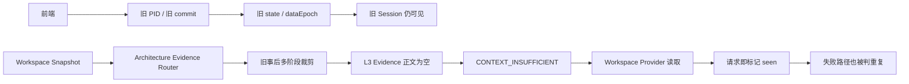
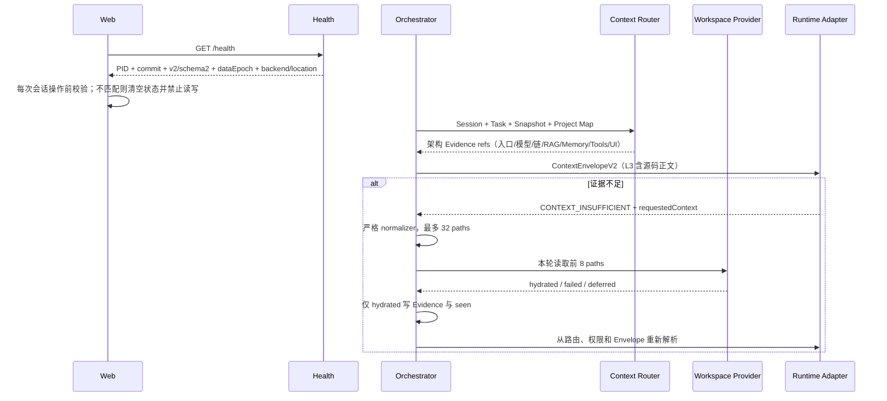

# Context v2 会话与证据链修复开发设计 v1

## 1. 根因



“清除旧会话”此前只是设计与 cutover 工具，不是已执行的真实数据操作。普通启动不会 apply；旧 PID 继续监听或新服务连接另一数据位置时，界面自然仍显示旧数据。Evidence 问题则由旧裁剪语义和补读状态缺失共同放大。

## 2. 目标数据流



## 3. 合同

`SupplementalContextResolution`：

```ts
type SupplementalContextResolution = {
  requestedPaths: string[]
  hydratedPaths: string[]
  failedPaths: Array<{
    path: string
    code: 'NOT_FOUND' | 'PERMISSION_REQUIRED' | 'BROKER_OFFLINE' | 'READ_UNAVAILABLE' | 'READ_ERROR'
    retryable: boolean
    message?: string
  }>
  deferredPaths: string[]
  contentBytes: number
}
```

Health 增加 `processId / startedAt / persistenceBackend / persistenceLocation`。`persistenceLocation` 对 PostgreSQL 只报告 collection table，不泄露连接串。

## 4. 持久化切换

apply 顺序固定为：校验 token/environment/backend/revision/maintenance/quiesced -> 规划 Artifact 清理 -> 加密并原子写外部只读归档与 manifest -> 原子替换 file state 或 PostgreSQL transaction，并记录 `cleanup_pending` -> 清理受控 Artifact -> 原子记录 `applied` -> 返回 metadata/archive/audit。清理中断后，同一 token 只允许在重新验证归档密文 hash/长度和认证解密成功后继续清理。

归档目录必须在活动数据根之外。密文使用现有 `enc-v2` AES-256-GCM+scrypt envelope；manifest 记录密文 SHA-256 和字节数。应用没有归档读取或恢复入口。

## 5. Evidence 选择

架构分析在 Workspace 扫描和 Evidence 路由两层都优先当前源码：真实 `main/app/server/bootstrap`、根级 `src/index`、package/config、model/chain/RAG/memory/prompts/tools、service/runtime/router/store/contracts 和前端入口。任意深度的 demo/example `index.ts` 降低正文读取优先级和导航分，不能先占满 80 文件扫描窗口，也不能挤掉核心数据流模块。

AGENTS、README 和 design 只提供导航声明。若其描述和当前入口源码冲突，以源码、package scripts 和可执行路径为准，并在结果中指出陈旧文档。

## 6. 安全与失败语义

- 缺 grounded L3 Evidence：fail closed，不启动或不接受 Runtime 完成。
- architecture strategy 在 discussion/brief generation/final delivery 同样要求 grounded L3，因此 discussion 和 delivery phase 都允许受预算约束的 L3；delivery 同时保留 L1 navigation 用于验证证据属于当前 Workspace。discussion 的 L4/L6 以及 delivery 的 L2/L4/L5 仍保持关闭。
- malformed requestedContext：忽略补读请求并保留原失败，不做不安全 cast。
- 读取失败：记录分类，不吞异常；可重试失败不进入 seen。
- 归档失败：不替换活动 state。
- 前后端不匹配：前端禁止会话操作。
- Session create 出现旧版或未知字段：400 拒绝，不静默忽略。
- 只读架构调用：Codex 固定 `read-only` sandbox，Claude 固定 plan + Read/Grep/Glob；即使 Catalog 错含 `run_test` 也不授予 Bash。
- 跨副本/旧进程无法由单进程内存闸门证明，因此 apply 还要求操作者完成 drain、停副本并显式设置 `AGENT_CLUSTER_CUTOVER_QUIESCED=true`。
- 不自动停止进程、不自动 apply、不自动部署；这些操作分别需要授权。

## 7. 验证矩阵

| 风险 | 自动化证据 |
| --- | --- |
| 非法补读结构进入运行链 | runtime context request normalizer spec |
| 失败路径被错误去重 | supplemental dedupe spec |
| 读取异常被吞 | orchestrator resolution spec |
| 归档泄露明文/位于活动根 | archive encryption/root isolation specs |
| 新旧进程无法区分 | Ops Health spec + RuntimeVersionSummary spec |
| 版本错配仍能恢复 Session | session version gate spec |
| demo index 挤掉数据流源码 | ai-langchain architecture routing spec |
| 扫描窗口先被 demo index 占满 | workspace scanner saturation spec + 真实目录诊断 |
| 失败补读在任务板显示为成功 | context supplement summary spec |
| 旧 Session create 字段被静默忽略 | Session controller v2 contract spec |
| 旧裁剪器回归 | v2-only source/doc Harness 检查 |
