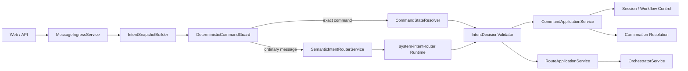
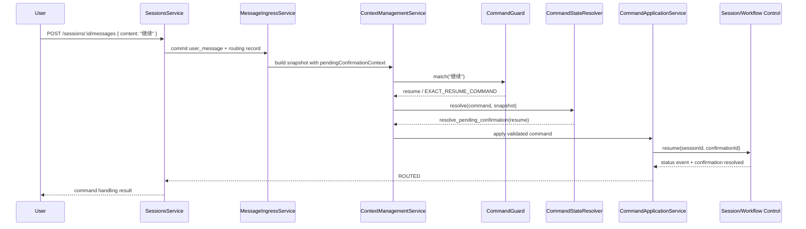
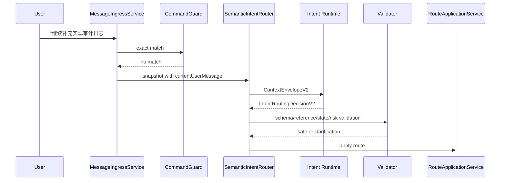

# 精确命令优先的用户消息意图路由系统开发设计 v1

> 日期：2026-08-11
> 状态：Phase 1-4 已实现，Phase 5 待 rollout 验证后收敛
> 适用范围：当前 `dataEpoch` 内的 v2 Session、用户后续消息、待确认恢复、失败重试与普通语义路由
> 上游目标设计：[`intent-context-workitem-system-agent-target-design-v1.md`](./intent-context-workitem-system-agent-target-design-v1.md)
> 上游系统设计：[`intent-context-workitem-system-agent-system-design-v1.md`](./intent-context-workitem-system-agent-system-design-v1.md)

## 0. 实现状态

截至 2026-08-11，Phase 1-4 的服务端实现已完成：

- 已增加统一 `DeterministicCommandGuard`，精确命令在 rollout 判断前执行，不调用 Intent Runtime。
- 已增加 `CommandStateResolver` 与 `CommandApplication`，统一处理 resume、retry、pause、cancel、no-op 和 clarify。
- 已增加结构化 `pendingConfirmationContext`；只有唯一、未解决且可聊天恢复的确认目标可以被“继续”解析。
- 已将 `currentUserMessage` 放入 `ContextEnvelopeV2.L1`，并从 `constraints` 中移除。
- 已将用户可见路由事件改为固定中文动作文案，不再拼接 raw `coordinatorInstruction`。
- 已补充命令守卫、状态裁决、应用层、Context 合同和 Session 回归测试。

Phase 5 仍是发布后的 rollout 工作：当前实现不自动切换生产环境的 `INTENT_ROUTING_MODE`，也不删除 shadow/旧路径。完成放量指标观察后，再按本设计删除 `OrchestratorService.recognizeFollowUpMessage()` 的旧分类职责。

## 1. 文档目的

本文档给出“继续”被错误识别为 `constraint` 问题的可实施修复方案，并将修复收敛为统一的用户消息意图路由设计。

目标不是为单个状态增加关键词判断，而是建立以下稳定顺序：

```text
消息持久化
  -> 精确命令识别
  -> 当前状态与待确认目标裁决
  -> 状态转换校验
  -> 命令动作执行
  -> 普通消息语义识别
  -> WorkItem 路由与后续编排
```

该顺序落实上游设计中的原则：精确暂停、取消、继续、重试、确认和拒绝必须先经过确定性命令守卫，再校验当前状态；模型只处理无法由确定性规则安全判断的普通消息。

## 2. Intent Contract

### 2.1 目标

- 输入精确“继续”时，系统必须识别为 `command`，不得识别为 `constraint`。
- 存在包含 `resume` 选项的待确认卡时，“继续”等价于用户选择该确认卡的“继续执行”。
- 精确命令不得调用 Intent Runtime，不受模型、Workspace 规则或 Agent Profile 文本影响。
- 普通自然语言仍由 `system-intent-router` 识别，并保留 fail-closed、引用校验和状态校验。
- 当前用户消息必须作为非特权调用输入进入 `ContextEnvelopeV2`，不能伪装成系统规则、任务约束或历史记忆。
- 旧接收者识别路径与 Intent Router v2 使用同一个命令守卫，并最终收敛到 v2 单轨。

### 2.2 非目标

- 不改变专业任务拆解、Agent 派发、Workflow 节点执行和 Runtime Adapter 的职责。
- 不允许聊天中的“确认”绕过高风险能力授权、外部通知或 DingTalk 确认。
- 不新增前端页面，不改变现有确认卡的主要交互方式。
- 不迁移不同 `dataEpoch` 的历史 Session。
- 不通过扩大模型 Prompt 解决精确命令问题。
- 不把 Harness Engineering 规则实现成业务运行时模块。

### 2.3 验收标准

1. `继续`、`继续执行`、`resume`、`continue` 在所有 Session 状态下都先识别为精确命令。
2. 命令识别结果由状态裁决器决定 `resume`、`continue_active_work_item`、`acknowledge_running` 或 `clarify`，模型不得参与。
3. `继续补充实现审计日志` 不得被精确命令守卫截获，应进入普通语义路由。
4. `WAIT_USER_DECISION` 且存在未解决的 `resume` 确认时，命令复用现有确认处理逻辑并产生 `user_confirmation_resolved`。
5. `EXECUTING` 状态收到“继续”时不得创建新 Brief、WorkItem 或任务。
6. Intent Runtime 的 `ContextEnvelopeV2` 可以审计到本轮 `currentUserMessage`。
7. 用户可见事件不得展示模型生成的内部英文约束摘要。

## 3. 当前实现与问题证据

### 3.1 当前调用路径

`SessionsService.sendMessage()` 当前先根据 rollout mode 选择 Intent Router v2 或旧接收者路径。在旧路径中，只有以下条件成立才使用本地命令识别：

```ts
isResumeCommand(content) &&
  (session.status === 'FAILED' || hasFailedWorkflowRun(session))
```

当 Session 为 `WAIT_USER_DECISION`、Workflow 仍为 `running` 时，精确“继续”会绕过本地命令识别并进入 `OrchestratorService.recognizeFollowUpMessage()`。

### 3.2 复现场景

本次问题的事件顺序为：

1. Workflow Agent 拒绝接收任务。
2. Session 进入 `WAIT_USER_DECISION`。
3. 系统创建 `coordinator_routing_needs_user_decision` 确认卡，选项为 `resume` 和 `cancel`。
4. 用户输入“继续”。
5. 旧接收者 Runtime 返回 `intent: constraint`、`failedExecutionAction: none`。
6. 系统错误启动后续 Brief 生成和任务拆解，而不是解析待确认卡。

### 3.3 当前消息丢失

旧接收者路径把当前消息写入：

```ts
contextAssembly.constraints = [
  ...contextAssembly.constraints,
  `Current user message: ${content}`
];
```

但 v2 Runtime 只消费 `ContextEnvelopeV2`。当前 Envelope builder 不把 `ContextAssembly.constraints` 或 `relevantEvents[].summary`写入可读上下文，只使用 `relevantEvents.length` 计算 `turnCount`。结果是 Intent Runtime 可能看不到当前消息，只看到 L0 系统规则、Agent Profile 和 Workspace 约束。

这解释了模型为何复述 Workspace permission、output contract 和 DingTalk confirmation，而没有处理“继续”。

### 3.4 已有可复用能力

- `SemanticIntentRouterService.deterministicDecision()` 已能确定性识别精确继续、暂停、取消、确认和拒绝。
- `IntentRecognitionService.detectUserMessageIntent()` 已把“继续”识别为 `command`，且优先于 constraint 规则。
- `SessionsService.resume()`、`control()` 和 Workflow resume 已有状态转换与执行恢复逻辑。
- 确认卡已有 `confirmationId`、`reason`、`options` 和 `user_confirmation_resolved` 事件。
- `MessageIngressService`、`IntentContextSnapshot`、`IntentRoutingRecord` 和 `RouteApplicationService` 已具备持久化异步路由基础。

## 4. 方案比较与决策

### 4.1 方案 A：只修改接收者 Prompt

做法：在 Prompt 中增加“输入为继续时返回 command”。

问题：

- 模型仍可能看不到当前消息。
- 行为依赖 Runtime 可用性和模型稳定性。
- 无法可靠绑定具体待确认卡。
- 与上游“确定性命令守卫”设计冲突。

结论：不采用。

### 4.2 方案 B：在 `WAIT_USER_DECISION` 增加特判

做法：在 `SessionsService.sendMessage()` 中增加 `WAIT_USER_DECISION && isResumeCommand()`。

优点：改动小，可以修复当前截图场景。

问题：

- 继续维护旧路径和 v2 两套命令语义。
- `EXECUTING`、`COMPLETED` 和其他确认类型仍会误路由。
- 状态判断继续散落在 `SessionsService`。

结论：可作为紧急补丁，但不作为最终方案。

### 4.3 方案 C：统一命令守卫、状态裁决和动作应用

做法：抽取纯命令守卫和服务端状态裁决器，旧路径与 v2 共用；补齐结构化待确认上下文和 `currentUserMessage`，最终删除旧 Runtime 接收者识别。

优点：

- 符合现有目标设计。
- 精确命令不消耗 Runtime 调用。
- 状态与确认目标可审计、可测试。
- 可以渐进上线，并最终收敛到 v2 单轨。

结论：采用方案 C。

## 5. 目标架构



### 5.1 依赖约束

```text
MessageRoutingModule
  -> IntentRecognitionModule
  -> ContextManagementModule
  -> SessionControlPort
  -> EventsModule

IntentRecognitionModule
  -> RuntimeInvocationModule
  -> AgentsModule

IntentRecognitionModule -X-> OrchestratorModule
DeterministicCommandGuard -X-> RuntimeInvocationModule
CommandStateResolver -X-> Runtime Adapter
```

### 5.2 核心不变量

- 精确命令识别是纯函数，不读取模型输出。
- 命令识别只判断“用户说了什么”，状态裁决只判断“当前允许做什么”。
- 高风险确认不能由普通聊天命令静默批准。
- 用户消息属于 L1 invocation input，不属于 L0 authority。
- WorkItem、Session、Workflow 和 Confirmation 的状态转换必须由服务端验证。
- 同一消息的命令动作最多应用一次。
- 命令无法安全应用时必须返回确定性澄清，不得降级为模型猜测。

## 6. 模块设计

### 6.1 `DeterministicCommandGuardService`

建议文件：

```text
apps/server/src/modules/intent-recognition/
  deterministic-command-guard.service.ts
  deterministic-command-guard.service.spec.ts
```

职责：

- 对用户原始消息执行 Unicode、空白和有限尾部标点规范化。
- 只匹配完整命令或白名单别名。
- 返回稳定命令类型和 reason code。
- 不读取 Session，不决定状态转换，不产生副作用。

建议合同：

```ts
type ExactUserCommand =
  | 'resume'
  | 'retry'
  | 'pause'
  | 'cancel'
  | 'confirm'
  | 'reject';

type ExactCommandMatch = {
  command: ExactUserCommand;
  normalizedText: string;
  reasonCode:
    | 'EXACT_RESUME_COMMAND'
    | 'EXACT_RETRY_COMMAND'
    | 'EXACT_PAUSE_COMMAND'
    | 'EXACT_CANCEL_COMMAND'
    | 'EXACT_CONFIRM_COMMAND'
    | 'EXACT_REJECT_COMMAND';
};
```

规范化规则：

1. 使用 Unicode `NFKC`。
2. 去除首尾空白。
3. ASCII 文本转小写。
4. 只去除尾部 `。！？!?，,；;：:`。
5. 不删除中间词语，不做包含匹配。

首期别名：

| 命令 | 精确别名 |
| --- | --- |
| `resume` | `继续`、`继续执行`、`恢复`、`resume`、`continue` |
| `retry` | `重试`、`重新执行`、`retry` |
| `pause` | `暂停`、`pause` |
| `cancel` | `取消`、`终止`、`cancel`、`stop` |
| `confirm` | `确认`、`同意`、`通过`、`confirm`、`approve` |
| `reject` | `拒绝`、`不同意`、`reject` |

以下内容不是精确命令：

- `继续补充实现审计日志`
- `继续之前先修改方案`
- `不要继续`
- `为什么不能继续`

这些消息进入普通语义路由。

### 6.2 `CommandStateResolverService`

建议文件：

```text
apps/server/src/modules/message-routing/
  command-state-resolver.service.ts
  command-state-resolver.service.spec.ts
```

职责：

- 输入精确命令、Session snapshot、Workflow snapshot、active WorkItem 和结构化待确认上下文。
- 输出确定性的 `IntentRoutingDecisionV2`。
- 不直接修改 Session、Workflow 或 Confirmation。

建议扩展动作：

```ts
type IntentRoutingAction =
  | ExistingIntentRoutingAction
  | 'resolve_pending_confirmation'
  | 'acknowledge_running';
```

当不希望扩展公开 union 时，可以把两个动作保留为内部 `CommandResolutionAction`，在进入 `RouteApplicationService` 前映射为现有领域调用。

### 6.3 `CommandApplicationService`

建议文件：

```text
apps/server/src/modules/message-routing/
  command-application.service.ts
  command-application.service.spec.ts
```

职责：

- 应用已经通过状态验证的命令决定。
- 复用现有 `resume()`、`pause()`、`control()`、Workflow retry 和确认解析逻辑。
- 写入 RoutingRecord、确认解决事件和状态变化事件。
- 保证 idempotency key 和 `routingId` 不会重复执行。

禁止职责：

- 不重新解析用户文本。
- 不调用 Intent Runtime。
- 不复制 Session/Workflow 恢复实现。
- 不绕过现有状态机和确认校验。

### 6.4 `SemanticIntentRouterService`

保留职责：

- 处理非精确命令消息。
- 从快照候选中选择 WorkItem、Decision 和 Artifact。
- 输出严格结构化结果。
- 在 Runtime 失败、输出非法或关系歧义时 fail closed。

调整：

- 删除内部重复的命令正则，改为注入 `DeterministicCommandGuardService`。
- `classify()` 先调用守卫；命中后调用 `CommandStateResolverService`，不得进入 Runtime 循环。
- 模型返回 `dialogueAct: constraint` 时，服务端必须确认 `currentUserMessage` 确实表达约束；否则标记 `SEMANTIC_INTENT_CONFLICT` 并要求澄清。

### 6.5 `SessionsService`

调整原则：

- `sendMessage()` 继续负责入口、幂等和调度，不再拥有命令正则。
- 移除 `explicitResumeCommand` 只对 `FAILED` 生效的门禁。
- rollout 为 `shadow` 时，精确命令仍必须由确定性主路径执行；shadow 只比较普通语义消息，不允许影响命令行为。
- 最终删除 `recognizeFollowUpHandlingPlan()` 对普通消息的旧 Receiver Runtime 分类，由 Intent Router v2 成为唯一语义入口。

## 7. 上下文与共享合同

### 7.1 当前用户消息

在 `ContextAssembly` 和 `ContextL1Invocation` 增加：

```ts
currentUserMessage?: string;
```

语义：

- 仅在 `user_message_routing` 等以本轮用户消息为输入的 phase 中存在。
- 原文保留，不执行摘要、翻译或拼接到系统规则。
- 属于非特权数据；Runtime 必须把它视为待分类对象，而不是权威规则。

Envelope 示例：

```json
{
  "L0": {
    "systemRules": ["Return only IntentRoutingDecisionV2 structured output."]
  },
  "L1": {
    "sessionGoal": "完成当前贪吃蛇需求",
    "currentUserMessage": "继续",
    "phase": "user_message_routing",
    "navigation": { "entries": [], "truncated": false }
  }
}
```

不得继续使用：

```ts
contextAssembly.constraints.push(`Current user message: ${content}`);
```

### 7.2 结构化待确认上下文

现有 `IntentContextSnapshot.pendingConfirmation?: string` 只提供摘要，无法安全绑定命令目标。新增：

```ts
type PendingConfirmationContext = {
  confirmationId: UUID;
  reason: string;
  title?: string;
  description?: string;
  options: Array<{
    key: string;
    label: string;
    style?: 'primary' | 'default' | 'danger';
  }>;
  createdAt: ISODateTime;
};

type IntentContextSnapshot = {
  // existing fields
  pendingConfirmationContext?: PendingConfirmationContext;
};
```

兼容策略：

- 现有 `pendingConfirmation?: string` 暂时保留为展示摘要。
- 新快照必须写 `pendingConfirmationContext`。
- 旧快照缺少结构化字段时不得猜测确认目标，只能重新构建快照或澄清。
- 不回填不同 `dataEpoch` 的历史数据。

### 7.3 RoutingRecord 审计字段

确定性命令至少记录：

```ts
decision.dialogueAct = 'command';
decision.reasonCodes = ['EXACT_RESUME_COMMAND'];
decision.modelConfidence = 1;
validation.schemaValid = true;
```

建议增加内部审计信息：

```ts
type CommandResolutionAudit = {
  deterministic: true;
  sourceCommand: ExactUserCommand;
  targetConfirmationId?: UUID;
  targetWorkflowRunId?: UUID;
  stateAtDecision: SessionStatus;
};
```

该信息进入 RoutingRecord 或事件 metadata，不进入用户可编辑字段。

## 8. 状态裁决矩阵

### 8.1 `resume / retry`

| Session / Context | 服务端动作 | 是否调用模型 | 用户可见结果 |
| --- | --- | --- | --- |
| 有未解决确认且 options 包含 `resume` | `resolve_pending_confirmation(resume)` | 否 | 已收到继续指令，正在恢复任务 |
| `PAUSED` | 调用现有 `resume()` | 否 | 会话已继续 |
| `INTERRUPTED` | 恢复有效 checkpoint；无 checkpoint 则澄清 | 否 | 正在从中断点恢复，或提示无法恢复 |
| `FAILED` 且 Workflow failed | 调用 Workflow retry | 否 | 正在重试失败环节 |
| `FAILED` 且普通任务失败 | 恢复当前 Brief 未完成任务 | 否 | 正在恢复原任务 |
| `WAIT_USER_DECISION` 且无 `resume` 目标 | `clarify` | 否 | 当前没有可直接继续的操作，请选择确认卡 |
| `EXECUTING` / `REWORKING` / `POST_REVIEW` | `acknowledge_running` | 否 | 当前任务已在执行 |
| `COMPLETED` | `clarify` | 否 | 当前任务已完成，请说明要继续的内容 |
| 无 active WorkItem | `clarify` | 否 | 当前没有可继续的任务 |

### 8.2 `pause / cancel`

- `pause` 只在存在可停止后台执行时调用现有暂停流程；已经暂停时幂等返回。
- `cancel` 必须继续通过 Session 状态机和 Workflow cancel，不能只更新聊天状态。
- 已完成或已取消的 Session 收到相同命令时返回幂等结果，不创建新 WorkItem。

### 8.3 `confirm / reject`

- 只有唯一且仍有效的低风险业务确认可以通过聊天命令解析。
- `confirm_local_runtime_permission`、外部通知、DingTalk 操作和其他高风险确认不得由通用“确认”自动批准。
- 多个未解决确认同时存在时必须要求用户点击具体确认卡或明确目标。

## 9. 核心时序

### 9.1 精确“继续”解析待确认卡



### 9.2 普通消息语义路由



## 10. 事务、幂等与并发

### 10.1 消息持久化优先

用户消息必须先提交，再执行命令或语义识别。即使恢复动作失败，聊天记录和 RoutingRecord 仍可审计和重试。

### 10.2 幂等键

沿用：

```text
message:<sessionId>:<clientMessageId>
<sessionId>:<sourceEventId>:intent-v2.1
```

命令应用增加：

```text
command:<routingId>:<command>:<targetId-or-sessionId>
```

同一个 key 已完成时返回已有结果，不再次 resume Workflow 或解决确认卡。

### 10.3 Snapshot 时效

命令应用前重新校验：

- Session revision；
- active WorkItem id/revision；
- Workflow run id/revision/status；
- confirmationId 仍未解决；
- 目标 option 仍存在。

任一事实变化时不得应用旧决定。精确命令可以基于新快照重新裁决一次；仍不一致则澄清。

### 10.4 Session 内串行

同一 Session 的 Intent Routing 和 Command Application 使用现有 `sessionSeq` 与 Session 级串行队列。后到“取消”不能被先到但较慢的“继续”覆盖。

## 11. API、事件与前端展示

### 11.1 API

保留现有入口：

```http
POST /api/sessions/:sessionId/messages
POST /api/sessions/:sessionId/resume
POST /api/sessions/:sessionId/cancel
```

聊天命令和确认卡按钮必须复用同一内部 application service。API 不新增隐式权限。

消息响应可以继续返回 `handlingPlan` 和 `routingId`，但精确命令的计划必须为：

```json
{
  "intent": "command",
  "requirementRelation": "continuation",
  "failedExecutionAction": "resume",
  "priority": "high",
  "requiresUserConfirmation": false,
  "coordinatorInstruction": "恢复当前任务"
}
```

### 11.2 事件

精确命令使用服务端模板生成可见文案：

- `已收到继续指令，正在恢复当前任务。`
- `当前任务已在执行，无需重复恢复。`
- `当前没有可直接继续的操作，请处理待确认事项。`

不得继续展示：

```text
接收者已完成意图识别，开始进行任务拆分与派发：<raw coordinatorInstruction>
```

内部 `coordinatorInstruction` 只用于后续编排，不直接作为用户可见消息。命令路径不进入任务拆分时，不得使用“开始拆分与派发”前缀。

### 11.3 前端

首期无需新增组件。`ChatTimeline` 继续渲染现有事件；只需确认：

- 命令结果使用中文服务端模板。
- 已解决确认卡根据 `user_confirmation_resolved.confirmationId` 失活。
- 不出现新的 Brief、Task 或 Workflow 选择弹窗。
- 长文本和状态标签不发生布局溢出。

## 12. 安全设计

- `currentUserMessage` 是不可信输入，只能进入 L1，不能进入 L0 `systemRules`。
- Workspace permission、output contract 和 DingTalk confirmation 是执行约束，不是待分类文本。
- Intent Router 无 Tool、写权限和外部操作能力。
- `confirm` 命令只能解析白名单低风险确认；Capability、Local Runtime permission、外部通知和 DingTalk 确认继续要求明确确认目标。
- 模型输出不能创建 confirmationId、WorkItemId、DecisionId 或 ArtifactId。
- `resume` 不能绕过 Workflow 状态机、失败 checkpoint 或用户确认记录。

## 13. 可观测性

建议指标：

```text
intent_exact_command_total{command,state,result}
intent_exact_command_model_bypass_total{command}
intent_command_clarification_total{reason}
intent_pending_confirmation_resolved_total{reason,option}
intent_semantic_conflict_total{model_intent}
intent_current_message_missing_total{phase}
```

日志至少包含：

- `sessionId`、`routingId`、`sourceEventId`；
- 命令类型和 reason code；
- 裁决时 Session/Workflow 状态；
- 目标 confirmationId 或 WorkItemId；
- 是否调用 Runtime；
- 最终 action 和 validation error。

禁止在日志中输出 Runtime 密钥、完整敏感 Workspace 内容或外部凭据。

## 14. 分阶段实施计划

### Phase 0：冻结行为基线

主要文件：

- `apps/server/src/modules/sessions/sessions.service.spec.ts`
- `apps/server/src/modules/intent-recognition/semantic-intent-router.service.spec.ts`
- `apps/server/src/modules/intent-recognition/intent-recognition.service.spec.ts`

任务：

1. 用测试复现 `WAIT_USER_DECISION + pending resume confirmation + 继续` 被错误分类。
2. 记录旧接收者 Runtime 被调用、返回 constraint 和新 Brief 被创建的当前失败行为。
3. 为现有 `FAILED + 继续`、Workflow failed retry 和 `PAUSED` 行为建立基线。

退出标准：测试能稳定证明问题，且不依赖真实 Codex/Claude。

### Phase 1：抽取统一命令守卫

主要文件：

- 新增 `deterministic-command-guard.service.ts`
- 修改 `intent-recognition.module.ts`
- 修改 `semantic-intent-router.service.ts`
- 修改 `sessions.service.ts`

任务：

1. 实现纯规范化和精确别名匹配。
2. 删除 `SessionsService.isResumeCommand()` 和 Semantic Router 内重复正则。
3. 让旧路径和 v2 都注入同一个守卫。
4. 精确命令在任何 rollout mode 下都不得调用 Runtime。

退出标准：所有精确命令测试模型调用次数为 0。

### Phase 2：结构化状态裁决与确认解析

主要文件：

- `packages/shared/src/contracts.ts`
- `apps/server/src/modules/context-management/context-management.service.ts`
- 新增 `command-state-resolver.service.ts`
- 新增 `command-application.service.ts`
- 修改 `route-application.service.ts`
- 修改 `sessions.service.ts`

任务：

1. 增加 `pendingConfirmationContext` 快照字段。
2. 将 resume confirmation、Session pause/resume、Workflow retry 统一映射为服务端动作。
3. 命令应用复用现有领域方法并写入幂等审计。
4. 无安全目标时返回确定性澄清。

退出标准：截图场景等价于点击确认卡的 `resume`，且确认卡被正确解决。

### Phase 3：修复 `currentUserMessage` 合同

主要文件：

- `packages/shared/src/contracts.ts`
- `apps/server/src/modules/orchestrator/orchestrator.service.ts`
- `apps/server/src/modules/context-v2/build-envelope-from-context-assembly.ts`
- 对应 Context Envelope 单元测试

任务：

1. 在 `ContextAssembly` 和 `ContextL1Invocation` 增加 `currentUserMessage`。
2. Envelope builder 只在相关 phase 写入该字段。
3. 删除把当前消息追加到 `constraints` 的逻辑。
4. 添加合同测试，确保用户消息不进入 L0。

退出标准：Intent Runtime 输入包含原始当前消息，且 authority 层不包含该消息。

### Phase 4：用户可见事件收敛

主要文件：

- `apps/server/src/modules/sessions/sessions.service.ts`
- `apps/server/src/modules/message-routing/route-application.service.ts`
- `apps/web/src/components/ChatTimeline.vue`（仅在现有 metadata 无法表达时修改）
- `tests/e2e/chinese-visible-copy-smoke.mjs`

任务：

1. 使用动作类型映射中文模板。
2. 禁止直接显示 raw `coordinatorInstruction`。
3. 命令 no-op、resume、clarify 使用不同文案。
4. 验证确认卡解决状态和时间线展示。

退出标准：用户看不到内部英文路由指令，也不会看到虚假的“任务拆分”提示。

### Phase 5：v2 单轨收敛

主要文件：

- `apps/server/src/modules/sessions/sessions.service.ts`
- `apps/server/src/modules/orchestrator/orchestrator.service.ts`
- `apps/server/src/modules/message-routing/`
- Intent routing rollout 配置和运维文档

任务：

1. 先对当前 `dataEpoch` 启用 v2 enforce 并观察指标。
2. shadow 只保留普通语义消息差异观测，不再参与命令执行。
3. 达到退出指标后删除旧 `recognizeFollowUpMessage()` 用户消息分类职责。
4. 删除旧路径和无效 rollout 兼容代码，保持 Context Pipeline v2 单轨。

退出标准：所有用户消息都从 `MessageIngressService -> Intent Router -> Route Application` 进入，Orchestrator 不再识别用户消息意图。

## 15. 测试设计

### 15.1 命令守卫单元测试

| 输入 | 期望 |
| --- | --- |
| `继续` | `resume` |
| ` 继续！ ` | `resume` |
| `continue` | `resume` |
| `继续补充日志` | no match |
| `不要继续` | no match |
| `为什么不能继续？` | no match |
| `取消` | `cancel` |
| `确认` | `confirm` |

### 15.2 状态裁决单元测试

- `WAIT_USER_DECISION + resume option -> resolve_pending_confirmation`。
- `WAIT_USER_DECISION + no resume option -> clarify`。
- `FAILED + failed workflow -> retry workflow`。
- `FAILED + failed task -> resume brief`。
- `PAUSED -> resume session`。
- `EXECUTING -> acknowledge_running`。
- `COMPLETED -> clarify`。
- 无 active WorkItem -> clarify。
- 高风险确认 + confirm -> clarification / explicit card required。

### 15.3 Sessions 集成测试

- 精确命令持久化 `user_message`，但不调用 Receiver Runtime。
- 相同 `clientMessageId` 不重复 resume。
- resolve confirmation 同时产生且只产生一个 `user_confirmation_resolved`。
- stale confirmation 触发重建或澄清，不应用旧动作。
- resume 与 cancel 并发时按 `sessionSeq` 保持确定顺序。

### 15.4 Context 合同测试

- `currentUserMessage` 出现在 L1。
- `currentUserMessage` 不出现在 L0、Workspace evidence 或 confirmed decisions。
- 普通执行 phase 未提供当前消息时字段省略。
- `pendingConfirmationContext` 只包含当前未解决确认。
- 旧快照缺少结构化确认时 fail closed。

### 15.5 E2E

新增建议：

```text
tests/e2e/exact-command-intent-routing-smoke.mjs
```

覆盖流程：

1. 创建 Session 并进入 `WAIT_USER_DECISION`。
2. 创建包含 `resume/cancel` 的确认卡。
3. 通过消息 API 发送“继续”。
4. 断言确认卡 resolved、Session 恢复、没有新 Brief。
5. 断言时间线只有中文动作说明，不包含 Workspace/DingTalk 规则摘要。

### 15.6 验证命令

```bash
npm run typecheck
npm run test
npm run test:e2e:chinese-copy
npm run build
```

开发阶段优先执行相关 workspace 单测；合并前执行完整集合。

## 16. 灰度、迁移与回滚

### 16.1 灰度顺序

1. 先上线命令守卫和指标，但保持普通消息现有 rollout。
2. 对选定 Session 启用 v2 enforce。
3. 扩展到当前 `dataEpoch`。
4. 删除旧 Receiver intent recognition。

### 16.2 放量门槛

- 精确命令模型调用数为 0。
- 精确命令误捕获率为 0。
- `WAIT_USER_DECISION + resume` 成功率达到 100% 测试基线。
- stale snapshot 不产生重复 resume。
- 普通语义消息 clarification rate 没有异常上升。

### 16.3 回滚

- Phase 1-4 可通过 rollout mode 回滚普通语义路由，但确定性命令守卫不回滚到模型识别。
- 命令应用发生异常时关闭对应 application action，返回澄清；不得回退到 Runtime 猜测。
- `currentUserMessage` 是可选新增字段，旧 Runtime consumer 可以忽略，不需要数据删除。
- 结构化确认缺失时重建快照，不修改历史事件。

## 17. 风险与控制

| 风险 | 控制 |
| --- | --- |
| 精确匹配误伤普通需求 | 只允许完整白名单，不做包含匹配 |
| 多个确认卡目标不明确 | 只解析唯一合法目标，否则澄清 |
| 聊天“确认”绕过高风险审批 | confirmation reason 白名单 + Capability/Approval 硬门禁 |
| Session 与 Workflow 状态不同步 | 应用前同时校验 revision 和状态 |
| 重复消息导致重复恢复 | message、routing、command 三层幂等 |
| 当前消息再次丢失 | shared 合同测试 + Envelope snapshot 测试 |
| shadow 与 enforce 行为分叉 | 命令路径不受 rollout mode 影响 |
| 原始内部指令泄露给用户 | 服务端模板与 UI 可见文案测试 |

## 18. Architecture Constraints

### 18.1 Allowed paths

- `packages/shared/src/contracts.ts`
- `apps/server/src/modules/intent-recognition/`
- `apps/server/src/modules/message-routing/`
- `apps/server/src/modules/context-management/`
- `apps/server/src/modules/context-v2/`
- `apps/server/src/modules/sessions/`
- `apps/server/src/modules/orchestrator/`
- 必要时 `apps/web/src/components/ChatTimeline.vue`
- 对应 `tests/e2e/`、`docs/design/`、`docs/contracts/`、`docs/quality/`

### 18.2 Forbidden paths/actions

- 不修改 Runtime 密钥或外部服务配置。
- 不执行 DingTalk、通知、部署、发布或真实数据删除。
- 不新增 v1 兼容执行语义。
- 不通过模型 Prompt 替代服务端状态校验。
- 不在命令识别阶段执行专业任务或 Workspace Tool。

### 18.3 必须保持的不变量

- 用户消息先持久化，后路由。
- 高风险动作继续需要明确确认。
- Intent Router 不直接修改 Session。
- Route Application 不重新解释模型输出。
- File 与 PostgreSQL backend 产生等价路由事实。
- 当前消息、系统规则和已确认决策保持不同信任层级。

## 19. 完成定义

满足以下条件后，本专项可以关闭：

1. 截图中的“继续”场景通过自动化测试，并等价于点击 `resume` 确认按钮。
2. 所有精确命令都由统一守卫识别，模型调用次数为 0。
3. 当前用户消息在 `ContextEnvelopeV2.L1.currentUserMessage` 中可审计。
4. 旧 Receiver 不再承担用户消息意图识别。
5. 用户时间线不再显示 raw `coordinatorInstruction`。
6. 相关单测、E2E、typecheck 和 build 全部通过。
7. 合同、设计、质量矩阵和运维 rollout 文档同步完成。

## 20. 开放问题

当前无阻塞性产品问题。实现时默认采用以下策略：

- “继续”优先解析唯一的 `resume` 待确认目标。
- 高风险确认不接受通用聊天“确认”。
- `EXECUTING + 继续` 为幂等 no-op。
- `COMPLETED + 继续` 要求澄清，不自动创建新需求。
- 普通语义路由最终收敛为 Intent Router v2 单轨。
