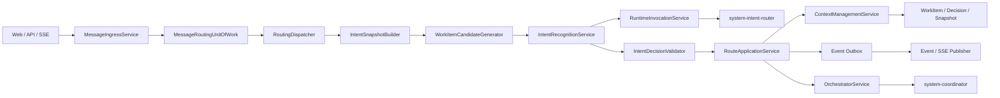
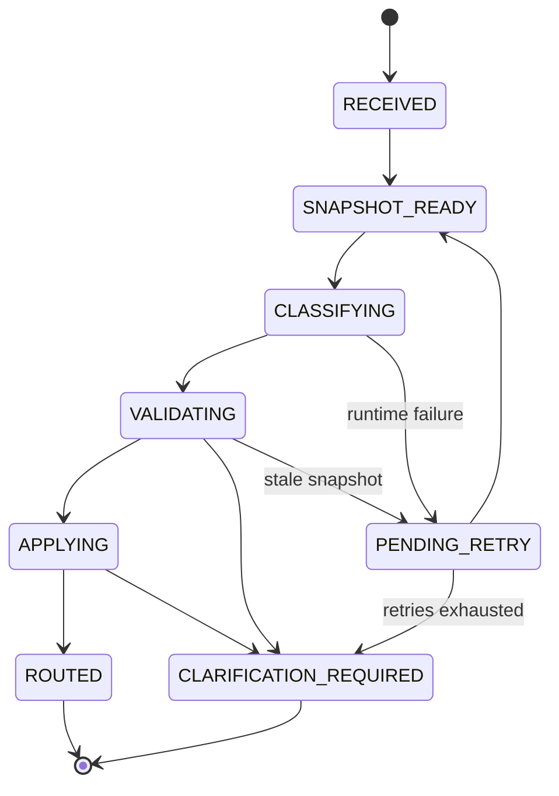
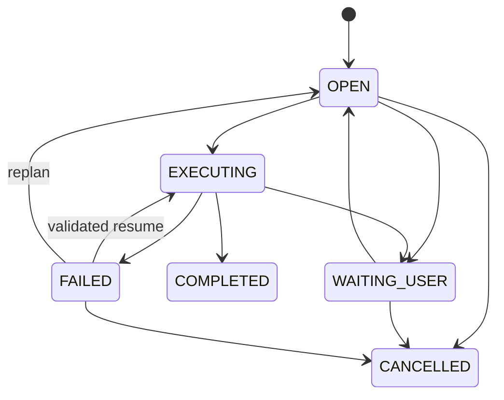

# 意图识别、WorkItem 上下文与系统 Agent 系统设计 v1

> 日期：2026-08-07
> 状态：系统设计方案，尚未实现
> 上游目标设计：[`intent-context-workitem-system-agent-target-design-v1.md`](./intent-context-workitem-system-agent-target-design-v1.md)
> 精确命令专项开发设计：[`exact-command-first-intent-routing-system-development-design-v1.md`](./exact-command-first-intent-routing-system-development-design-v1.md)
> 适用架构：NestJS 模块化单体、Vue Web、Context Pipeline v2、File/PostgreSQL 双持久化

## 1. 设计结论

首期采用“模块化单体 + 持久化异步路由 + WorkItem 聚合 + Decision Ledger + Transactional Outbox”。

系统 Agent 是平台内的逻辑身份，不拆成独立部署进程。Intent Router 的模型调用发生在数据库事务之外；消息接收和路由应用分别使用短事务，并通过 Session/WorkItem/Workflow revision 防止应用过期判断。

关键设计选择：

1. 用户消息先持久化再识别，API 不等待完整 LLM 路由。
2. 同一 Session 的路由结果按 `sessionSeq` 串行应用。
3. `WorkItem`、`DecisionRecord`、`IntentRoutingRecord` 使用一等实体，不嵌入聊天文本或 Summary。
4. PostgreSQL 使用 Session 级 advisory transaction lock；File backend 使用完整状态原子替换。
5. 事件在业务事务内写 Outbox，提交后再投递 SSE。
6. 系统 Agent 由服务端 Registry 解析，不属于 Session 参与者。
7. Intent Router 只做分类和路由建议，不拥有 Tool、写权限或任务执行能力。

## 2. 架构约束

### 2.1 必须保持的不变量

- 系统只保留 Context Pipeline v2，不引入 v1 分支。
- `IntentRecognitionModule` 不依赖 `OrchestratorModule`。
- Agent Definition 不保存实际 Runtime/Model。
- Intent Router 不能直接修改 Session、WorkItem、Task 或 Workflow。
- Coordinator 不能通过 `participatingAgentIds` 解析。
- 独立新需求不能继承旧 WorkItem 的 Decision 或 Artifact。
- 已确认 Decision 不允许原地覆盖。
- Runtime 不接收完整聊天历史或完整工作区。
- Runtime 不可用、输出非法或状态过期时 fail closed。
- File 与 PostgreSQL 对相同业务提交必须产生等价状态。

### 2.2 首期不采用微服务

原因：

- Sessions、Events、Workflow、Runtime 和 Persistence 当前处于同一 NestJS 进程。
- 路由提交需要同时更新多个领域对象，过早拆服务会引入分布式事务。
- 当前调用量不足以证明独立扩缩容收益。
- 模块边界和合同稳定后，Intent Runtime worker 才可以独立部署，而不改变领域合同。

## 3. 组件架构



### 3.1 后端模块依赖

```text
SessionsModule
  -> MessageRoutingModule
  -> ContextManagementModule
  -> OrchestratorModule

MessageRoutingModule
  -> IntentRecognitionModule
  -> ContextManagementModule
  -> EventsModule
  -> PersistenceModule

IntentRecognitionModule
  -> RuntimeInvocationModule
  -> AgentsModule

OrchestratorModule
  -> RuntimeInvocationModule
  -> ContextManagementModule
  -> AgentsModule

RuntimeInvocationModule
  -> RuntimeRoutingModule
  -> RuntimesModule
  -> CapabilitiesModule
```

禁止依赖：

```text
IntentRecognitionModule -X-> OrchestratorModule
ContextManagementModule  -X-> SessionsModule
RuntimeInvocationModule  -X-> Agent 参与者选择逻辑
```

## 4. 服务职责

| Service | 职责 | 禁止职责 |
| --- | --- | --- |
| `MessageIngressService` | 接收、去重、分配序号、创建 RoutingRecord | 调用专业 Agent |
| `RoutingDispatcher` | Session 级串行调度、重试、恢复 | 修改业务实体 |
| `IntentSnapshotBuilder` | 构建最小且有 revision 的快照 | 注入完整历史 |
| `WorkItemCandidateGenerator` | 生成有限合法候选 | 决定最终关系 |
| `IntentRecognitionService` | 命令守卫、调用 Router、验证和评分 | 拆解任务、修改 Session |
| `RouteApplicationService` | 根据验证结果原子应用 route/clarify/queue | 重新解释模型输出 |
| `ContextManagementService` | WorkItem、Decision、Snapshot、Envelope | 选择 Runtime |
| `RuntimeInvocationService` | InvocationPlan、Runtime、Tool、审计 | 重新选择 Agent 身份 |
| `SystemAgentRegistry` | 系统角色、保护规则、Surface | 保存 Runtime/Model |
| `RoutingRecoveryService` | 恢复非终态 RoutingRecord | 猜测用户意图 |

## 5. 消息路由状态机



建议合同：

```ts
type MessageRoutingStatus =
  | 'RECEIVED'
  | 'SNAPSHOT_READY'
  | 'CLASSIFYING'
  | 'VALIDATING'
  | 'APPLYING'
  | 'ROUTED'
  | 'CLARIFICATION_REQUIRED'
  | 'PENDING_RETRY'
  | 'REJECTED';
```

这是消息级状态，不加入 `SessionStatus`。

## 6. WorkItem 状态机



SessionStatus 继续表达平台主流程状态；WorkItemStatus 表达逻辑需求状态。两者不能使用同一个枚举，也不能互相隐式推导。

## 7. 核心时序

### 7.1 消息接收

```text
Client
  -> POST /sessions/:sessionId/messages
  -> MessageIngressService
  -> transaction A
       lock session
       verify clientMessageId idempotency
       allocate sessionSeq
       persist user_message
       persist IntentRoutingRecord(RECEIVED)
       persist event outbox
     commit
  <- 202 { messageId, routingId, status: RECEIVED }
  -> RoutingDispatcher.enqueue(sessionId, routingId)
```

API 必须在消息持久化后返回，不应等到 Intent Runtime 完成后才让用户看到自己的消息。

### 7.2 意图识别

```text
RoutingDispatcher
  -> load RoutingRecord
  -> IntentSnapshotBuilder.build()
  -> persist snapshot hash/revisions
  -> DeterministicCommandGuard
  -> WorkItemCandidateGenerator
  -> RuntimeInvocationService.invoke(system-intent-router)
  -> IntentDecisionValidator
  -> RouteApplicationService.apply()
```

LLM 调用期间不持有数据库锁或事务。

### 7.3 路由应用

```text
RouteApplicationService
  -> transaction B
       lock session
       reload active WorkItem / Workflow / Decision revisions
       compare snapshot revision vector
       validate state transition again
       create/reuse WorkItem
       write explicit inheritance rows
       write/update FollowUp message
       update IntentRoutingRecord
       write user-facing event + outbox
     commit
  -> publish outbox
  -> schedule Coordinator planning when route=ROUTED
```

Snapshot 过期时不得修补旧判断，必须回到 `SNAPSHOT_READY` 重建。

## 8. 顺序、并发与幂等

### 8.1 Session 级串行

- 每个 Session 同一时刻最多有一个 RoutingRecord 进入 `APPLYING`。
- 普通消息按 `sessionSeq` 应用，不能以后到消息先切换 active WorkItem。
- 暂停和取消可以提高调度优先级，但必须引用当前 revision 并通过状态守卫。
- 多实例部署时，进程内 Map/Promise 不能作为唯一锁。

### 8.2 PostgreSQL 锁

事务 A/B 使用：

```sql
select pg_advisory_xact_lock(hashtext('agent-cluster:routing:' || :session_id));
select id, revision, active_work_item_id
from agent_cluster.sessions
where external_id = :session_id
for update;
```

### 8.3 幂等键

```text
message ingestion: sessionId + clientMessageId
routing:          sessionId + sourceEventId + policyVersion
route apply:       routingId + expectedSnapshotHash
outbox:            eventType + aggregateId + aggregateRevision
workflow resume:   workItemId + workflowRunId + failedNodeId + attempt
```

重复请求返回原有实体，不创建第二个 WorkItem 或第二次 Workflow Resume。

## 9. Snapshot Revision Vector

IntentContextSnapshot 必须带有：

```ts
type IntentSnapshotRevision = {
  sessionRevision: number;
  activeWorkItemId?: UUID;
  activeWorkItemRevision?: number;
  decisionLedgerRevision: number;
  workflowRunId?: UUID;
  workflowRevision?: number;
  latestEventSeq: number;
};
```

任何参与最终路由的对象发生变化，都需要在事务 B 重新校验。允许忽略的变化仅限与候选和状态无关的 debug/audit 事件。

## 10. Intent Router 算法

### 10.1 阶段

```text
Normalize
  -> Deterministic command guard
  -> Candidate generation
  -> Structured model classification
  -> Schema validation
  -> Reference validation
  -> State transition validation
  -> Risk validation
  -> Server decision
```

### 10.2 候选生成

候选来源按优先级：

1. 用户显式引用的 WorkItem、Task、Brief 或 Artifact。
2. 当前 active WorkItem。
3. 待确认或失败的 WorkItem。
4. Session 内最近且目标摘要相似的有限 WorkItem。

首期使用确定性权重和文本相似度即可，不强制引入向量数据库。模型只能从候选 ID 中选择；不存在合法候选时只能选择 independent 或 ambiguous。

### 10.3 服务端裁决

硬门禁：

- Schema 非法；
- 引用不存在或跨 Session；
- 状态转换非法；
- Snapshot 过期；
- high-risk 且缺少确认；
- 候选被模型创造；
- 必填信息缺失。

任一硬门禁失败都不能自动 route。LLM 自报 confidence 不进入授权判断。

## 11. ContextEnvelopeV2 映射

| Layer | WorkItem 化后的内容 |
| --- | --- |
| L0 | 系统策略、Agent identity、Profile hash、Tool Catalog hash |
| L1 | Session、WorkItem goal/status/revision、Brief、阶段 |
| L2 | Project/Domain Map |
| L3 | 当前 WorkItem 的最小 Grounded Evidence |
| L4 | 本 WorkItem 已执行 Tool 结果 |
| L5 | 有效 Decision、Summary、Continuation/Failure checkpoint |
| L6 | Artifact、ChangeSet、Report、Delivery refs |

Envelope 审计字段：

```ts
type WorkItemContextAudit = {
  workItemId: UUID;
  workItemRevision: number;
  contextSnapshotId: UUID;
  decisionSetHash: string;
  inheritedDecisionIds: UUID[];
  inheritedArtifactIds: UUID[];
};
```

Runtime 只能把 Envelope 中真实出现的 Decision 和 Evidence 视为已知信息。

## 12. 系统 Agent 设计

### 12.1 Registry

```ts
type SystemAgentRole = 'intent_router' | 'coordinator';

type SystemAgentRegistration = {
  role: SystemAgentRole;
  agentId: UUID;
  key: string;
  allowedSurfaces: Array<'management'>;
  editableFields: Array<'name' | 'description' | 'profileMarkdown'>;
};
```

`allowedSurfaces` 和 `editableFields` 由服务端代码生成，不能从客户端或持久化记录提升权限。

### 12.2 Profile 编译

最终系统 Prompt：

```text
immutable system safety prefix
  + validated editable profile markdown
  + phase-specific system rules
  + minimal Intent/Coordinator context
```

Intent Router 的 Tool Catalog 固定为空。Coordinator 按实际阶段解析最小 Tool Catalog，不能因系统身份自动获得更多权限。

### 12.3 Catalog

```ts
interface AgentCatalogService {
  listForManagement(): AgentDefinition[];
  listForChat(): AgentDefinition[];
  listForWorkflow(): AgentDefinition[];
  listForMention(): AgentDefinition[];
  resolveSystemRole(role: SystemAgentRole): AgentDefinition;
}
```

Session、Workflow、`@`、参与人数、Agent Panel、文件 Revision 和协作图必须使用 Catalog，禁止散落 key 判断。

## 13. 数据模型

### 13.1 PostgreSQL 表

```text
sessions
  active_work_item_id -> work_items.id

work_items
  id, external_id, session_id, parent_work_item_id
  title, goal, status, revision
  created_from_event_id, created_at, updated_at

decision_records
  id, external_id, session_id, work_item_id
  kind, status, content/content_ref, confirmation
  source_event_id, supersedes_decision_id, revision, created_at

work_item_decision_inheritances
  work_item_id, decision_id, source_work_item_id, created_at

work_item_artifact_inheritances
  work_item_id, artifact_id, source_work_item_id, created_at

context_snapshots
  id, external_id, session_id, work_item_id
  purpose, revision_vector, snapshot_hash, payload/content_ref, created_at

intent_routing_records
  id, external_id, session_id, source_event_id
  status, policy_version, snapshot_id, invocation_id
  model_output, validation_result, final_action, reason_codes
  retry_count, idempotency_key, created_at, updated_at

session_follow_up_messages
  id, external_id, session_id, work_item_id, source_event_id
  status, handling_payload, queued_at, started_at, completed_at

event_outbox
  id, idempotency_key, aggregate_type, aggregate_id
  event_type, payload, status, attempts, created_at, published_at
```

Brief、Task、Artifact、RuntimeInvocation、WorkflowRun 增加可选 `work_item_id`。外键必须验证 WorkItem 与 Session 一致。

### 13.2 File backend collections

```text
workItemsBySession
decisionRecordsBySession
contextSnapshotsBySession
intentRoutingRecordsBySession
followUpMessagesBySession
eventOutbox
```

File 状态仍是单一 JSON 文档，但领域服务不直接连续调用多个 `setCollection()` 完成一次路由。

## 14. 持久化原子性

### 14.1 PostgreSQL

在 `RelationalStateStore` 增加专用领域方法：

```ts
commitMessageIngress(input): Promise<MessageIngressCommit>;
commitIntentRoute(input): Promise<IntentRouteCommit>;
claimPendingRouting(input): Promise<IntentRoutingRecord | undefined>;
```

这些方法在一个 `PoolClient` 事务中写全部关联表。不能依赖多个异步 `setCollection()` 达到跨集合原子性。

### 14.2 File

在 `PersistenceService` 增加：

```ts
mutateStateAtomically<T>(
  expectedRevision: string,
  mutator: (draft: PersistedState) => T
): Promise<T>;
```

实现顺序：clone state、应用 mutation、写唯一临时文件、`fsync`、原子 rename、替换内存 state。失败时保留旧文件和旧内存状态。

## 15. Outbox 与 SSE

业务事务内只写 `event_outbox`，提交后由 Publisher：

1. claim pending row；
2. 创建/确认 `collaboration_event`；
3. 发布 SSE；
4. 标记 `published_at`；
5. 失败时按有限退避重试。

SSE 重连仍以 collaboration event 序号回放；Outbox 重试不得生成重复时间线事件。

用户可见事件：

- `intent_clarification_required`
- `work_item_created`
- `work_item_activated`
- `decision_superseded`
- `follow_up_queued`

仅 Debug/Audit 可见：

- Router 原始结构化输出；
- 校验明细和可信度组成；
- Snapshot hash 和候选证据；
- Shadow 新旧路由差异。

## 16. API 设计

### 16.1 用户消息

```http
POST /api/sessions/:sessionId/messages
Idempotency-Key: <clientMessageId>
```

```json
{
  "content": "继续之前失败的任务",
  "mentionedAgentIds": []
}
```

返回：

```json
{
  "code": 0,
  "data": {
    "messageId": "...",
    "routingId": "...",
    "routingStatus": "RECEIVED"
  }
}
```

### 16.2 查询与澄清

```text
GET  /api/sessions/:sessionId/message-routings/:routingId
POST /api/sessions/:sessionId/message-routings/:routingId/clarify
GET  /api/sessions/:sessionId/work-items
GET  /api/sessions/:sessionId/work-items/:workItemId
POST /api/sessions/:sessionId/work-items/:workItemId/activate
GET  /api/sessions/:sessionId/decisions
GET  /api/sessions/:sessionId/debug/intent-routing
```

手动激活 WorkItem 只切换活动上下文，不自动 Resume Workflow。Resume 必须通过独立、状态校验后的命令。

### 16.3 Agent 与 Runtime 策略

```text
GET   /api/agents?surface=management|chat|workflow|mention
GET   /api/runtime-routing/system-agent-policies
PATCH /api/runtime-routing/system-agent-policies/:systemRole
```

## 17. Runtime Invocation

Intent Router 调用计划固定：

```ts
const plan = {
  phase: 'user_message_routing',
  agent: systemAgentRegistry.resolve('intent_router'),
  toolCatalog: { tools: [], decisions: [], catalogHash: EMPTY_HASH },
  contextEnvelope: intentEnvelope,
  expectedOutput: { kind: 'intent_routing_decision', schemaVersion: '2.0' },
  writeMode: 'none'
};
```

Runtime failure 不允许回退为 `continuation`。允许一次结构修复调用；Runtime 不可用或重试耗尽后生成针对性澄清卡。

## 18. 恢复设计

启动恢复扫描当前 `dataEpoch`：

| Routing 状态 | 恢复行为 |
| --- | --- |
| `RECEIVED/SNAPSHOT_READY` | 重新入队 |
| `CLASSIFYING` 且无活动 Invocation | 标记 `PENDING_RETRY` 后入队 |
| `VALIDATING/APPLYING` | 重新加载 revision，幂等执行或回到 Snapshot |
| `ROUTED` 但 FollowUp 未启动 | 幂等调度 FollowUp |
| `CLARIFICATION_REQUIRED` | 等待用户，不自动重试 |

恢复不得复用不同 WorkItem、Agent、Runtime 或 Workspace 的 CLI session。不同 `dataEpoch` 的 RoutingRecord 不加载。

## 19. 前端设计

最低可用改造：

- 用户消息立即显示“正在识别”状态，而不是阻塞输入提交。
- 收到 `ROUTED` 后移除识别状态，显示正常系统决策/任务卡。
- `CLARIFICATION_REQUIRED` 显示继续当前、关联新任务、独立新任务等明确选项。
- 顶部或任务区域显示当前 WorkItem 名称，不增加复杂多页导航。
- Agent 管理页显示系统标识和不可编辑字段。
- 所有 Agent 选择面读取服务端 Surface 目录。

前端不负责计算需求关系、继承决策或保护系统 Agent。

## 20. 安全设计

- Intent Router Tool Catalog 固定为空。
- Router 无 Workspace 文件正文、命令、写入和外部 Connector 权限。
- 用户消息视为不可信输入，不能覆盖 immutable system prefix。
- Profile 保存时编译和版本化；非法版本不能成为 active revision。
- 系统 Agent 保护在 Controller DTO 和 Service policy 两层执行。
- WorkItem/Decision/Artifact 引用必须验证 Session ownership。
- Debug API 不返回凭据、完整敏感正文或模型思维链。
- 高风险 pause/cancel/resume 继续通过状态机和用户权限校验。

## 21. 可观测性

每条路由至少记录：

- message/routing/session/workItem ID；
- system Agent/profile revision；
- Runtime/Model/Invocation ID；
- snapshot hash/revision vector；
- 候选 WorkItem ID 和 reason code；
- Schema/reference/state/risk 校验结果；
- 最终 route/clarify/queue；
- latency、token、retry 和 failure code。

核心指标：

```text
intent_route_total
intent_route_latency_ms
intent_route_runtime_failure_total
intent_route_clarification_total
intent_route_stale_snapshot_total
routing_idempotency_replay_total
decision_inheritance_total
event_outbox_lag_ms
```

## 22. 灰度与回滚

```text
disabled
  -> shadow
  -> enforce_new_sessions
  -> enforce_selected_sessions
  -> enforce_all_current_epoch
```

这是 Intent Routing rollout mode，不是 Context Pipeline v1/v2 feature flag。

回滚规则：

- 只能回到 `shadow`，不能删除 WorkItem、Decision 或 Audit。
- 回滚后新 Router 不再驱动状态，仍继续记录对比结果。
- 已经创建的 WorkItem 继续可读；不得把多个 WorkItem 合并回旧 Session 上下文。
- 数据库迁移保持向前兼容，不通过 down migration 删除业务数据。

## 23. 代码落点

```text
packages/shared/src/
  contracts.ts
  runtime-contracts/output-contracts.ts

apps/server/src/modules/
  message-routing/
  intent-recognition/
  context-management/
  runtime-invocation/
  agents/
  sessions/
  events/
  workflows/
  persistence/
  recovery/

apps/web/src/
  api/client.ts
  stores/session.ts
  stores/agent.ts
  stores/event.ts
  components/SessionWorkspace.vue
  components/AgentManager.vue
  components/ConfirmationCard.vue
  components/DebugRuntimeView.vue
```

## 24. 实施顺序

1. 冻结 Shared 合同、错误码、状态机和 golden dataset。
2. 实现 Message Routing Unit of Work、Outbox 和恢复扫描。
3. 委托式抽取 RuntimeInvocationService，保持现有行为等价。
4. 实现 SystemAgentRegistry、系统 Agent seed/保护和统一 Catalog。
5. 实现 WorkItem、Decision、Snapshot、Routing 双持久化。
6. 上线 Shadow Intent V2，只记录不应用。
7. 新 Session 启用异步路由和 WorkItem。
8. dry-run 初始化当前 `dataEpoch` 存量 Session。
9. 分批启用存量 Session，验证恢复与 Workflow Resume。
10. 删除 Orchestrator 意图职责和默认 `continuation` 回退。

## 25. 测试与质量门

| 层级 | 必测内容 |
| --- | --- |
| Unit | 命令守卫、候选生成、Schema/引用/状态校验、Decision 继承 |
| Contract | Intent V2、WorkItem、Decision、Agent Surface、Envelope |
| Transaction | 路由部分失败、revision 冲突、Outbox 重放、幂等提交 |
| Persistence | File/PostgreSQL 等价、外键、原子性、当前 epoch 初始化 |
| Recovery | 非终态 RoutingRecord、服务重启、重复队列消息 |
| Workflow | failed node 精确 Resume、replan、跨 WorkItem 隔离 |
| Security | 系统 Agent 禁删禁用、无 Tool、非法引用和 prompt injection |
| Frontend | 即时消息、识别状态、澄清卡、系统 Agent 全 Surface 隐藏 |
| E2E | 同需求、相关需求、独立需求、歧义、多意图、失败恢复 |

建议验证：

```bash
npm run typecheck
npm run test
npm run test:e2e:main-chain
npm run test:e2e:recovery
npm run test:e2e:postgres-persistence
npm run test:e2e:runtime-routing
npm run build
```

## 26. 验收标准

1. 消息持久化后立即返回，Router 失败不会丢失用户输入。
2. 同一 Session 的路由应用顺序与 `sessionSeq` 一致。
3. Snapshot 过期时不应用旧判断。
4. “继续”只恢复明确的活动 WorkItem 和失败检查点。
5. 独立新需求没有旧 Decision/Artifact 继承记录。
6. 相关新需求的每个继承项都有显式来源 ID。
7. 系统 Agent 不进入任何普通 Agent Surface，且 API 无法破坏其系统属性。
8. Intent Router 无 Tool、写权限或外部副作用。
9. File/PostgreSQL 在故障和重放后保持等价状态。
10. 所有路由、澄清、继承和恢复均可根据 RoutingRecord 和 Event 审计。

## 27. 实施前注意事项

当前工作区中的 `sessions.service.ts`、`workflow-runtime.service.ts` 和 `SessionWorkspace.vue` 存在与失败恢复、本地 Runtime 和前端选择相关的未提交修改。开始实现前必须先确认这些变更的最终状态，并在同一分支上重新建立 golden baseline，避免覆盖用户已有工作或基于过期代码拆分模块。

Intent Runtime timeout、重试次数、可信度阈值、候选差距、Snapshot 大小和保留周期是运行参数，不阻塞系统结构，但必须在生产灰度前通过评测冻结首期值。
