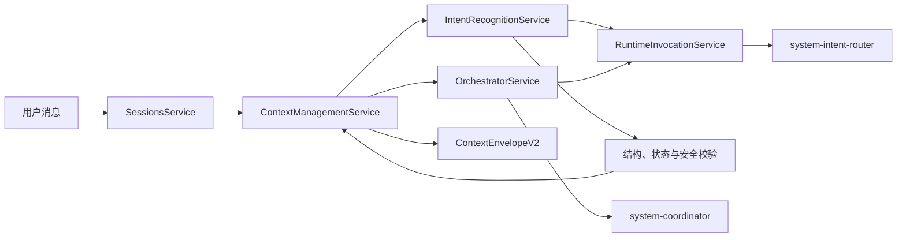

# 意图识别、WorkItem 上下文与系统 Agent 目标设计 v1

> 日期：2026-08-07
> 状态：已确认方案，尚未实现
> 适用范围：当前 `dataEpoch` 内的 v2 Session、用户后续消息、任务续跑与新需求路由
> 下游系统设计：[`intent-context-workitem-system-agent-system-design-v1.md`](./intent-context-workitem-system-agent-system-design-v1.md)
> 精确命令专项开发设计：[`exact-command-first-intent-routing-system-development-design-v1.md`](./exact-command-first-intent-routing-system-development-design-v1.md)
> 相关设计：[`context-router-target-design-v1.md`](./context-router-target-design-v1.md)、[`context-pipeline-v2-only-agent-decoupling-system-design-v1.md`](./context-pipeline-v2-only-agent-decoupling-system-design-v1.md)

## 1. 文档目的

本文档定义如何把当前系统中的上下文管理和语义识别拆分为稳定模块，并解决以下问题：

- 用户在同一窗口发送“继续”时，不能从头开始或丢失此前已确认决策。
- 用户提出新问题时，系统要判断它是原需求补充、相关新需求、独立新需求还是存在歧义。
- 旧聊天记录需要保留，但不能无条件注入当前任务上下文。
- 意图识别必须由独立系统 Agent 完成，不能继续和 Coordinator、Orchestrator 混在一起。
- Coordinator 也需要成为受保护的系统 Agent，不参与群聊选择和人数统计。
- Agent 身份、Runtime 和 Model 必须继续解耦。

本文档是目标设计和实施基线，不表示相关功能已经落地。

## 2. 已确认决策

1. 新增 `system-intent-router` 系统 Agent，专门负责用户消息的语义理解和路由建议。
2. 现有 `coordinator` 改为受保护的系统 Agent，只负责讨论协调、任务拆解和派发。
3. 两个系统 Agent 只在 Agent 管理列表中展示，不进入：
   - 会话参与者和参与人数；
   - 创建会话的 Agent 选择；
   - `@Agent` 候选；
   - Workflow Agent 节点选择；
   - 协作图中的普通群聊成员。
4. 系统 Agent 不能被删除、禁用或修改 key、system role、系统可见性等受保护字段。
5. 系统 Agent 的 Profile 可以在受控范围内调整；Runtime/Model 通过独立 Runtime 路由策略配置。
6. 一个 UI 窗口继续对应一个 `Session`，一个 Session 可以包含多个逻辑 `WorkItem`。
7. 用户已确认的决策由 Decision Ledger 保存，Summary Memory 不能替代决策事实。
8. 采用两阶段迁移原则：先做行为等价的模块拆分，再启用系统 Agent、WorkItem 和新路由。
9. 首期失败策略采用健壮的 fail-closed 方案，并保留配置能力供后续调优。

## 3. 非目标

- 不恢复 v1 Context Pipeline，也不重新引入 v1/v2 双轨。
- 不迁移不同 `dataEpoch` 的旧业务数据。
- 不把完整聊天记录、完整工作区或全部 RAG 内容发送给 Intent Router。
- 不让 Intent Router 做专业任务拆解、文件修改、命令执行或外部通知。
- 不允许语义识别结果绕过 Capability、Tool Authority 或用户确认。
- 不把 Harness Engineering 产品化为本次业务模块。

## 4. 当前系统事实

当前系统已经具备以下基础：

- `apps/server/src/modules/intent-recognition/intent-recognition.service.ts` 提供关键词型任务和消息识别。
- `apps/server/src/modules/sessions/sessions.service.ts` 是用户消息和 FollowUp 队列入口。
- `apps/server/src/modules/orchestrator/orchestrator.service.ts` 当前同时包含 Runtime 型后续消息识别、Context Assembly 和 Runtime 调用。
- `apps/server/src/modules/context-v2/` 已有 L0-L6 Context Envelope、Evidence 选择和预算裁剪纯函数。
- `apps/server/src/modules/runtime-routing/` 已有 Invocation Resolver 等执行目标解析能力。
- `packages/shared/src/contracts.ts` 已定义 Session、Agent、HandlingPlan、Task、Artifact 和 Runtime 合同。
- File backend 与 PostgreSQL relational projection 同时存在，新增集合必须保持对等。

当前主要缺口：

- 本地识别依赖关键词，只有 `continuation/new_requirement` 等粗粒度结论。
- 正常消息由 Orchestrator 临时让 Coordinator 调 Runtime 识别，职责耦合。
- Runtime 识别失败后可能回退关键词识别，存在错误续接风险。
- Session 是主要上下文边界，没有独立 WorkItem 和决策账本。
- Agent 合同没有系统归属和不可变策略。
- UI 和后端多处直接使用 `agents.filter(...)` 或 `agent.key !== 'coordinator'`，缺少统一目录策略。

## 5. 目标架构



### 5.1 依赖约束

```text
SessionsModule
  -> ContextManagementModule
  -> IntentRecognitionModule
  -> OrchestratorModule

IntentRecognitionModule
  -> RuntimeInvocationModule
  -> AgentsModule

OrchestratorModule
  -> ContextManagementModule
  -> RuntimeInvocationModule

RuntimeInvocationModule
  -> RuntimeRoutingModule
  -> RuntimesModule
```

不变量：

- `IntentRecognitionModule` 不得依赖 `OrchestratorModule`。
- Intent Router 不直接修改 Session、WorkItem 或 Task。
- Sessions 负责流程编排，Context Management 负责状态事实和原子应用。
- Orchestrator 不再拥有用户消息语义识别逻辑。
- Runtime Adapter 继续只消费稳定的 InvocationPlan 和 `ContextEnvelopeV2`。

## 6. 模块职责与建议目录

### 6.1 IntentRecognitionModule

职责：

- 识别对话行为、需求关系、目标分段、上下文继承策略和请求的状态转换。
- 构建严格结构化输出并执行 Schema、引用、状态和安全校验。
- 根据服务端证据计算路由可信度和歧义状态。
- 生成 `route/clarify/queue` 建议，不直接执行任务。

建议目录：

```text
apps/server/src/modules/intent-recognition/
  intent-recognition.module.ts
  intent-recognition.service.ts
  intent-output-validator.ts
  intent-confidence-evaluator.ts
  deterministic-command-guard.ts
  intent-recognition.service.spec.ts
```

### 6.2 ContextManagementModule

职责：

- 管理 WorkItem 生命周期、活动 WorkItem、Decision Ledger 和 Context Snapshot。
- 计算同需求、相关需求和独立需求的上下文继承结果。
- 包装现有 `context-v2` 纯函数，构建 `ContextEnvelopeV2`。
- 管理 Project Map、Evidence Selection、Summary Memory 和恢复检查点。

建议目录：

```text
apps/server/src/modules/context-management/
  context-management.module.ts
  context-management.service.ts
  work-item.service.ts
  decision-ledger.service.ts
  intent-context-snapshot.builder.ts
  context-envelope.builder.ts
```

### 6.3 RuntimeInvocationModule

职责：

- 从 Orchestrator 抽取通用 InvocationPlan 构建、Runtime 解析、调用和审计。
- 让 Intent Recognition 和 Orchestrator 复用相同 Runtime 边界。
- 保持 Tool Authority、Runtime eligibility、流式事件、取消和 Resume 语义一致。

建议目录：

```text
apps/server/src/modules/runtime-invocation/
  runtime-invocation.module.ts
  runtime-invocation.service.ts
  invocation-plan.builder.ts
  invocation-audit.service.ts
```

### 6.4 AgentsModule

新增职责：

- 系统 Agent 注册、seed、自修复和受保护字段校验。
- 提供统一 Agent Catalog，而不是由各调用方自行过滤。
- 解析系统角色，但不把系统 Agent 加入群聊参与者。

建议接口：

```ts
interface AgentCatalog {
  listForManagement(): AgentDefinition[];
  listForChat(): AgentDefinition[];
  listForWorkflow(): AgentDefinition[];
  resolveSystemRole(role: SystemAgentRole): AgentDefinition;
}
```

## 7. WorkItem 上下文生命周期

### 7.1 结构

```text
Session
  -> activeWorkItemId
  -> WorkItems
       -> Briefs
       -> Tasks
       -> Attempts
       -> DecisionRecords
       -> ContextSnapshots
       -> Artifact refs
```

建议合同：

```ts
type WorkItemStatus =
  | 'open'
  | 'waiting_user'
  | 'executing'
  | 'completed'
  | 'failed'
  | 'cancelled';

type WorkItem = {
  id: UUID;
  sessionId: UUID;
  title: string;
  goal: string;
  status: WorkItemStatus;
  parentWorkItemId?: UUID;
  inheritedDecisionIds: UUID[];
  inheritedArtifactIds: UUID[];
  createdFromEventId: UUID;
  createdAt: ISODateTime;
  updatedAt: ISODateTime;
};
```

### 7.2 需求关系与上下文策略

| `scopeRelation` | 行为 | 上下文策略 |
| --- | --- | --- |
| `same_requirement` | 复用活动 WorkItem | `inherit_confirmed` |
| `related_new_requirement` | 创建关联 WorkItem | `inherit_selected` |
| `independent_new_requirement` | 创建干净 WorkItem | `clean_task_context` |
| `ambiguous` | 不切换、不执行，询问用户 | `ask_user` |

旧聊天记录永不因为切换 WorkItem 而删除，只是从当前 Runtime 的主动上下文中排除。

### 7.3 Decision Ledger

```ts
type DecisionRecord = {
  id: UUID;
  sessionId: UUID;
  workItemId: UUID;
  kind: 'requirement' | 'constraint' | 'scope' | 'approach' | 'approval' | 'preference';
  content: string;
  status: 'valid' | 'superseded' | 'revoked';
  sourceEventId: UUID;
  confirmation: 'explicit_user' | 'brief_confirmation' | 'system_import';
  appliesTo: string[];
  supersedesDecisionId?: UUID;
  inheritedFromWorkItemId?: UUID;
  createdAt: ISODateTime;
};
```

规则：

- 只有明确用户确认、Brief 确认或可信系统迁移才能创建权威决策。
- 已确认决策不可原地覆盖，只能被新记录 supersede 或 revoke。
- 相关 WorkItem 只能继承显式列出的 Decision/Artifact ID。
- Summary Memory 是派生缓存；丢失后可以根据 Ledger、Brief、Task 和事件重建。
- 存量 Session 不能从普通聊天文本推断“用户已确认”；无法证明的内容只能标记为历史参考。

## 8. 健壮语义识别

### 8.1 识别不是单标签分类

目标输出至少覆盖：

- `dialogueAct`：提问、命令、纠正、补充约束、确认、拒绝、偏好输入等。
- `scopeRelation`：与哪个 WorkItem 以及什么关系。
- `goalSegments`：一条消息中的多个目标片段。
- `candidateWorkItems`：候选 WorkItem 和可审计证据。
- `contextPolicy`：继承全部确认决策、选择性继承、干净上下文或询问用户。
- `requestedTransition`：暂停、继续、重试、重规划、取消、确认等。
- `referencedEntities`：Agent、Task、Brief、Workflow、Artifact、文件等引用。
- `missingFields` 和 `ambiguityReasons`。
- 风险等级和是否允许自动应用。

建议新增独立的 V2 Runtime 输出，而不是原地扩展旧 `UserMessageHandlingPlan`：

```ts
type IntentRoutingDecisionV2 = {
  schemaVersion: '2.0';
  dialogueAct: string;
  scopeRelation:
    | 'same_requirement'
    | 'related_new_requirement'
    | 'independent_new_requirement'
    | 'ambiguous';
  goalSegments: GoalSegment[];
  candidateWorkItems: Array<{
    workItemId: UUID;
    evidenceCodes: string[];
  }>;
  contextPolicy:
    | 'inherit_confirmed'
    | 'inherit_selected'
    | 'clean_task_context'
    | 'ask_user';
  requestedTransition?: string;
  referencedEntities: EntityReference[];
  missingFields: string[];
  ambiguityReasons: string[];
  risk: 'low' | 'medium' | 'high';
  proposedAction: 'route' | 'clarify' | 'queue';
};
```

### 8.2 IntentContextSnapshot

Intent Router 只接收最小快照：

```text
当前用户消息
活动 WorkItem 摘要
少量候选 WorkItem 摘要
待用户确认事项
仍有效的决策摘要和 ID
当前 Brief / Workflow / 失败检查点
少量相关事件
可引用 Agent / Task / Artifact ID
```

禁止注入：

- 完整聊天历史；
- 完整工作区文件正文；
- 全部 RAG 结果；
- 与候选 WorkItem 无关的旧任务细节；
- 凭据、密钥或非必要敏感信息。

### 8.3 服务端可信度

LLM 自报 confidence 只能作为诊断，不能决定是否执行。服务端评分至少考虑：

- 输出 Schema 是否完全合法；
- 与确定性命令规则是否一致；
- WorkItem、Task、Agent 和 Artifact 引用是否有效；
- 请求的状态转换是否合法；
- 快照是否过期；
- 候选 WorkItem 差距是否足够；
- 是否存在缺失字段；
- 风险等级是否允许自动应用；
- 是否与待确认决策冲突。

阈值和候选差距必须配置化，并通过评测集校准，不能散落为业务代码常量。

## 9. 端到端消息流程

```text
1. 接收消息并生成稳定 message/event id
2. 持久化原始消息并执行幂等去重
3. 标准化内容，提取命令、@引用和结构化实体
4. Context Management 构建 IntentContextSnapshot
5. system-intent-router 返回 IntentRoutingDecisionV2
6. 校验 Schema、引用、Session/Workflow 状态和风险
7. 计算服务端可信度与最终 route/clarify/queue 决策
8. 原子应用：创建/切换 WorkItem、记录继承、写路由审计、加入 FollowUp 队列
9. route 后交给 system-coordinator
10. Coordinator 讨论、拆解、执行、Review 和 Delivery
11. 阶段结束时写 Decision/Context checkpoint
```

### 9.1 原子路由提交

以下动作必须形成单一业务提交，或者使用 CAS + 幂等补偿实现等价语义：

- IntentRoutingRecord 写入；
- WorkItem 创建或 `activeWorkItemId` 切换；
- 决策和 Artifact 继承关系写入；
- FollowUp 队列写入；
- 路由结果事件写入。

推荐幂等键：

```text
sessionId + sourceEventId + routingPolicyVersion
```

重复消息、队列重放或进程恢复不得创建第二个 WorkItem，也不得重复恢复 Workflow。

## 10. 系统 Agent 生命周期与安全

### 10.1 系统角色

```ts
type SystemAgentRole = 'intent_router' | 'coordinator';
```

系统角色必须由服务端内置注册表决定。API 返回的系统属性只是只读投影，客户端不能通过传入 `systemRole` 或 `protected` 把普通 Agent 提权为系统 Agent。

### 10.2 可变与不可变边界

| 字段/能力 | 系统 Agent |
| --- | --- |
| key、system role、系统归属 | 不可修改 |
| status | 始终 active，不可禁用 |
| 删除 | 禁止 |
| 群聊/Workflow 可见性 | 服务端固定为 hidden |
| Profile 正文 | 可修改，但必须校验并版本化 |
| 系统安全前缀 | 不可由 Profile 覆盖 |
| Runtime/Model | 由独立路由策略配置 |
| Tool Catalog | Intent Router 固定为空；Coordinator 按阶段最小授权 |

### 10.3 seed 与自修复

- 服务启动时检查固定 key 和固定 ID/role 映射。
- 缺失系统 Agent 时 seed；受保护字段被污染时恢复规范值并记录审计。
- Profile 保留用户允许的最新合法版本，不因自修复无条件覆盖。
- Profile 编译失败时使用最近的合法版本并阻止新 Invocation。
- Runtime 路由无 eligible target 时 fail closed，不能静默改用普通 Agent。

### 10.4 用户可见行为

- Intent Router 的模型输出只进入 audit/debug，不显示为群聊发言。
- Coordinator 的用户可见结果投影为系统决策、Brief、任务或交付卡片。
- 系统 Agent 不计入参与人数，不显示在 Agent 状态侧栏和协作图。
- Agent 管理页显示“系统 Agent”标识、受保护说明和允许编辑的 Profile 区域。

## 11. Runtime 与 Model 路由

Agent Definition 不保存实际执行 Runtime/Model。新增独立策略：

```ts
type SystemRoleRuntimePolicy = {
  systemRole: SystemAgentRole;
  preferredRuntimeType?: RuntimeType;
  preferredModelId?: string;
  allowedRuntimeTypes?: RuntimeType[];
  timeoutMs: number;
  maxRepairAttempts: number;
};
```

该策略只是 `InvocationResolver` 输入，不能绕过：

- Runtime availability；
- Workspace Provider 能力；
- Tool Authority；
- Phase policy；
- token budget；
- 用户审批。

Intent Router 应使用无 Tool、低 token、严格结构化输出的专用 phase。Coordinator 使用现有协作 phase，但通过系统角色解析身份。

## 12. 首期失败策略 4a

| 场景 | 首期行为 |
| --- | --- |
| 精确暂停/取消/继续/重试/确认/拒绝 | 先走确定性命令守卫，再校验当前状态 |
| 普通消息 | 调用 `system-intent-router` |
| Runtime 不可用/超时 | 消息进入 `PENDING_INTENT_RECOGNITION`，有限重试后询问用户 |
| 输出 Schema 非法 | 最多一次结构修复调用，仍失败则澄清 |
| 低可信或候选接近 | 不执行，询问“继续当前任务还是创建新任务” |
| Context Snapshot 过期 | 重建快照后重新识别 |
| 多目标消息 | Router 只分段，Coordinator 负责拆任务 |
| 重复或晚到消息 | 幂等返回已有 RoutingRecord |
| 高风险状态转换 | 必须通过状态机和用户确认，不以模型结论直接执行 |

`PENDING_INTENT_RECOGNITION` 是消息级路由状态，不应把整个 Session 变成不可使用的全局阻塞状态。

## 13. 持久化设计

### 13.1 新增实体

- `work_items`
- `decision_records`
- `context_snapshots`
- `intent_routing_records`
- `sessions.active_work_item_id`
- Brief、Task、Artifact、RuntimeInvocation 增加可选 `work_item_id`

`intent_routing_records` 至少记录：

- source message/event ID；
- snapshot hash 和 revision；
- Router Agent/Profile/Runtime Invocation ID；
- 原始结构化输出；
- Schema、引用、状态和安全校验结果；
- 服务端最终动作和原因码；
- routing policy version；
- 幂等键和时间戳。

不保存模型思维链，只保存结构化结论和可审计 reason/evidence code。

### 13.2 File/PostgreSQL 对等要求

- 新实体同时进入 File backend collection 和 relational schema/projection。
- PostgreSQL 外键必须防止 WorkItem 跨 Session 关联。
- `active_work_item_id` 必须属于同一个 Session。
- Decision 继承目标必须存在，且不能形成循环。
- 所有 collection 必须注册到 relational state store，不能触发 `RELATIONAL_COLLECTION_UNMAPPED`。
- Recovery 必须在当前 `dataEpoch` 内重建活动 WorkItem 和未完成路由。

### 13.3 当前 v2 Session 初始化

这次演进只处理当前 `dataEpoch` 的 v2 Session，不恢复旧 epoch 或 v1 数据：

1. 每个现有 Session 创建一个 `legacy-bootstrap` WorkItem。
2. 现有 Brief、Task、Artifact 和 Invocation 归入该 WorkItem。
3. 只有明确确认事件和已确认 Brief 可以生成权威 DecisionRecord。
4. 无法证明已经确认的聊天内容只保留在事件历史中。
5. 初始化过程必须可 dry-run、可重复执行并产生完整性报告。

## 14. API 与前端影响

### 14.1 API

建议新增或扩展：

```text
GET  /api/sessions/:sessionId/work-items
GET  /api/sessions/:sessionId/work-items/:workItemId
POST /api/sessions/:sessionId/work-items/:workItemId/activate
GET  /api/sessions/:sessionId/decisions
GET  /api/sessions/:sessionId/debug/intent-routing
GET  /api/agents?surface=management|chat|workflow
GET  /api/runtime-routing/system-agent-policies
PATCH /api/runtime-routing/system-agent-policies/:systemRole
```

用户消息 API 返回值增加消息级路由状态，但在 Shadow 阶段不改变现有执行结果。

### 14.2 前端

需要统一修改所有 Agent 选择面：

- Session 创建 Agent 选择；
- `@Agent`；
- Agent 状态侧栏；
- 协作图；
- 文件 Revision Agent；
- Workflow Agent 和 Robot Reviewer；
- 参与人数和默认全选。

不能继续依赖 `agent.key !== 'coordinator'` 等散落判断，应由 API surface 或统一 store selector 提供候选集合。

WorkItem 首期不必做复杂多标签页。最低可用 UI：

- 当前 WorkItem 标识；
- 歧义时的继续/新任务选择卡；
- 相关任务的继承内容摘要；
- Debug 页查看 Intent、决策和上下文来源。

## 15. 市面方案参考与本系统取舍

| 产品/框架 | 可借鉴模式 | 本系统取舍 |
| --- | --- | --- |
| LangGraph | checkpoint、conditional edge、interrupt | 用 ContextSnapshot 和消息级澄清实现可恢复路由 |
| AutoGen | model selector、候选限制、自定义 selector | 模型从服务端提供的有效 WorkItem 候选中选择 |
| Rasa | confidence ranking、fallback、two-stage clarification | 低可信不执行，使用针对性两阶段澄清 |
| Dialogflow CX | state route、no-match/no-input handler | 所有路由必须通过 Session/Workflow 状态机 |
| CrewAI Flows | stateful event routing | WorkItem 和 RoutingRecord 形成显式状态事件 |
| Dify | LLM question classifier 和分类说明 | 使用严格结构化输出，但不只输出单一类别 |
| Copilot Studio | 多资源、多意图编排和缺失输入追问 | Router 分段，Coordinator 拆解，缺失信息先询问 |

本系统额外增加 Decision Ledger 和显式继承 ID，用来解决通用分类器通常没有覆盖的“继续后保留用户决策”问题。

## 16. 影响与风险评审

### 16.1 P0 风险

1. **默认续接错误**：当前缺失 `requirementRelation` 时可能默认 `continuation`；失败 Session 又可能自动变为 `resume`。启用新路由前必须改成 fail closed。
2. **系统 Coordinator 选错**：当前部分代码从 Session 参与者中选择 Coordinator。隐藏系统 Agent 后必须改为 `resolveSystemRole()`。
3. **路由部分提交**：消息、WorkItem、Decision、FollowUp 和事件如果不是原子提交，会造成重复任务或上下文错位。
4. **持久化不完整**：只修改 Shared contract 或 File backend 会导致 PostgreSQL 投影失败或恢复丢数据。

### 16.2 P1 风险

1. **Workflow Resume 竞争**：路由识别和真实恢复之间状态可能变化，Resume 必须绑定 `workflowRunId + failedNodeId + attempt + expectedRevision`。
2. **系统 Agent 可被 API 修改**：当前通用 Agent update 必须增加服务端字段级策略。
3. **Workflow 绕过前端过滤**：后端必须拒绝系统 Agent 作为普通 Workflow 节点或 Reviewer。
4. **Runtime 抽取回归面大**：Orchestrator 的 Runtime、Context、审计、心跳、Tool、CLI Resume 高度耦合，必须先做委托式等价抽取。
5. **合同原地升级**：直接扩大旧 HandlingPlan 会破坏 Mock/Generic Runtime 和持久化数据，必须新增 V2 output kind/version。

### 16.3 P2 风险

1. 每条消息调用模型会增加延迟、成本和单点依赖。
2. 系统 Agent Profile 可编辑，可能破坏关键行为；需要不可覆盖的安全前缀和最近合法版本。
3. 旧 Session 自动生成决策可能误把讨论当确认，只能迁移可证明事实。
4. Agent 可见性过滤点较多，必须以统一 Catalog 收口。
5. Router 可能受到用户输入 prompt injection，必须固定无 Tool、无副作用权限。

## 17. 分阶段实施与回滚门禁

### Phase 0：合同与评测基线

- 冻结 V2 Intent 输出、WorkItem、DecisionRecord 和系统 Agent 不变量。
- 建立中英文真实消息评测集和现有行为 golden fixtures。
- 记录当前 FollowUp、失败恢复和 Context Envelope 基线。

退出门禁：合同评审完成；不存在会改变数据模型的开放问题。

### Phase 1：行为等价拆分

- 抽取 RuntimeInvocationService，但内部仍委托现有实现。
- 创建 ContextManagementService，先包装现有 `context-v2` 纯函数。
- 将 Orchestrator 的后续消息识别迁入 IntentRecognitionModule，但不改变旧 HandlingPlan 行为。

退出门禁：现有主链路、Runtime 路由、恢复和 Context 快照测试等价。

### Phase 2：数据和系统 Agent 基础

- 新增 WorkItem、Decision、Snapshot、RoutingRecord 的 File/PostgreSQL 对等结构。
- seed `system-intent-router`，把 Coordinator 标记为系统角色。
- 新增 Agent Catalog 和后端保护策略。
- 系统 Agent 暂不改变生产路由，仅验证管理和隐藏行为。

退出门禁：系统 Agent 不能被修改或进入聊天/Workflow；双持久化一致。

### Phase 3：Shadow 语义识别

- 每条消息同时运行旧逻辑和 Intent V2。
- V2 只写 RoutingRecord，不创建/切换 WorkItem。
- 对比需求关系、候选 WorkItem、澄清率、延迟和失败率。

退出门禁：评测指标达标；不存在高风险错误自动路由。

### Phase 4：新 Session 灰度

- 新 Session 启用 WorkItem、Decision Ledger 和原子路由提交。
- 从低风险、非执行中消息开始灰度。
- 对纠正、失败恢复和高风险命令保持更严格澄清。

回滚：切回 Shadow 模式，保留已写 WorkItem/Decision/Audit 数据，不做破坏性回滚。

### Phase 5：当前 v2 存量 Session

- dry-run 初始化 `legacy-bootstrap` WorkItem。
- 校验 Brief/Task/Artifact/Invocation 归属和明确决策。
- 分批启用存量 Session，不跨 `dataEpoch`。

退出门禁：File/PostgreSQL 恢复、队列重放和 Workflow Resume 测试通过。

### Phase 6：旧逻辑收口

- 删除 Orchestrator 中的意图识别职责。
- 删除关键词识别作为普通消息默认回退的语义。
- 删除散落的系统 Agent key 判断和前端过滤。
- 保留确定性命令守卫、V2 Router 和统一 Catalog。

## 18. 可观测性与评测

### 18.1 指标

- `intent_route_total{relation,action,result}`
- `intent_route_latency_ms`
- `intent_route_runtime_failure_total`
- `intent_route_schema_repair_total`
- `intent_route_clarification_total{reason}`
- `work_item_created_total{relation}`
- `decision_inheritance_total{result}`
- `routing_idempotency_replay_total`
- `routing_snapshot_stale_total`

### 18.2 评测集

至少覆盖：

- “继续”“重试”“换方案继续”等恢复表达；
- 原需求补充、纠正、约束和追问；
- 相关新需求与独立新需求；
- 一条消息包含多个目标；
- 代词、隐含引用和跨语言表达；
- 多个相近 WorkItem；
- Session/Workflow 状态变化；
- Runtime 超时、非法 JSON、过期快照和重复消息；
- prompt injection 和高风险命令；
- 当前项目真实中文群聊样本，经脱敏后进入 golden dataset。

核心质量门：

- 安全评测集中错误自动执行为 0。
- 独立新需求不得继承旧 WorkItem 决策。
- 同一 WorkItem 恢复后有效已确认决策完整保留。
- 不确定样本优先澄清，不能为了降低澄清率提高错误路由率。

## 19. 测试矩阵

| 层级 | 覆盖内容 |
| --- | --- |
| Unit | 命令守卫、Schema 校验、候选验证、可信度、决策继承、循环检测 |
| Contract | Intent V2、WorkItem、Decision、系统 Agent、ContextEnvelopeV2 |
| Integration | Message -> Snapshot -> Intent -> WorkItem -> FollowUp -> Coordinator |
| Persistence | File/PostgreSQL 双投影、外键、幂等、恢复和存量初始化 |
| Workflow | failed node resume、revision 竞争、重试和新 WorkItem 隔离 |
| Security | 系统 Agent 禁删禁用、Workflow 拒绝、Intent Router 无 Tool |
| Frontend | Chat/Workflow/@/人数/Agent Panel 隐藏和管理页系统标识 |
| E2E | 同需求、相关需求、独立需求、歧义、多意图、服务重启和队列重放 |

建议最小验证命令：

```bash
npm run typecheck
npm run test
npm run test:e2e:main-chain
npm run test:e2e:recovery
npm run test:e2e:postgres-persistence
npm run test:e2e:runtime-routing
npm run build
```

## 20. 验收标准

1. 同一 WorkItem 在暂停、失败、服务重启和用户发送“继续”后，所有有效已确认决策完整保留。
2. 独立新需求不携带旧任务决策；相关新需求只继承显式 Decision/Artifact ID。
3. 低可信、上下文不足或 Runtime 不可用时不自动续接或执行。
4. `system-intent-router` 和 Coordinator 不出现在群聊选择、人数、`@`、Workflow 和普通 Agent 状态列表。
5. API 无法删除、禁用或修改系统 Agent 的受保护属性。
6. IntentRecognitionModule 不依赖 OrchestratorModule。
7. Intent Router 无 Tool、无文件写入、无命令和外部副作用权限。
8. Runtime 输入不包含完整历史，只包含当前 WorkItem 的 `ContextEnvelopeV2`。
9. 路由、继承、澄清、失败和恢复均有可查询审计记录。
10. File backend 与 PostgreSQL 对同一操作产生一致的 WorkItem、Decision 和 Routing 状态。

## 21. 实施前必须冻结的配置项

以下不是架构阻塞项，但必须在进入生产灰度前通过评测确定默认值：

- Intent Runtime timeout；
- Schema repair 次数；
- Runtime unavailable 重试次数和退避；
- 自动 route 的服务端可信度阈值；
- 第一、第二候选 WorkItem 的最小差距；
- IntentContextSnapshot 的事件、决策和 token 上限；
- RoutingRecord 和 ContextSnapshot 的保留周期；
- Shadow/灰度的观测周期和回滚阈值。

这些参数应集中配置和版本化，每条 RoutingRecord 保存实际使用的 policy version。
