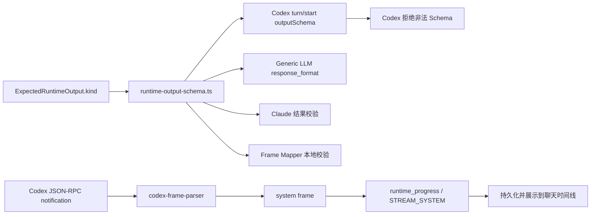
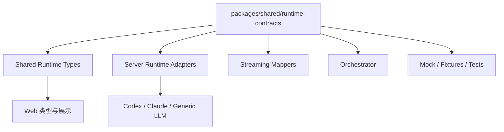

# Runtime 输出合约集中管理与严格结构化输出硬切换技术方案 v1

## 1. 结论

当前故障的根本原因可以归纳为：**Runtime 输出的 TypeScript 类型、发送给模型的 JSON Schema、运行时校验、流式结果转换和前端事件展示没有由同一个权威合约统一管理**。

本次看到的错误：

```text
Invalid schema for response_format 'codex_output_schema':
In context=('properties','kind'), schema must have a 'type' key.
```

不是前后端未启动，也不是模型随机断流。它表示系统发送给 Codex 的 JSON Schema 不符合 Strict Structured Outputs 约束。当前 `kind` 字段只生成了：

```json
{ "const": "agent_message" }
```

而严格模式要求该节点至少明确为：

```json
{ "type": "string", "const": "agent_message" }
```

错误中的 `type` 来自 JSON Schema 规范，不是业务代码中凭空出现的 TypeScript `type`。

此外，`thread/started`、`mcpServer/startupStatus/updated`、`remoteControl/status/changed` 等内容是 Codex app-server 的内部协议通知。当前解析器把未知通知统一转换成可见的 `runtime_progress`，导致内部协议方法名被展示在聊天时间线。这与结构化输出 Schema 故障是两个不同问题，但都属于 Runtime 边界合约不清晰造成的表现。

建议采用以下根治方案：

1. 在 `packages/shared` 建立唯一权威的 Runtime 合约注册中心。
2. 由同一份声明同时生成 TypeScript 类型、JSON Schema、示例和校验器。
3. 所有 Runtime、Mapper、Orchestrator、Mock 和测试只通过注册中心取得合约。
4. 按 Strict Structured Outputs 规则重建七类输出合约。
5. 内部协议通知进入 Debug/Audit，不再默认进入用户时间线。
6. 不兼容旧 Runtime 输出和旧持久化数据，启用新的 schema version 与 data epoch。

## 2. 问题边界

### 2.1 `spawn EPERM` 与当前 Schema 错误不是同一个问题

| 问题 | 所在阶段 | 含义 | 是否由输出合约导致 |
| --- | --- | --- | --- |
| `spawn EPERM` | 启动 Codex 子进程 | Windows 进程创建权限、shell 或启动参数问题 | 否 |
| `Invalid schema ... must have a 'type' key` | `turn/start` 提交输出 Schema | JSON Schema 不满足 Codex 严格模式 | 是 |
| 页面显示 `thread/started` 等方法名 | 流式通知解析与事件展示 | 内部协议通知被误映射为用户可见事件 | 间接相关，属于事件合约问题 |

修复进程启动只能让请求继续执行，不能修复错误的输出 Schema。Schema 问题必须在合约生成和调用前校验层解决。

### 2.2 当前实现中的直接缺陷

当前权威实现集中在：

```text
apps/server/src/modules/runtimes/runtime-output-schema.ts
```

主要缺陷包括：

- `kind` 使用 `const`，但没有声明 `type: "string"`。
- 多个枚举只提供 `enum`，没有显式声明 `type`。
- 存在 `additionalProperties: true` 的任意对象。
- 大量字段在 TypeScript 中是可选字段，Schema 中也没有全部加入 `required`。
- `RuntimeArtifactMetadata` 使用 `Record<string, unknown>`，模型可以输出未定义字段。
- `requestedContext`、`handoffSuggestion`、`suggestedTasks` 等嵌套对象没有完整严格 Schema。
- AJV 使用 `strict: false`，本地校验比上游 Codex 宽松，导致错误直到远端调用时才暴露。
- TypeScript 类型、JSON Schema、示例和 Mapper 默认值分别维护，容易发生漂移。

### 2.3 当前影响链路



因此只修改一个报错字段虽然可以解除当前阻塞，但不能防止下一个嵌套对象、枚举、可选字段或 `additionalProperties` 再次触发严格模式错误。

## 3. 目标与非目标

### 3.1 目标

- 建立 Runtime 输出合约的唯一事实来源。
- 七类 Runtime 输出都能通过 Codex Strict Structured Outputs 校验。
- 编译期类型与运行时 Schema 永不手工双写。
- Runtime 启动前即可发现非法合约，禁止把错误推迟到真实请求。
- 所有 Runtime Provider 使用相同的输出语义。
- 所有模型可写元数据使用明确白名单。
- 内部协议通知、用户可见进度和真实错误具有清晰分类。
- 使用新版本合约和新 data epoch，旧数据不参与新系统运行。
- 通过针对性测试和全量回归证明不会影响无关功能。

### 3.2 非目标

- 不新增合约管理后台页面。
- 不新增用于人工编辑 Schema 的数据库表。
- 不允许运行时动态上传任意 Schema。
- 不兼容、转换或自动迁移旧 Runtime 输出。
- 不自动删除旧数据；旧数据只是不再由新系统加载。
- 不改变 Agent、Workflow、Workspace Provider 的业务职责。

## 4. 核心设计原则

1. **单一权威来源**：类型、Schema、示例、版本和校验器来自同一份声明。
2. **默认拒绝**：未知 kind、未知字段、错误字段类型和缺失字段全部拒绝。
3. **显式可空**：业务上可选的字段仍必须出现，通过 `null` 表示无值。
4. **数组不缺省**：集合字段必须出现，无数据时返回 `[]`。
5. **对象封闭**：每一层对象都设置 `additionalProperties: false`。
6. **Provider 无关**：Codex、Claude、Generic LLM 和 Mock 共享同一合约。
7. **协议与产品事件隔离**：Provider 内部通知默认不可见。
8. **平台证据权威**：模型只能提出结果，不能伪造平台已验证的文件变更、测试和审计事实。
9. **硬切换**：新代码只处理新合约，不保留旧分支和静默修复逻辑。

## 5. 目标架构

### 5.1 模块位置

新增共享模块：

```text
packages/shared/src/runtime-contracts/
├── contract-types.ts
├── schema-primitives.ts
├── artifact-contracts.ts
├── output-contracts.ts
├── event-policy.ts
├── registry.ts
├── preflight.ts
└── index.ts
```

建议使用 TypeBox 作为声明源，AJV 作为运行时校验器：

- TypeBox 负责从 Schema 声明推导 TypeScript 类型。
- AJV 负责进程内编译和校验 JSON 数据。
- 注册中心负责版本、Schema、示例、hash 和 validator 的统一访问。
- Strict Schema Preflight 负责验证 Schema 本身是否符合上游严格模式约束。

### 5.2 依赖方向



约束：

- `packages/shared` 不依赖 `apps/server` 或 `apps/web`。
- Server 和 Web 只能消费共享合约，不能重新定义同名 Schema。
- Provider Adapter 不能私自修正、放宽或扩展输出结构。
- Mapper 不能使用默认值把非法响应静默改造成合法响应。

## 6. 合约注册中心

### 6.1 合约标识

每份合约使用稳定标识：

```text
runtime.output.agent_message@1.0
runtime.output.task_acceptance_decision@1.0
runtime.output.task_brief@1.0
runtime.output.task_execution_result@1.0
runtime.output.post_review_report@1.0
runtime.output.final_delivery@1.0
runtime.output.user_message_handling_plan@1.0
```

### 6.2 注册项

```ts
export type RuntimeContractDefinition<T> = {
  contractId: string;
  version: '1.0';
  kind: RuntimeOutputKind;
  schema: TSchema;
  schemaHash: string;
  example: T;
  validate(value: unknown): ContractValidationResult<T>;
};
```

### 6.3 对外接口

```ts
getRuntimeOutputContract(kind: RuntimeOutputKind): RuntimeContractDefinition<RuntimeOutput>;
listRuntimeOutputContracts(): readonly RuntimeContractDefinition<RuntimeOutput>[];
validateRuntimeOutput(kind: RuntimeOutputKind, value: unknown): ContractValidationResult<RuntimeOutput>;
assertRuntimeContractsReady(): void;
```

调用方不得直接读取内部 Schema Map，也不得在 Adapter 内复制 Schema。

### 6.4 Schema Hash

对规范化后的 JSON Schema 计算稳定 hash，并记录到每次 invocation 的 Debug/Audit 数据：

```ts
type RuntimeContractAudit = {
  contractId: string;
  contractVersion: '1.0';
  schemaHash: string;
};
```

它用于确认某次调用实际使用了哪一份合约，而不是用于兼容旧数据。

## 7. Strict Structured Outputs 规则

所有输出合约必须满足：

- 根节点和每一个嵌套对象都显式声明 `type: "object"`。
- 所有对象都设置 `additionalProperties: false`。
- `properties` 中的所有字段都出现在同层 `required` 中。
- 可选语义使用 `null` 联合类型，而不是省略字段。
- 枚举同时声明基础类型，例如 `type: "string"` 与 `enum`。
- 常量同时声明基础类型，例如 `type: "string"` 与 `const`。
- 数组必须声明 `type: "array"` 和 `items`。
- 不允许未约束的 `object`、`Record<string, unknown>` 或任意 metadata。
- 不依赖运行时默认值补齐模型缺失字段。

参考：

- [OpenAI Function Calling - Strict mode](https://developers.openai.com/api/docs/guides/function-calling#strict-mode)
- [OpenAI Structured Outputs](https://developers.openai.com/api/docs/guides/structured-outputs)

### 7.1 正确的通用头部

七类输出统一包含：

```json
{
  "schemaVersion": "1.0",
  "kind": "agent_message"
}
```

对应 Schema：

```json
{
  "type": "object",
  "additionalProperties": false,
  "properties": {
    "schemaVersion": { "type": "string", "const": "1.0" },
    "kind": { "type": "string", "const": "agent_message" }
  },
  "required": ["schemaVersion", "kind"]
}
```

## 8. 七类输出合约

| kind | 使用阶段 | 关键字段 | 主要消费者 |
| --- | --- | --- | --- |
| `agent_message` | 讨论、回答、交接、进度 | `messageKind`、`content`、目标与关联 ID 数组 | Orchestrator、聊天时间线 |
| `task_acceptance_decision` | 任务接收 | `status`、`reason`、缺失上下文、交接建议 | Orchestrator、任务状态机 |
| `task_brief` | Brief 生成/修订 | `goal`、范围、约束、验收标准、建议任务 | Orchestrator、任务拆解 |
| `task_execution_result` | 任务执行 | `status`、`summary`、完成项、Artifact、风险 | Orchestrator、Artifact、Review |
| `post_review_report` | 执行后审查 | 一致性、匹配项、缺失项、测试、建议、动作 | Review 流程、Coordinator |
| `final_delivery` | 最终交付 | 总结、完成/未完成项、风险、Artifact 引用 | 会话交付、前端展示 |
| `user_message_handling_plan` | 用户消息路由 | 意图、优先级、暂停/修订/确认决策 | Coordinator、会话控制 |

### 8.1 字段规范

- 所有输出新增必填 `schemaVersion: "1.0"`。
- 原 `targetAgentIds?: string[]` 改为 `targetAgentIds: string[]`。
- 原 `requestedContext?: RuntimeContextRequest` 改为 `requestedContext: RuntimeContextRequest | null`。
- 原 `handoffSuggestion?: HandoffSuggestion | null` 改为 `handoffSuggestion: HandoffSuggestion | null`。
- 原 `confidence?: number` 改为 `confidence: number | null`，并限定为 `0..1`。
- 原 `actions?: PostReviewAction[]` 改为 `actions: PostReviewAction[]`。
- 所有嵌套对象继续使用相同的“必填 + 显式 null + 封闭对象”规则。

### 8.2 `agent_message` 示例

```json
{
  "schemaVersion": "1.0",
  "kind": "agent_message",
  "messageKind": "summary",
  "content": "已完成问题分析。",
  "targetAgentIds": [],
  "targetAgentKeys": [],
  "mentionedAgentIds": [],
  "relatedTaskIds": []
}
```

### 8.3 禁止静默兼容

以下输入在新系统中必须直接校验失败：

- 缺少 `schemaVersion`。
- `schemaVersion` 为 `0.1`。
- 缺少必填数组并期待 Mapper 自动补 `[]`。
- 使用旧 Artifact 类型别名。
- metadata 包含未声明字段。
- `kind` 与 invocation 的 `expectedOutput.kind` 不一致。

## 9. Artifact 元数据边界

### 9.1 当前风险

当前类型：

```ts
type RuntimeArtifactMetadata = Record<string, unknown> & { ... };
```

该结构无法形成严格 Schema，也混合了三类来源和生命周期不同的数据：

1. 模型生成的提议和说明。
2. 平台按阶段生成、尚待写入或确认的文件投影。
3. 平台从文件系统、测试执行和审计过程得到的权威证据。

### 9.2 新边界

拆分为：

```ts
type RuntimeArtifactProposal = {
  type: ArtifactType;
  title: string;
  content: string;
  uri: string | null;
  summary: string | null;
  metadata: RuntimeArtifactProposalMetadata;
};

type RuntimeArtifactProposalMetadata = {
  fileChanges: RuntimeFileChange[];
  validationEvidence: ValidationEvidenceReport | null;
  summaryMemoryCheckpoint: SummaryMemoryCheckpoint | null;
};

type RuntimeArtifactSystemEvidence = {
  workspaceChangeSet: WorkspaceChangeSet | null;
  verifiedTestResults: VerifiedTestResult[];
  capturedAt: string;
  invocationId: string;
};

type Artifact = {
  metadata: ArtifactMetadata; // 仅保留 phase 等平台业务元数据
  runtimeProposals: RuntimeArtifactProposal[];
  platformProjections: RuntimeFileChange[];
  systemEvidence: RuntimeArtifactSystemEvidence | null;
};
```

约束：

- 模型只能写 `RuntimeArtifactProposalMetadata` 白名单字段。
- `platformProjections` 只由 Brief、Review、Final Delivery 等平台阶段生成器写入，表示“计划应用”，不得标记为已观测证据。
- `WorkspaceChangeSet` 由平台扫描真实工作区后产生，不接受模型声明。
- 测试是否真实执行由平台证据确定，不能只依赖模型文本。
- Artifact 顶层不再存在含义模糊的 `fileChanges`、`metadata.output`、`metadata.fileChanges` 或 `metadata.validationEvidence`。
- 前端分别展示“平台生成的待写入文件”和“平台观测的文件变更”；diff 证据只能读取 `systemEvidence`。
- 本地写入队列可以消费平台投影和系统观测变更，但必须保留来源；同一路径冲突时系统观测结果优先。

## 10. Runtime 通知与事件分类

### 10.1 分类结果

Provider 原始帧先被归类，再决定是否生成产品事件：

| 分类 | 示例 | 产品行为 |
| --- | --- | --- |
| 用户可见内容 | `item/agentMessage/delta` | 转换为 `runtime_progress` |
| 工具调用 | `item/started`、`item/completed` 的工具项 | 转换为 `tool_called` / `tool_completed` |
| 最终结果 | `turn/completed` | 进入结构化结果解析，不单独显示协议名 |
| Usage | `thread/tokenUsage/updated` | 更新 usage，不进入聊天时间线 |
| 内部生命周期 | `thread/started` | 仅 Debug/Audit |
| MCP 启动状态 | `mcpServer/startupStatus/updated` | 仅 Debug/Audit；不得覆盖 `turn/completed` 终态，真实工具失败由工具结果或 turn 失败表达 |
| Remote Control 状态 | `remoteControl/status/changed` | 仅 Debug/Audit |
| 未知通知 | 任意未知 method | 仅 Debug/Audit，并记录计数 |
| stderr | CLI 标准错误输出 | 默认 Debug；确认是错误后转换为结构化 RuntimeError |

### 10.2 新策略接口

```ts
type RuntimeNotificationDisposition =
  | 'user_progress'
  | 'tool_event'
  | 'result'
  | 'usage'
  | 'debug_only'
  | 'runtime_error';

class RuntimeNotificationPolicy {
  classify(provider: RuntimeProvider, method: string, payload: unknown): RuntimeNotificationDisposition;
}
```

默认策略为 `debug_only`，只有明确允许的协议方法可以进入用户时间线。

### 10.3 前端防线

即使 Server 误传，Web 端也不得把以下事件直接作为聊天文本展示：

- `metadata.code === "STREAM_SYSTEM"`
- `visibility === "debug"`
- 仅包含 Provider method 名而无用户语义的事件

Server 过滤是主防线，Web 过滤是防御性边界，不能只修前端隐藏。

## 11. 新数据规范与硬切换

用户已明确不兼容旧数据，因此采用单轨硬切换：

- Runtime output `schemaVersion` 从 `0.1` 切换为 `1.0`。
- 系统 `dataSchemaVersion` 升级到新版本，建议从当前 `2` 升为 `3`。
- 切换时生成新的 `dataEpoch`。
- 新进程只加载 `dataSchemaVersion: 3` 且 `dataEpoch` 与当前 epoch 完全一致的数据。
- 旧 session、queue、invocation、artifact 和 runtime result 不做读取兼容。
- 不进行字段补齐、旧 kind 转换或 metadata 清洗。
- 旧数据保留在原存储或只读归档中，便于人工回滚和审计，但不进入新主链路。

### 11.1 启动门禁

启动时依次检查：

1. 所有 Runtime 合约已成功注册。
2. 所有 Schema 通过 Strict Schema Preflight。
3. Schema hash 可稳定计算。
4. 持久化 metadata 的 `dataSchemaVersion` 正确。
5. 当前 `dataEpoch` 可用。

任一失败都应阻止 Runtime 接受新任务，并返回明确的启动错误，禁止带病运行。

## 12. 可执行实施方案

### 阶段 A：建立合约基础设施

新增：

```text
packages/shared/src/runtime-contracts/*
```

工作项：

1. 建立严格 Schema primitives。
2. 定义七类 TypeBox Schema。
3. 从 Schema 推导 RuntimeOutput 类型。
4. 建立注册中心、Schema hash、示例和 AJV validator。
5. 实现 Strict Schema Preflight。
6. 从 `packages/shared/src/index.ts` 统一导出。

验收：七类 Schema 均可独立编译、示例均通过校验、非法 Schema fixture 会在 preflight 中失败。

### 阶段 B：切换共享类型

修改：

```text
packages/shared/src/contracts.ts
packages/shared/src/index.ts
```

工作项：

1. `ExpectedRuntimeOutput.schemaVersion` 改为 `1.0`。
2. RuntimeOutput 改为从 Schema 推导的联合类型。
3. 移除 Runtime output 中的可选字段语义。
4. 移除模型可写 metadata 的开放索引签名。
5. 将 Artifact 拆分为 runtime proposal、platform projection 与 system evidence 三个域。

验收：TypeScript 编译错误能够准确列出所有仍在生产旧结构的调用方。

### 阶段 C：切换所有 Runtime Provider

修改范围：

```text
apps/server/src/modules/runtimes/runtime-output-schema.ts
apps/server/src/modules/runtimes/codex-runtime-adapter.service.ts
apps/server/src/modules/runtimes/generic-llm-runtime.service.ts
apps/server/src/modules/runtimes/claude-code-runtime-adapter.service.ts
apps/server/src/modules/runtimes/mock-runtime.service.ts
apps/server/src/modules/runtimes/streaming/codex-streaming-runner.ts
apps/server/src/modules/runtimes/streaming/claude-streaming-runner.ts
apps/server/src/modules/runtimes/streaming/frame-to-output.mapper.ts
```

工作项：

1. 原 `runtime-output-schema.ts` 降级为注册中心的兼容门面，随后删除手写 Schema。
2. Codex `turn/start` 从注册中心取得 Schema。
3. Generic LLM `response_format`、repair prompt 和本地校验使用同一注册项。
4. Claude 最终结果使用同一 validator。
5. Mock 直接使用注册中心 example 或严格 fixture。
6. Mapper 删除默认补字段和旧 Artifact 类型归一化。
7. 校验失败返回统一 `RUNTIME_OUTPUT_CONTRACT_VIOLATION`。

验收：同一非法输出在所有 Provider 上得到一致错误，同一合法 fixture 在所有 Provider 上通过。

### 阶段 D：修复事件可见性

修改范围：

```text
apps/server/src/modules/runtimes/streaming/codex-frame-parser.ts
apps/server/src/modules/runtimes/streaming/frame-to-runtime-event.ts
apps/server/src/modules/orchestrator/runtime-stream-consumer.ts
apps/web/src/stores/event.ts
apps/web/src/components/ChatTimeline.vue
```

工作项：

1. 增加通知分类策略。
2. 未知和内部通知记录到 Debug/Audit，不生成普通 `runtime_progress`。
3. MCP、turn 和 CLI 失败转换为结构化 RuntimeError。
4. Web 根据 visibility/code 做防御性过滤。
5. DebugRuntimeView 保留查看原始协议通知的能力。

验收：聊天时间线不再出现协议方法名；Debug 视图仍可追踪原始通知。

### 阶段 E：启用新 data epoch

修改范围：

```text
packages/shared/src/contracts.ts
apps/server/src/modules/persistence/*
apps/server/src/modules/queue/*
apps/server/src/modules/recovery/*
```

工作项：

1. 升级 `dataSchemaVersion`。
2. 生成新 `dataEpoch`。
3. 启动门禁只允许新 epoch。
4. 新队列任务、Session、Invocation 和 Artifact 全部写入新 epoch。
5. 恢复服务拒绝恢复旧 epoch 的执行。
6. 保留旧存储，不自动删除。

验收：旧数据不可见、新数据可正常创建和恢复、跨 epoch 任务被明确拒绝。

### 阶段 F：文档与运行手册

需要同步：

- `docs/contracts/runtime-contract-v0.1.md`：发布新的 Runtime Contract 版本文档。
- `docs/contracts/event-contract-v0.1.md`：补充 visibility 和 Debug-only 语义。
- `docs/contracts/data-contract-v0.1.md`：记录新的 data schema 与 epoch。
- `docs/devops/local-development.md`：补充 cutover 和启动 preflight 操作。

## 13. 影响范围评估

### 13.1 总体影响等级

| 领域 | 影响等级 | 原因 |
| --- | --- | --- |
| Shared Runtime 类型 | 高 | 七类输出和 metadata 都是跨模块公共类型 |
| Codex Runtime | 高 | Schema 直接进入 `turn/start` |
| Generic LLM | 高 | 使用相同 Schema、repair 和校验 |
| Claude Runtime | 中高 | 主要影响最终结果校验和 Mapper |
| Mock/Test Runtime | 中 | fixture 必须补齐新字段 |
| Orchestrator | 中高 | 消费所有 RuntimeOutput kind |
| Artifact | 高 | metadata 信任边界和三域持久化结构变化 |
| Persistence/Recovery/Queue | 高 | 启用新 data schema 与 epoch |
| Web 聊天时间线 | 中 | 事件过滤；待写入投影与观测变更分开展示 |
| Agent/Profile/Skill/Tool | 低 | 不改变其业务合约，仅受 TypeScript 联动检查 |
| Workspace Broker/Worktree | 中 | 写入队列消费投影/观测变更，authoritative ChangeSet 仍只来自系统证据 |
| Workflow | 中 | 节点期望输出版本需要同步为 `1.0` |

### 13.2 预期不会改变的功能

- Runtime 路由选择逻辑。
- Agent Profile、Skill、Tool 的配置方式。
- Workspace Provider 的读写授权模型。
- Managed worktree 和 browser mirror 的隔离机制。
- 用户确认后应用 ChangeSet 的流程。
- Token 预算、Context Pipeline 和 Prompt 编排的业务语义。
- 前端普通用户消息、任务卡片和 Artifact 下载行为。

这些模块仍需参加回归测试，但不应为了合约改造而重写。

### 13.3 破坏性变化

以下变化是有意且已确认的：

- `schemaVersion: "0.1"` 输出全部失效。
- 缺字段但可由旧 Mapper 补齐的输出全部失效。
- 开放 metadata 字段全部失效。
- 旧持久化数据不再加载。
- 旧测试 fixture 必须按新合约重写。

## 14. 测试与评测方案

### 14.1 Schema 单元测试

每个 kind 至少覆盖：

- 官方 example 校验成功。
- 缺少任一必填字段失败。
- 多出任意未知字段失败。
- `kind` 不匹配失败。
- `schemaVersion` 不为 `1.0` 失败。
- 可空字段缺失失败、值为 `null` 成功。
- 嵌套对象出现额外字段失败。
- enum、number range、数组 item 类型错误失败。

### 14.2 Preflight 测试

构造以下非法 Schema，确认系统启动前拒绝：

- `const` 无 `type`。
- `enum` 无 `type`。
- 对象缺少 `additionalProperties: false`。
- `properties` 中字段未全部列入 `required`。
- 任意开放对象。
- 不受支持的 Schema 关键字。

### 14.3 Provider 一致性测试

对 Codex、Claude、Generic LLM、Mock 使用同一组 golden fixtures：

```text
valid-agent-message.json
valid-task-acceptance-decision.json
valid-task-brief.json
valid-task-execution-result.json
valid-post-review-report.json
valid-final-delivery.json
valid-user-message-handling-plan.json
invalid-extra-property.json
invalid-missing-required.json
invalid-version.json
```

### 14.4 事件测试

- `thread/started` 不生成用户可见事件。
- `mcpServer/startupStatus/updated` 成功状态仅进入 Debug。
- MCP 启动失败保留为结构化诊断；不得单独把已完成的 turn 改判为 RuntimeError。
- `remoteControl/status/changed` 不进入聊天时间线。
- 未知 method 被计数和审计，但不展示。
- assistant delta、tool call、tool result 仍按原业务语义展示。

### 14.5 数据隔离测试

- 新进程拒绝旧 `dataSchemaVersion`。
- 新进程拒绝不同 `dataEpoch` 的 Session 和 Queue Job。
- Recovery 不恢复旧 epoch invocation。
- 旧存储文件仍存在且未被删除。
- 新 epoch 的 Session 创建、执行、重启恢复正常。

### 14.6 回归验证命令

按风险从小到大执行：

```bash
npm run typecheck
npm run test
npm run test:harness
npm run build
```

还需执行：

- Runtime contract 针对性单测。
- Codex streaming stub E2E。
- Generic LLM response shape E2E。
- Claude streaming stub E2E。
- Session/Queue/Recovery data epoch E2E。
- 真实 Codex 最小调用，确认 `turn/start` 接受 Schema。
- 浏览器手工检查聊天时间线与 DebugRuntimeView。

真实 Codex 验收必须证明：

1. 不再出现 `schema must have a 'type' key`。
2. 七类输出至少各完成一次 Schema 提交或 contract fixture 验证。
3. 最终结果通过本地同源 validator。
4. 内部 JSON-RPC method 不出现在用户聊天时间线。

### 14.7 必须拒绝的旁路反例

除字段级 Schema fixture 外，还必须验证以下输入无法通过本地解析器：

- Markdown fence 包裹的 JSON。
- JSON 前后带解释性文本。
- JSON 字符串内含裸换行、制表符或其他控制字符。
- Codex buffered 输出使用 `result`、`output`、`final_output` 字符串包装。
- 旧 `agent.text_delta`、`tool.called`、`tool.completed`、`run.completed` 通知方法。
- 仅存在于 `runtimeProposals.metadata.fileChanges`、但未出现在 `systemEvidence.workspaceChangeSet` 的文件变更。
- Artifact 顶层或事件 payload 使用旧的含义模糊 `fileChanges` 字段。
- 缺少必填 `platformProjections` 域的持久化 Artifact。
- `contractId` 或 `schemaHash` 与当前注册中心不一致的持久化 RuntimeInvocation。

模型重新生成是一条新的 Provider 调用，只能在原始结果已经被判定为无效后发生并记录次数；本地不得修改原始文本再把它当作合法结果。

## 15. 发布与回滚

### 15.1 发布步骤

1. 停止接收新任务并等待运行中 invocation 结束或明确终止。
2. 备份当前持久化数据和运行配置。
3. 部署包含新合约的完整版本，不允许新旧 Server 混跑。
4. 执行 Contract Preflight。
5. 创建新的 data epoch。
6. 启动 Server，检查启动门禁、contract hash 和 persistence metadata。
7. 执行最小 Runtime 冒烟测试。
8. 启动 Web 并验证事件展示。
9. 恢复对外任务入口。

### 15.2 回滚边界

由于不做旧数据兼容，回滚以“完整版本 + 对应数据快照”为单位：

- 新版本失败时，停止新版本。
- 恢复旧版本代码和切换前数据快照。
- 不让旧版本读取新 epoch 数据。
- 不把新 epoch 数据反向转换给旧版本。
- 不自动删除新旧任一侧数据，待问题确认后人工处理。

## 16. 主要风险与缓解

| 风险 | 表现 | 缓解措施 |
| --- | --- | --- |
| Strict Schema 仍含不支持结构 | 真实 Codex 拒绝请求 | 本地 Preflight + 官方严格模式规则测试 + 真实最小调用 |
| 类型切换遗漏生产者 | TypeScript 或运行时校验失败 | 从共享类型开始硬切换，用编译错误清点全部生产者 |
| Mapper 继续静默补值 | 非法输出被掩盖 | 删除默认补字段，统一返回 contract violation |
| Artifact 信任边界混淆 | 模型伪造已验证变更或测试 | proposal 与 system evidence 分离 |
| 内部通知过滤过度 | 用户看不到真实错误 | Debug-only 与 RuntimeError 分开分类，失败必须结构化上报 |
| 新旧实例混跑 | 相同任务产生不同版本输出 | 发布期间禁止滚动混跑，启动时校验 contract version/hash |
| 新数据污染旧版本 | 回滚失败 | data epoch 完全隔离，版本和数据快照成对回滚 |
| 改造影响无关模块 | 功能回归 | 文件范围约束 + targeted tests + 全量 typecheck/test/harness/build |

## 17. 验收标准

- 七类 Runtime 输出均由共享注册中心提供。
- TypeScript 类型不再与 JSON Schema 手工双写。
- 所有对象节点均为封闭对象。
- 所有字段均必填，可选语义只用 `null`。
- `kind`、枚举和常量均有明确基础类型。
- Runtime 启动前完成全合约 Preflight。
- Invocation Debug 数据记录 contract id、version 和 schema hash。
- Codex、Claude、Generic LLM、Mock 使用同一合约。
- Mapper 不再兼容或修复旧输出。
- Artifact metadata 不再接受任意字段。
- 模型 proposal、平台待写入 projection 与平台 system evidence 已拆分。
- 所有 diff 证据、Artifact 卡片的“平台观测文件变更”和上下文文件变更引用只读取 `systemEvidence.workspaceChangeSet`。
- 平台阶段生成文件只进入 `platformProjections`，不冒充系统观测证据；前端单独标识并安全进入写入队列。
- 内部协议通知不进入用户聊天时间线。
- 真实 Provider 错误以结构化 RuntimeError 展示。
- RuntimeInvocation 启动门禁逐项校验当前 `contractId`、`contractVersion` 与 `schemaHash`。
- 新系统只读取新 data schema 和新 data epoch。
- 旧数据未删除，但不可被新系统加载。
- `npm run typecheck`、`npm run test`、`npm run test:harness`、`npm run build` 全部通过。
- 真实 Codex 最小验收不再出现 Schema 错误。

## 18. 最终决策记录

| 决策项 | 结论 |
| --- | --- |
| 是否单独建设合约管理 | 是，建设为内部共享代码模块 |
| 是否建设管理 UI/API/DB | 否 |
| 合约权威来源 | `packages/shared/src/runtime-contracts` |
| Schema 与类型是否双写 | 否，由同一声明生成 |
| 是否兼容旧输出 | 否 |
| 是否迁移旧数据 | 否 |
| 是否删除旧数据 | 否，保留但不加载 |
| 可选字段表达方式 | 字段必填，值使用 `null` |
| 数组无数据表达方式 | `[]` |
| metadata 策略 | 明确白名单、封闭对象 |
| 内部协议通知策略 | Debug/Audit only |
| 真实错误策略 | 结构化 RuntimeError |
| 发布方式 | 完整版本硬切换 + 新 data epoch |

## 19. 实施完成定义

本方案只有在“代码、合约、数据、事件展示和验证”五个方面全部闭环后才算根治。仅补充 `kind.type`、仅隐藏前端文字、仅重启后端，均只能解决局部现象，不能视为完成。
