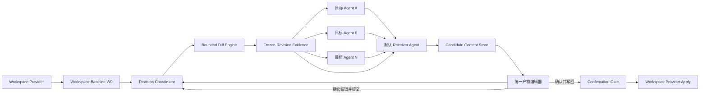
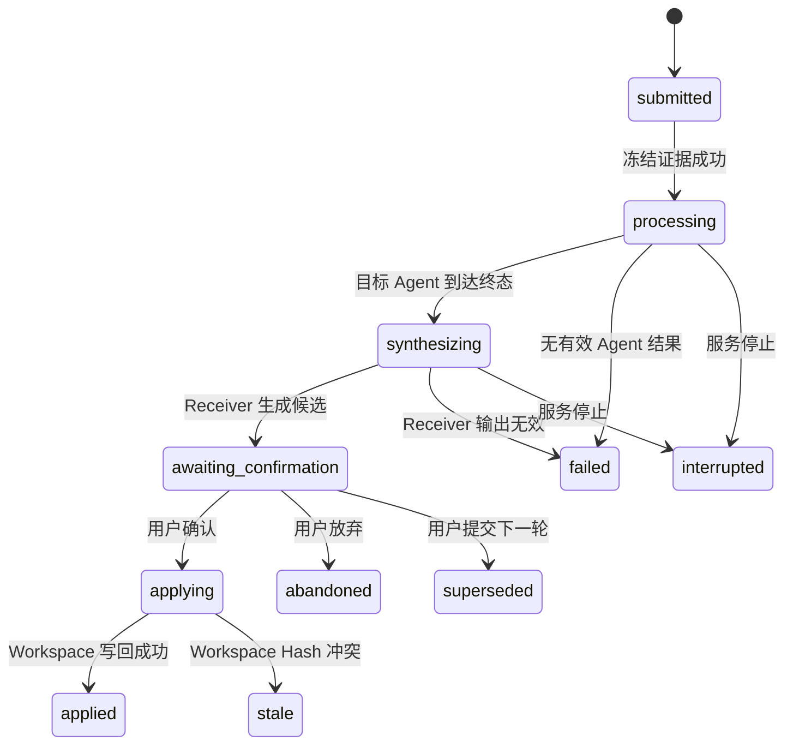
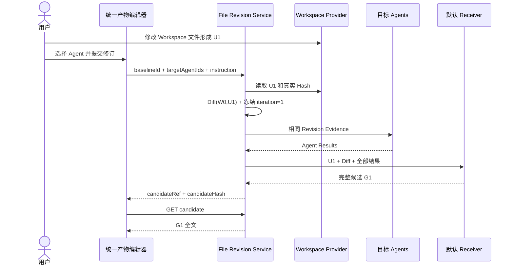
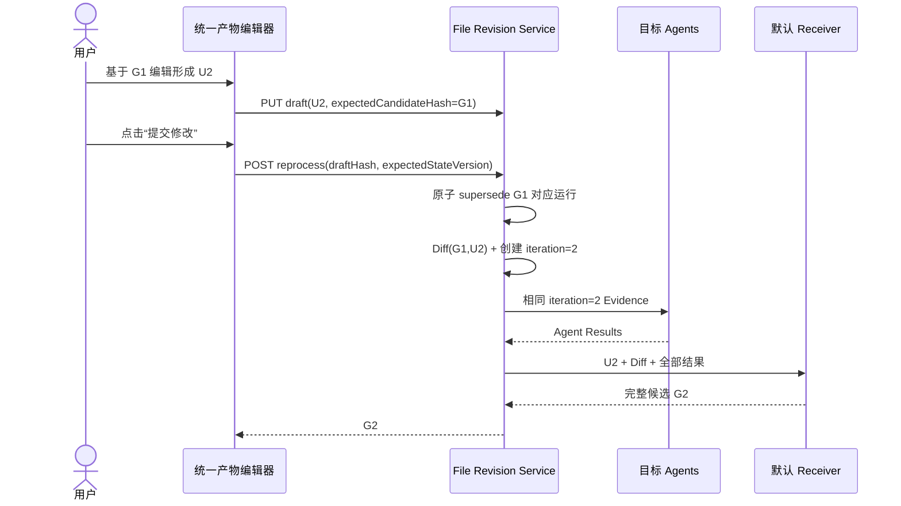

# 用户文件修订候选迭代系统开发设计 v2

状态：已实现，确定性主链路验收完成；真实 PostgreSQL 集成和付费 Runtime 为环境补充项  
日期：2026-07-29  
适用范围：File Revision、统一产物编辑器、Context Pipeline v2、Orchestrator、Receiver Agent、Workspace Provider、Persistence、Recovery

## 1. 文档定位

本文定义用户文件修订从一次性处理升级为候选版本迭代的目标设计和开发约束。

本文基于现有 `user-file-revision-multi-agent-processing-system-design-v1.md` 和当前代码实现，但修正以下产品语义：

1. Agent 形成最终候选后，业务界面只展示候选全文，不展示用户修改稿与候选之间的 Diff。
2. 用户可以在统一产物编辑器内继续修改候选；只有用户点击“提交修改”才启动下一轮 Agent。
3. 下一轮内部 Diff 的两端是“上一轮生成候选”和“用户当前修改稿”。
4. 默认 Receiver Agent 直接读取全部 Agent 结果并生成最终候选全文。
5. 候选和编辑草稿只保存在平台内容存储中；最终确认前不得写入 Workspace 原文件。

本文同时作为 v2 目标设计和实现验收基线。实现已落在 Shared Contract、File Revision、Orchestrator、Context v2、Session API、Persistence/Recovery 和 Web 候选编辑器；如果 v1 文档在候选展示、再次修订或 Receiver 汇总职责上冲突，以本文和活动合同为准。

## 2. 目标与验收标准

### 2.1 产品目标

系统必须让用户、一个或多个专业 Agent、默认 Receiver Agent 围绕同一个文件形成可重复迭代的修订闭环：

```text
Workspace 基线 W0
  -> 用户修改稿 U1
  -> 内部 Diff(W0, U1)
  -> 目标 Agent 处理
  -> Receiver 生成候选 G1
  -> 用户仅查看 G1
      -> 确认：G1 写回 Workspace
      -> 修改：形成 U2，内部 Diff(G1, U2)，进入下一轮
```

后续版本链表示为：

```text
W0 -> U1 -> G1 -> U2 -> G2 -> U3 -> G3 -> ... -> 用户确认 -> Workspace
```

其中：

- `W0`：开始修订前捕获的 Workspace 基线。
- `Un`：用户在第 n 轮提交的权威修改稿。
- `Gn`：Receiver 在第 n 轮生成的唯一最终候选。
- Diff 只用于内部上下文、审计和 Agent 理解，不在业务界面展示。

### 2.2 可验证目标

| 编号 | 目标 | 验收标准 |
| --- | --- | --- |
| G1 | 版本基线正确 | 第一轮 Diff 使用 `W0/U1`；第 n 轮使用 `G(n-1)/Un`。 |
| G2 | 用户修改权威 | 所有 Agent 明确把 `Un` 作为当前权威输入，不得无意恢复上一候选内容。 |
| G3 | 多 Agent 输入一致 | 同一轮所有目标 Agent 使用相同 `revisionId/iteration/baseHash/userDraftHash/diffHash`。 |
| G4 | Receiver 唯一候选 | 单 Agent 和多 Agent 都由默认 Receiver 生成唯一 `Gn`。 |
| G5 | UI 只展示候选 | 业务界面展示 `Gn` 全文，不展示 Diff hunks 或前后对比。 |
| G6 | 手动启动下一轮 | 编辑或保存草稿不启动 Agent；只有“提交修改”创建新一轮。 |
| G7 | 确认前零 Workspace 写入 | 目标 Agent、Receiver、Artifact 后处理和编辑器均不能改写 Workspace 原文件。 |
| G8 | 最终写回防冲突 | 写回时 Workspace 当前 Hash 必须等于版本链的 `workspaceExpectedHash`。 |
| G9 | 确认对象精确 | 确认、继续修改和放弃操作必须绑定确切的 `revisionId/confirmationId/candidateHash`。 |
| G10 | 可恢复和可审计 | 重启后能恢复编辑稿、待确认候选和版本链；每轮输入、结果和决策可追溯。 |

## 3. 已确认产品决策

本设计采用以下已确认决策：

| 决策 | 选择 | 设计含义 |
| --- | --- | --- |
| 候选承载方式 | 统一产物编辑器 | 候选成为当前工作稿，但确认前不写 Workspace。 |
| 下一轮触发方式 | 用户手动提交 | 草稿保存与 Agent 执行解耦。 |
| 汇总主体 | 默认 Receiver Agent | Receiver 直接读取全部结果并生成候选全文。 |
| Diff 展示 | 不展示 | Diff 只属于内部证据和审计数据。 |
| Agent 数量 | 单个或多个 | 两种情况使用同一状态机和 Receiver 汇总路径。 |

## 4. 范围与非目标

### 4.1 V2 范围

- 单条版本链处理一个 UTF-8 文本文件。
- 第一轮复用现有 Workspace 基线和文件读取能力。
- 后续轮次在统一产物编辑器内修改上一候选。
- 目标 Agent 并行处理同一份冻结证据。
- Receiver 直接生成唯一完整候选。
- 候选可以重复编辑和重新提交，不限制固定轮数。
- 最终确认后通过 Workspace Provider 原子写回。
- 支持 `server_local` 和 `local_bridge` Workspace Provider。
- 支持文件存储和 PostgreSQL 持久化后端。

### 4.2 非目标

- 不在业务界面展示 Diff、三方合并视图或版本树。
- 不支持多个用户实时协同编辑同一候选。
- 不允许 Agent 直接修改 Workspace 原文件。
- 不在 V2 首期支持一次修订跨多个文件的原子写回。
- 不把本功能抽象成通用 Git、文档管理或 Artifact 版本平台。
- 不让 LLM 负责计算权威 Diff、Hash 或冲突判断。
- 不允许基于截断正文生成整文件候选。

## 5. 实现基线与原始差距

### 5.1 可复用能力

| 能力 | 当前落点 | V2 处理 |
| --- | --- | --- |
| 基线捕获和内容 Hash | `apps/server/src/modules/file-revisions/file-revisions.service.ts` | 复用。 |
| 确定性行级 Diff | `apps/server/src/modules/file-revisions/file-revision-diff.ts` | 复用接口，替换为有界实现。 |
| Content Reference | `apps/server/src/modules/persistence/local-content-store.ts` | 复用保存基线、草稿和候选。 |
| Workspace 读取和 ChangeSet | `apps/server/src/modules/workspaces/` | 复用，保持唯一写入口。 |
| 多 Agent 任务执行 | `apps/server/src/modules/orchestrator/orchestrator.service.ts` | 复用 fan-out，重写汇总阶段。 |
| Context v2 修订证据 | `apps/server/src/modules/context-v2/` | 从一次性证据扩展为迭代证据。 |
| Session API 和事件 | `apps/server/src/modules/sessions/`、`events/` | 扩展版本链 API 和事件。 |
| 前端会话和确认卡 | `apps/web/src/stores/session.ts`、`SessionWorkspace.vue` | 增加候选编辑器并修正确认路由。 |

### 5.2 实施前差距（现均已关闭）

1. 当前 `FileRevisionRun` 是一次性运行，没有 `chainId/iteration/parentRevisionId`。
2. 当前 `awaiting_confirmation` 阻止用户创建下一轮。
3. 当前前端无法读取和展示候选全文。
4. 当前多 Agent 汇总由第一个成功的专业 Agent 执行，不是 Receiver。
5. 当前上下文可能截断正文后仍要求返回完整文件。
6. 当前 `proposal_only` 不是接单、执行、Artifact 后处理全链路不变量。
7. 当前确认值只有 TypeScript 类型约束，没有运行时白名单。
8. 当前确认和状态迁移缺少 revision 级原子 CAS。
9. 当前持久化、恢复和前端 Session 隔离不足以支持连续版本链。

## 6. 架构约束与系统不变量

### 6.1 允许修改范围

- `packages/shared/src/contracts.ts`
- `packages/shared/src/runtime-contracts/`
- `packages/shared/src/default-agent-presets.ts`
- `apps/server/src/modules/file-revisions/`
- `apps/server/src/modules/sessions/`
- `apps/server/src/modules/orchestrator/`
- `apps/server/src/modules/context-v2/`
- `apps/server/src/modules/runtime-routing/`
- `apps/server/src/modules/persistence/`
- `apps/server/src/modules/recovery/`
- `apps/web/src/components/`
- `apps/web/src/stores/`
- `apps/web/src/types/`
- `docs/contracts/`、`docs/quality/`、`docs/design/`

### 6.2 禁止范围漂移

- 不新增通用版本控制产品模块。
- 不修改普通任务的 Receiver 职责；只增加 `revision_synthesis` 受限例外。
- 不为实现本功能开放 Receiver 的通用文件写入或命令能力。
- 不把候选正文写入事件 metadata。
- 不绕过 Workspace Provider 直接写文件。

### 6.3 强制不变量

```text
I1: 一个 chain 同一时刻最多有一个 latestRevision。
I2: 一个 revision 最多有一个可应用 candidate。
I3: 只有 latestRevision 的 awaiting_confirmation candidate 可以应用。
I4: 用户提交下一轮后，上一轮必须原子进入 superseded。
I5: candidateHash 必须对应用户实际看到的候选正文。
I6: 最终写回必须同时校验 confirmationId、candidateHash 和 workspaceExpectedHash。
I7: proposal_only 必须覆盖接单、执行和平台后处理。
I8: 任何 incomplete/truncated revision evidence 都不能进入候选生成。
I9: Diff 不进入业务 UI。
I10: 写回成功不能被后置基线捕获失败伪装成写回失败。
```

## 7. 总体架构



### 7.1 模块职责

| 模块 | 职责 |
| --- | --- |
| File Revision Service | 管理版本链、冻结用户稿、生成 Diff、维护状态和 CAS。 |
| Revision Coordinator | 驱动 fan-out、等待所有目标 Agent、调用 Receiver、发布候选。 |
| Target Agents | 基于同一轮权威用户稿提出独立处理结果。 |
| Receiver Agent | 读取全部 Agent 结果和修订证据，直接生成唯一候选全文。 |
| Context v2 | 为目标 Agent 和 Receiver 编译完整、可验证的修订证据。 |
| Candidate Editor | 展示和编辑最新候选，保存草稿，手动提交下一轮。 |
| Confirmation Gate | 校验确认对象和 Workspace Hash，触发唯一真实写入。 |
| Persistence/Recovery | 持久化版本链、编辑草稿、运行状态和副作用账本。 |

## 8. 领域模型

### 8.1 版本链头

`FileRevisionChain` 是本功能内部的轻量链头，不是通用版本管理实体。

```ts
type FileRevisionChainStatus =
  | 'active'
  | 'applying'
  | 'applied'
  | 'abandoned'
  | 'stale'
  | 'failed';

type FileRevisionChain = {
  id: UUID;
  dataEpoch: UUID;
  sessionId: UUID;
  workspaceId: string;
  filePath: string;
  rootBaselineId: UUID;
  workspaceExpectedRevision: WorkspaceRevision;
  workspaceExpectedHash: FileHash;
  latestRevisionId: UUID;
  latestIteration: number;
  stateVersion: number;
  status: FileRevisionChainStatus;
  createdAt: ISODateTime;
  updatedAt: ISODateTime;
  completedAt?: ISODateTime;
};
```

`stateVersion` 用于 CAS。任何提交下一轮、确认、放弃或恢复操作必须带 `expectedStateVersion`。

### 8.2 单轮修订

```ts
type FileRevisionRunStatus =
  | 'submitted'
  | 'processing'
  | 'synthesizing'
  | 'awaiting_confirmation'
  | 'superseded'
  | 'applying'
  | 'applied'
  | 'abandoned'
  | 'stale'
  | 'failed'
  | 'interrupted';

type FileRevisionRun = {
  id: UUID;
  chainId: UUID;
  dataEpoch: UUID;
  sessionId: UUID;
  iteration: number;
  parentRevisionId?: UUID;

  baseKind: 'workspace_baseline' | 'previous_candidate';
  baseContentRef: string;
  baseHash: FileHash;
  userDraftContentRef: string;
  userDraftHash: FileHash;
  userDraftSizeBytes: number;
  diffContentRef: string;
  diffHash: FileHash;
  diffSummary: FileRevisionDiffSummary;

  targetAgentIds: UUID[];
  instruction?: string;
  contextSnapshotHash: string;
  agentResults: FileRevisionAgentResult[];

  candidateContentRef?: string;
  candidateHash?: FileHash;
  candidateSizeBytes?: number;
  receiverInvocationId?: UUID;
  confirmationId?: UUID;

  status: FileRevisionRunStatus;
  errorCode?: string;
  errorMessage?: string;
  createdAt: ISODateTime;
  updatedAt: ISODateTime;
  completedAt?: ISODateTime;
};
```

### 8.3 编辑器草稿

编辑器草稿属于平台内部状态，不是 Workspace 真源，也不会触发 Agent。

```ts
type FileRevisionEditorDraft = {
  chainId: UUID;
  sourceRevisionId: UUID;
  sourceCandidateHash: FileHash;
  contentRef: string;
  contentHash: FileHash;
  sizeBytes: number;
  updatedBy: ActorRef;
  updatedAt: ISODateTime;
};
```

草稿保存可以防止刷新丢失，但只有显式 `reprocess` 才能冻结草稿并创建下一轮。

### 8.4 Receiver 输出合同

新增严格 Runtime 输出类型，不复用任意 `task_execution_result.changedArtifacts` 作为候选来源。

```ts
type FileRevisionCandidateOutput = {
  schemaVersion: '1.0';
  kind: 'file_revision_candidate';
  revisionId: UUID;
  chainId: UUID;
  iteration: number;
  sourceDraftHash: FileHash;
  evidenceHash: string;
  content: string;
  summary: string;
  incorporatedAgentResultIds: UUID[];
  unresolvedConflicts: Array<{
    agentResultIds: UUID[];
    description: string;
  }>;
};
```

服务端必须校验：

- `revisionId/chainId/iteration/sourceDraftHash/evidenceHash` 与当前运行完全一致。
- `content` 是完整 UTF-8 文件，不是 patch、摘要或代码围栏。
- 候选大小不超过统一限制。
- `incorporatedAgentResultIds` 只能引用本轮结果。
- 存在未解决冲突时不得进入自动确认，必须返回明确失败或用户决策。

## 9. 状态机



说明：用户点击“继续编辑”只改变前端编辑器和 `FileRevisionEditorDraft`，服务端 Run 继续保持 `awaiting_confirmation`。上一轮真正进入 `superseded` 的时间点是新一轮成功创建时。这样用户取消编辑时仍可返回原候选并确认。

## 10. 主流程

### 10.1 第一轮



### 10.2 后续轮次



### 10.3 最终确认

1. UI 提交 `revisionId/confirmationId/candidateHash/expectedStateVersion`。
2. 服务端以 chain 级锁或数据库 CAS 抢占 `applying`。
3. 服务端验证该 revision 是 chain 最新版本且状态为 `awaiting_confirmation`。
4. Workspace Provider 重新读取真实文件并比较 `workspaceExpectedHash`。
5. Hash 不同则进入 `stale`，不写入。
6. Hash 相同则以 `workspaceExpectedHash` 作为 ChangeSet `expectedHash` 应用候选。
7. 写回成功后先持久化 `applied` 事实并返回 `applied: true`。
8. 后置基线捕获独立执行；失败时记录 `postApplyBaselineStatus=failed`，不得把已发生的写回伪装成失败。

## 11. API 设计

### 11.1 保留接口

```text
GET  /sessions/:sessionId/file-revisions
POST /sessions/:sessionId/file-revisions/baselines
POST /sessions/:sessionId/file-revisions
POST /sessions/:sessionId/file-revisions/:revisionId/decision
```

`POST /file-revisions` 继续承担第一轮创建，但响应增加 `chainId/iteration/stateVersion`。

### 11.2 候选读取

```http
GET /sessions/:sessionId/file-revisions/:revisionId/candidate
```

响应：

```json
{
  "revisionId": "uuid",
  "chainId": "uuid",
  "iteration": 2,
  "candidateHash": { "algorithm": "sha256", "value": "..." },
  "content": "完整候选正文",
  "sizeBytes": 1024,
  "status": "awaiting_confirmation",
  "stateVersion": 6
}
```

候选正文不得进入事件流、Session 列表或日志。

### 11.3 草稿保存

```http
PUT /sessions/:sessionId/file-revisions/:revisionId/draft
```

请求：

```json
{
  "expectedCandidateHash": { "algorithm": "sha256", "value": "..." },
  "content": "用户当前编辑稿"
}
```

草稿保存只更新 `FileRevisionEditorDraft`，不改变 Run 状态，不创建任务，不调用 Agent。

### 11.4 提交下一轮

```http
POST /sessions/:sessionId/file-revisions/:revisionId/reprocess
```

请求：

```json
{
  "draftHash": { "algorithm": "sha256", "value": "..." },
  "expectedCandidateHash": { "algorithm": "sha256", "value": "..." },
  "expectedStateVersion": 6,
  "targetAgentIds": ["uuid"],
  "instruction": "可选处理说明"
}
```

服务端必须在一个原子状态迁移中：

1. 校验父 revision 是最新待确认版本。
2. 校验草稿确实基于该 candidateHash。
3. 将父 revision 标记为 `superseded`。
4. 创建 `iteration + 1` 子 revision。
5. 更新 chain head 和 `stateVersion`。

### 11.5 部分失败决策

```http
POST /sessions/:sessionId/file-revisions/:revisionId/failure-decision
```

```ts
type ResolveFileRevisionFailureInput = {
  expectedStateVersion: number;
  decision: 'retry_agents' | 'continue_with_successful' | 'abandon_revision';
  instruction?: string;
};
```

该接口只接受错误码为 `REVISION_PARTIAL_AGENT_FAILURE` 的最新 Run。`retry_agents` 清空本轮结果并重新派发全部目标 Agent；`continue_with_successful` 至少需要一个成功结果，并只将成功结果交给 Receiver，同时保留失败 Agent 清单作为证据；`abandon_revision` 关闭版本链。任何选项都不得静默复用旧请求或跳过 `expectedStateVersion` 校验。

### 11.6 最终决策

```http
POST /sessions/:sessionId/file-revisions/:revisionId/decision
```

请求只允许：

```ts
type DecideFileRevisionInput = {
  confirmationId: UUID;
  candidateHash: FileHash;
  expectedStateVersion: number;
  decision: 'apply_candidate' | 'abandon_revision';
};
```

必须使用运行时 Schema/DTO 白名单。未知 decision 返回 `400 INVALID_FILE_REVISION_DECISION`，不能落入默认应用分支。

### 11.7 中断恢复

```http
POST /sessions/:sessionId/file-revisions/:revisionId/retry
```

```ts
type RetryInterruptedFileRevisionInput = {
  expectedStateVersion: number;
  retryKey: string;
};
```

该接口只接受当前链头的 `interrupted` Run，并以 `retryKey` 保证重复请求不重复派发。Agent 结果不完整时清空旧结果并进入 `run_agents`；所有目标 Agent 结果已完整持久化时进入 `receiver_only`；错误码为 `REVISION_APPLY_OUTCOME_UNKNOWN` 时进入 `apply_reconcile`，只读取 Workspace Hash 决定 `applied/awaiting_confirmation/stale`，不得重跑 Agent 或重复写回。

### 11.8 标准错误

| 错误码 | 含义 |
| --- | --- |
| `REVISION_NO_CHANGES` | 当前用户稿与比较基线相同。 |
| `REVISION_NOT_CHAIN_HEAD` | 请求 revision 不是最新版本。 |
| `REVISION_STATE_CONFLICT` | `stateVersion` 已变化。 |
| `REVISION_CANDIDATE_MISMATCH` | 用户操作的候选 Hash 与服务端不一致。 |
| `REVISION_DRAFT_MISMATCH` | 提交草稿不是当前保存版本。 |
| `REVISION_CONTEXT_INCOMPLETE` | Agent 未获得完整修订证据。 |
| `REVISION_MODEL_CAPACITY_INSUFFICIENT` | 模型上下文或输出容量不足。 |
| `REVISION_WORKSPACE_STALE` | Workspace 已被外部修改。 |
| `REVISION_SYNTHESIS_FAILED` | Receiver 未返回合法完整候选。 |
| `REVISION_PARTIAL_AGENT_FAILURE` | 部分目标 Agent 失败，需要明确决策。 |

## 12. Agent 编排设计

### 12.1 目标 Agent 阶段

- 所有目标 Agent 并行接收同一份逻辑 Revision Evidence。
- 每个 Agent 仍拥有独立 `ContextEnvelopeV2`、工具权限和 Runtime。
- Agent 输出是专业处理结果，不是最终候选。
- Agent 不得写 Workspace，也不得把自己的结果当成用户确认事实。
- 单个 Agent 失败时必须等待其他 Agent 到达终态。
- 部分失败不得静默降级；进入明确的重试、继续或放弃决策。

### 12.2 Receiver 阶段

按照已确认决策，Receiver 必须直接生成最终候选全文：

```text
输入：当前用户稿 Un
    + 内部 Diff(G(n-1), Un) 或 Diff(W0, U1)
    + 全部成功 Agent Result
    + 失败 Agent 清单
    + 用户处理说明
    + 权威 Hash 和证据 Hash

输出：FileRevisionCandidateOutput.content = Gn
```

单 Agent 也必须经过 Receiver，避免“单 Agent 直接采用、多 Agent 才汇总”的双重语义。

### 12.3 Receiver 能力边界

当前 Receiver 的普通职责仍保持“意图识别和任务拆分”。只增加以下受限例外：

```text
executionPurpose = revision_synthesis
expectedOutput.kind = file_revision_candidate
writeMode = proposal_only
workspace write tools = blocked
command tools = blocked
source file post-processing = blocked
```

Receiver 可以生成候选正文，但不能自行应用候选、修改其他文件、运行命令或执行发布操作。

### 12.4 Runtime 执行要求

- 接单阶段和执行阶段都必须应用 `proposal_only`。
- `proposal_only` 在 Runtime 选择前就只保留 `read_file/search_code`；`write_file/run_test`、命令能力和其他副作用工具都不参与 Runtime eligibility。
- `proposal_only` 后必须重新计算工具目录、决策、审批和 catalogHash。
- 必须移除失效的写工具审批，不能要求用户批准已被屏蔽的工具。
- 平台 Artifact 后处理不得自动应用 `agent-output/` 或任何其他文件变更。
- Runtime 返回的候选必须经过严格输出合同校验后进入 ContentStore。

## 13. Context v2 设计

### 13.1 迭代证据

```ts
type FileRevisionEvidence = {
  chainId: UUID;
  revisionId: UUID;
  iteration: number;
  filePath: string;
  baseKind: 'workspace_baseline' | 'previous_candidate';
  base: {
    hash: FileHash;
    content: string;
  };
  userDraft: {
    hash: FileHash;
    content: string;
  };
  diff: {
    hash: FileHash;
    hunks: FileRevisionDiffHunk[];
    summary: FileRevisionDiffSummary;
  };
  agentResults?: FileRevisionAgentResult[];
  complete: true;
};
```

### 13.2 权威规则

每个目标 Agent 和 Receiver 必须收到：

```text
userDraft.content 是当前轮用户权威输入。
base.content 只用于理解用户相对上一版本进行了什么修改。
diff.hunks 是系统生成的内部事实，不得重新计算或改写。
不得恢复用户明确删除或修改的内容。
不得直接写 Workspace。
输出必须绑定 revisionId、iteration、userDraft.hash 和 evidenceHash。
```

完整、未截断的 `L3.fileRevisions` 本身就是文件修订任务的 grounded evidence，不要求为了通过门禁而在 `L3.files` 中重复附带 Workspace 正文。Context 编译器必须保证 `filePath` 同时存在于 `L1.navigation` 的安全导航清单中；即使服务重启后 Session 没有缓存 Workspace Index，也要根据统一的敏感路径和生成路径分类器补齐该导航条目。分类为敏感、生成或路径非法时继续 fail closed，不得绕过导航门禁。

### 13.3 完整性和预算

V2 禁止“截断正文后继续生成完整候选”。执行前必须做容量预检：

1. 计算 base、userDraft、Diff、Agent Results 和系统指令的完整输入预算。
2. 计算候选全文最大输出预算。
3. 路由到同时满足上下文窗口和最大输出能力的模型；有效输出上限取 Session 配额与 Adapter 声明硬上限的较小值。
4. 无可用模型时返回 `REVISION_MODEL_CAPACITY_INSUFFICIENT`。
5. Context 编译出现 `truncated=true` 时返回 `REVISION_CONTEXT_INCOMPLETE`。
6. 服务重启后缺少缓存 Workspace Index 时，仍能仅凭完整修订证据恢复安全导航并继续下一轮处理。

服务端和 Local Runtime 必须使用同一个文件大小配置。Diff 必须使用有界算法、Worker 或超时机制，不能在请求事件循环中执行无界二次复杂度计算。

## 14. 前端设计

### 14.1 候选编辑器

建议新增 `FileRevisionCandidateEditor.vue`，作为统一产物区域，不放在普通确认卡内部。

界面只包含：

- 最新候选全文。
- 文件名、轮次和处理状态。
- “确认并写回”。
- “继续编辑”。
- 编辑状态下的“保存草稿”“提交修改给 Agent”“放弃本次编辑”。
- 失败或 stale 状态的明确提示。

业务界面不得展示：

- 原文与候选 Diff。
- Diff hunks。
- Agent 内部 Prompt。
- Content Reference。
- Runtime 工具决策细节。

### 14.2 交互状态

```text
candidate_loading
  -> candidate_ready
      -> editing_draft
          -> saving_draft
          -> submitting_revision
      -> applying_candidate
  -> processing_agents
  -> synthesizing_candidate
  -> stale
  -> failed
```

### 14.3 前端状态隔离

- 修订状态必须按 `sessionId + chainId` 存储。
- 请求携带 generation token 或 AbortController，忽略会话切换后的迟到响应。
- 切换 Session 时关闭不属于当前 Session 的编辑器。
- 编辑器草稿必须记录 `sourceRevisionId/sourceCandidateHash`。
- 所有确认按钮发出 `{ confirmationId, revisionId, optionKey, candidateHash }`，不得只发 `optionKey`。
- 不能通过只写前端事件伪造服务端确认完成。

### 14.4 可访问性

- 编辑器和确认区域使用明确标题、状态文本和可访问按钮名称。
- 错误和 stale 提示使用 `role="alert"` 或 `aria-live`。
- 异步处理中保持布局稳定，禁用会产生并发提交的按钮。
- 进入编辑时聚焦文本框，取消编辑时回到“继续编辑”，处理中聚焦修订区域，新候选到达时聚焦候选正文。

## 15. 并发、幂等和一致性

### 15.1 Chain 级串行化

以下操作必须按 `chainId` 串行执行：

- 提交下一轮。
- 确认候选。
- 放弃版本链。
- 解决部分 Agent 失败。
- 恢复 `applying` 状态。

单进程可使用 keyed mutex；PostgreSQL 模式必须使用事务、行锁或 `state_version` CAS。不能仅依赖“先查再写”。

当前 PostgreSQL 实现对完整 V2 `fileRevisions` 投影执行 compare-and-set：事务取得固定 advisory lock，读取并规范化当前快照，比较调用方 expected snapshot revision 后再写入。CAS 冲突不应用本次 mutation，并从数据库刷新失败调用方的进程内快照；集成测试使用两个独立 Pool/连接验证并发调用只有一个成功，并注入关闭连接验证真实持久化失败。该测试证明数据库连接级竞争，不把单个测试进程误称为两个操作系统进程。

### 15.2 幂等键

创建下一轮的幂等键：

```text
sha256(
  chainId
  + parentRevisionId
  + expectedCandidateHash
  + draftHash
  + sorted(targetAgentIds)
  + normalizedInstruction
)
```

重复请求必须返回同一个子 revision，不得重复启动 Agent。

候选应用以 `confirmationId + revisionId + candidateHash` 作为副作用幂等键。

### 15.3 Workspace 外部变化

版本链创建后，`workspaceExpectedHash` 保持不变。用户在统一产物编辑器内的所有迭代都不修改 Workspace。

如果 Workspace 被外部修改：

- 当前 Agent 可以完成并形成候选。
- 最终应用必须进入 `stale`。
- 系统不得自动把外部修改与候选合并。
- 用户可以放弃当前链，基于新的 Workspace 状态重新捕获基线。

## 16. 持久化和恢复

### 16.1 Collection 结构

当前 `fileRevisions` collection 扩展为：

```ts
type PersistedFileRevisionsV2 = {
  schemaVersion: 2;
  baselines: FileRevisionBaseline[];
  chains: FileRevisionChain[];
  runs: FileRevisionRun[];
  drafts: FileRevisionEditorDraft[];
};
```

所有状态迁移必须等待持久化提交结果。持久化失败不能只记录日志后继续返回成功。

### 16.2 重启恢复

| 状态 | 恢复行为 |
| --- | --- |
| `submitted` | 启动恢复时标记为可见 `interrupted`，等待用户显式重试。 |
| `processing` | 启动恢复时标记为可见 `interrupted`；重试时结果不完整则重新派发全部目标 Agent。 |
| `synthesizing` | 启动恢复时标记为可见 `interrupted`；重试时结果完整则只重新运行 Receiver。 |
| `awaiting_confirmation` | 恢复候选编辑器、精确确认对象和可选的已保存草稿；不自动提交或应用。 |
| `applying` | 读取 Workspace Hash 与候选 Hash，执行副作用对账。 |
| 终态 | 只恢复展示和审计，不重放副作用。 |

`applying` 对账规则：

- Workspace Hash 等于 candidateHash：记账为 `applied`。
- Workspace Hash 等于 workspaceExpectedHash：此前未应用，恢复为 `awaiting_confirmation`，由用户重新确认。
- 两者都不等：进入人工可见的 `stale`，不得自动覆盖。
- 写回调用抛错且 Workspace 对账读取也失败：进入 `interrupted/REVISION_APPLY_OUTCOME_UNKNOWN`，显式重试只执行 `apply_reconcile`。

### 16.3 内容清理

- ContentStore 使用内容寻址，重复版本正文去重。
- 活动链的基线、草稿、用户稿和候选不得清理。
- 当前统一保留边界是 Session 生命周期：Session 存续期间保留终态链正文，支持历史查看和审计；不单独执行按天过期清理。
- 删除 Session 时先持久化级联删除修订链，再只物理删除当前持久状态中无任何引用的内容；跨 Session 或其他模块复用的相同内容必须保留。

## 17. 事件与可观测性

### 17.1 事件

建议增加或明确以下事件：

```text
file_revision_chain_created
file_revision_iteration_submitted
file_revision_dispatched
file_revision_agent_completed
file_revision_synthesis_started
file_revision_candidate_generated
file_revision_draft_saved
file_revision_candidate_superseded
file_revision_failure_decision_requested
file_revision_failure_resolved
file_revision_apply_started
file_revision_applied
file_revision_stale
file_revision_failed
```

事件 metadata 只保存 ID、Hash、轮次、状态、Agent ID 和统计信息，不保存正文。

### 17.2 指标

- `file_revision_chain_total`
- `file_revision_iteration_total`
- `file_revision_iteration_duration_ms`
- `file_revision_synthesis_duration_ms`
- `file_revision_stale_total`
- `file_revision_context_incomplete_total`
- `file_revision_model_capacity_rejected_total`
- `file_revision_persistence_failure_total`
- `file_revision_persistence_conflict_total`
- `file_revision_recovery_total`

状态迁移日志必须使用结构化 JSON，包含 `sessionId/chainId/revisionId/iteration/status/stateVersion`，在 Receiver invocation 已存在时包含 `invocationId`；可以包含受限的 action、errorCode、retryMode 或 decision，不得记录候选正文、用户草稿、Diff、提案或错误原文。

## 18. 安全和权限

1. 候选读取、草稿保存、重新提交和确认必须校验 Session 所有权。
2. 文件路径继续通过 Workspace Provider 路径安全校验。
3. 拒绝符号链接、二进制文件、敏感路径和超限文件。
4. Candidate API 使用 `Cache-Control: no-store`。
5. Agent Runtime 只获得完成任务所需的最小读取能力。
6. Receiver 不获得 Workspace 写入、命令执行、发布或通知能力。
7. 所有写回只能由 Confirmation Gate 调用 Workspace Provider。
8. decision、状态和 Runtime 输出都必须运行时校验，不能只依赖 TypeScript。

## 19. 迁移与兼容

### 19.1 文档和合同

需要同步更新：

- `docs/contracts/api-contract-v0.1.md`
- `docs/contracts/data-contract-v0.1.md`
- `docs/contracts/event-contract-v0.1.md`
- `docs/contracts/runtime-contract-v0.1.md`
- `docs/contracts/ui-state-contract-v0.1.md`
- `docs/quality/v1-acceptance-matrix.md`
- `docs/analysis/feature-inventory-and-status-v1.md`

### 19.2 现有修订记录

- v1 终态记录保持只读审计，不强制转换为可继续迭代的 chain。
- v1 `awaiting_confirmation` 可以迁移为 iteration 1，但必须补齐 chain head、candidateHash 和 `workspaceExpectedHash`。
- v1 `processing/aggregating` 不自动推断进度，迁移后标记 `interrupted`，由用户明确重试。
- 无法补齐 Hash 或 Content Reference 的记录保持只读并标记 `legacy_incomplete`。
- 如果项目采用 dataEpoch hard cutover，则由受控 cutover 替代在线兼容，不维护双主链路。

## 20. 实施分期

### Phase 0：安全前置修复

- 修复确认前 Runtime 和 Artifact 后处理写入。
- 增加 decision 运行时白名单。
- 增加 revision/chain 锁和 CAS。
- 等待持久化结果并补齐重启恢复。
- 对齐服务端和 Local Runtime 文件大小限制。
- 将 Diff 改为有界执行。

完成标准：现有一次性流程满足“确认前零写入”和“确认对象精确”。

### Phase 1：版本链和 API

- 增加 `FileRevisionChain`、迭代字段和编辑草稿。
- 实现 candidate、draft、reprocess API。
- 完成幂等键和状态迁移测试。
- 扩展 PostgreSQL projection 和恢复逻辑。

完成标准：不调用 Agent 也能完成 `G1 -> U2 -> iteration 2` 的可靠版本转换。

### Phase 2：Context 和 Receiver

- 扩展 `FileRevisionEvidence`。
- 增加完整性和模型容量 preflight。
- 新增 `file_revision_candidate` 输出合同。
- 给 Receiver 增加 `revision_synthesis` 受限职责。
- 单 Agent、多 Agent 统一经过 Receiver。

完成标准：Receiver 对每一轮生成唯一、完整、可验证候选。

### Phase 3：统一产物编辑器

- 新增候选读取和编辑组件。
- 实现草稿保存、手动提交和最终确认。
- 按 Session/Chain 隔离前端状态。
- 修复 confirmationId 精确路由和 stale 响应展示。

完成标准：用户界面只展示候选全文，并可连续完成至少三轮修订。

### Phase 4：恢复、迁移和验收

- 完成各状态重启恢复。
- 完成 v1 记录迁移或 dataEpoch cutover。
- 增加指标、审计和运维检查。
- 运行完整测试和真实 Runtime 验收。

## 21. 测试设计

### 21.1 单元测试

- 第一轮 `Diff(W0,U1)`。
- 后续轮 `Diff(Gn,Un+1)`。
- 相同内容返回 `REVISION_NO_CHANGES`。
- 非法 decision 不产生任何状态或文件变化。
- CAS 冲突只允许一个请求成功。
- candidateHash、draftHash 和 evidenceHash 校验。
- 有界 Diff 超时、行数和字节限制。
- 不完整上下文 fail-closed。

### 21.2 编排测试

- 单 Agent 结果进入 Receiver 后形成候选。
- 多 Agent 全部成功后 Receiver 形成候选。
- 部分 Agent 失败时不静默降级。
- 部分失败后重试会重新派发全部 Agent；继续只把成功结果交给 Receiver；放弃不再派发。
- Receiver 输出错误 revisionId/hash 时拒绝候选。
- 接单和执行阶段均无写工具。
- Artifact 后处理不写 `agent-output/` 或 Workspace。

### 21.3 API 和持久化测试

- Candidate API 返回完整内容但事件不包含正文。
- Draft 保存不启动 Agent。
- Reprocess 原子 supersede 父版本并创建子版本。
- 双击确认、网络重试和相反决策并发。
- PostgreSQL 持久化失败向调用方返回失败。
- PostgreSQL V2 `baseline/chain/run/draft` 投影可完整往返，两个独立数据库连接竞争 CAS 时只允许一个写者成功，失败方刷新本地快照，连接失败不能发布内存 mutation。
- `processing/synthesizing/awaiting_confirmation/applying` 重启恢复。
- `interrupted` 公共重试按持久化结果精确选择 Agent、Receiver 或只做 apply 对账，并对 `retryKey` 幂等。

### 21.4 前端测试

- 只渲染候选，不渲染 Diff。
- 编辑但未提交时不调用 reprocess。
- 提交后锁定编辑器并展示处理状态。
- 多 Session 慢请求不串用候选和草稿。
- `applied:false` 显示 stale，不显示写回成功。
- 点击历史确认卡不会操作最新确认。
- 键盘、焦点和错误播报可访问性。

### 21.5 E2E 验收矩阵

| 场景 | 预期结果 |
| --- | --- |
| `W0 -> U1 -> G1 -> 确认` | G1 写回，链终态 applied。 |
| `W0 -> U1 -> G1 -> U2 -> G2 -> 确认` | 第二轮 Diff 基线为 G1，最终只写 G2。 |
| 连续三轮修改 | 每轮 parentRevisionId 和 Hash 链正确。 |
| 单 Agent | 仍由 Receiver 生成 G1。 |
| 多 Agent | 所有 Agent Evidence Hash 相同。 |
| 部分 Agent 失败 | 要求明确决策，不静默汇总。 |
| 处理期间 Workspace 外部变化 | 候选可生成，确认时进入 stale。 |
| 确认前检查 Workspace | 文件内容始终保持用户第一次修改后的 U1。 |
| 服务在 synthesizing 时重启 | 恢复或明确 interrupted，不永久卡住。 |
| 服务在 applying 时重启 | 通过 Hash 对账，不重复覆盖。 |

## 22. 验证命令

实现完成后至少运行：

```bash
npm run typecheck
npm run test
npm run test:harness
npm run build
npm run test:e2e:file-revision-candidate-iteration
npm run test:e2e:browser-file-revision-candidate-iteration
```

候选迭代 API E2E 使用真实 HTTP、临时 Server Local Workspace 和确定性 Mock Runtime，覆盖两轮修订、完整候选读取、确认前不写 Workspace、最终写回和 Workspace Hash 冲突。浏览器 E2E 额外验证候选-only 交互、草稿保存后显式提交、桌面/移动布局和控制台错误。真实付费 Receiver Runtime 仍属于凭据环境下的补充验收，不阻塞确定性主链路的持续集成。

## 23. 完成定义

以下条件是本文保持“已实现”状态的持续验收门槛：

1. 用户可以从第一轮候选连续完成至少三轮修改和重新处理。
2. 每轮内部 Diff 基线与版本链一致。
3. 业务界面只展示候选全文，不展示 Diff。
4. 单 Agent 和多 Agent 都由默认 Receiver 生成唯一候选。
5. 用户编辑和 Agent 处理期间 Workspace 原文件不发生平台写入。
6. 最终确认具备精确对象校验、CAS 和 Workspace Hash 防冲突。
7. 大文件或不完整上下文明确失败，不能生成局部整文件候选。
8. 并发、重试、重启和持久化失败测试全部通过。
9. API、数据、事件、Runtime 和 UI 合同文档已同步。
10. 完整测试、Harness 验证和构建全部通过。

## 24. 2026-07-29 验收记录

确定性主链路已按第 23 节逐项验收：

- `npm run typecheck`：通过。
- `npm run test`：通过；Local Runtime CLI `30`、Shared `76`、Server `1071` 通过并 `4` 跳过、Web `140`、Server 脚本 `7`、开发监督器 `6`，全部 `0 fail`。
- `npm run test:harness`：全部阶段和 v2-only 门禁通过。
- `npm run build`：通过；仅保留第三方 PURE 注释和大 chunk 非阻塞警告。
- `npm run test:e2e:file-revision-candidate-iteration`：通过真实 HTTP 和确定性 Mock Runtime 验证两轮候选、确认前零写入、最终写回和 stale 冲突。
- `npm run test:e2e:browser-file-revision-candidate-iteration`：通过；桌面和 `390x844` 移动视口均只展示最终候选，无 Diff、重叠或裁切，草稿保存后显式提交形成第二轮，确认前 Workspace 保持不变，确认后只写最新候选，浏览器控制台 `0` error。
- PostgreSQL 集成：测试夹具已覆盖 v2 投影往返、幂等迁移和两个独立连接的 CAS 竞争；本次环境未配置 `RELATIONAL_TEST_DATABASE_URL`，因此相关 `3` 项测试跳过，不能记为真实数据库通过，也不把连接级竞争描述为两个操作系统进程。
- 重启恢复、Provider 异常、写回结果未知、跨实例 reprocess 竞争和持久化失败均由 Server 确定性测试通过；真实 PostgreSQL 失败注入仍随上项在数据库环境补验。

真实付费 Receiver Runtime 仍按第 22 节作为凭据环境下的补充验收，不阻塞本设计的确定性主链路完成状态。
