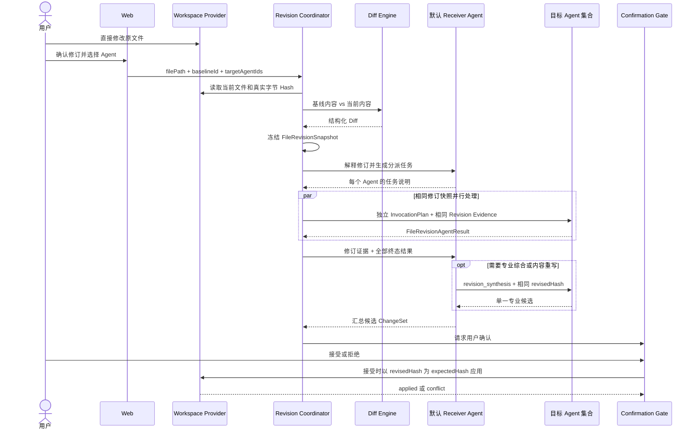

# 用户原文件修订与多 Agent 协同处理系统设计 v1

状态：历史基线，已由 `user-file-revision-candidate-iteration-development-design-v2.md` 取代  
日期：2026-07-28  
适用范围：Context Pipeline v2-only、Workspace Provider、Orchestrator、Receiver Agent、Runtime、Artifact/ChangeSet

> 本文保留用于解释 v1 的一次性修订模型，不再描述活动实现。当前产品语义、合同、状态机和验收均以 v2 候选迭代设计为准。

## 1. 目标

### 1.1 产品目标

用户直接修改 Agent 已生成或系统已确认的原文件。用户确认修订后，系统必须准确识别用户改动，并让指定的一个或多个 Agent 基于同一份修订结果继续处理；所有处理结果由系统默认的 Receiver Agent 汇总，最终候选结果经用户再次确认后才能写回原文件。

本设计要实现的核心闭环是：

```text
原文件 -> 用户直接修改 -> 用户确认修订 -> 系统确定性 Diff
       -> Receiver Agent 理解与分派 -> 指定 Agent 并行处理
       -> Receiver Agent 汇总 -> 用户确认 -> 安全写回原文件
```

### 1.2 可验证的系统目标

| 编号 | 目标 | 验证标准 |
| --- | --- | --- |
| G1 | 用户修改准确送达 | 系统生成的 Diff 可由相同基线和修订文件确定性复现，不依赖 LLM 比较文本。 |
| G2 | 多 Agent 输入一致 | 同一次修订处理中的所有 Agent Invocation 携带相同 `revisionId`、`baseHash`、`revisedHash` 和 `contextSnapshotHash`。 |
| G3 | 用户修改优先 | Agent 上下文明确声明修订文件是权威输入；旧原文只能用于解释变化，不得让结果无意恢复用户已确认的修改。 |
| G4 | 汇总结果不直接覆盖 | Receiver Agent 只产生候选 ChangeSet；没有用户确认不得写入原文件。 |
| G5 | 防止过期覆盖 | 写回前当前文件 Hash 必须仍等于 `revisedHash`，否则进入 `stale`，不允许自动应用。 |
| G6 | 全链路可审计 | 能从最终结果追溯原文件基线、用户修订快照、Diff、参与 Agent、各 Agent 结果和用户决策。 |
| G7 | 单 Agent 与多 Agent 统一 | 单 Agent 是目标 Agent 数量为 1 的相同流程，不维护第二套执行路径。 |
| G8 | 上下文预算可控 | 小文件可内联原文、修订文和 Diff；大文件使用完整内容引用、Diff hunks 和相关片段，不因重复全文挤掉任务指令。 |

## 2. 范围与边界

### 2.1 V1 范围

- 单次处理一个 UTF-8 文本文件。
- 文件本身是唯一可编辑真源。
- 系统保存只读基线和用户确认时的只读快照，用于 Diff、审计和上下文重建。
- 用户明确选择一个或多个目标 Agent。
- 目标 Agent 默认并行处理同一修订快照。
- Session 默认 Agent 作为 Receiver Agent，负责任务分派和结果汇总。
- 最终汇总结果使用现有 Workspace ChangeSet/确认机制写回。
- `server_local` 和 `local_bridge` 都通过 Workspace Provider 抽象完成读取、Hash、Diff 和应用；本地工作区正文不得绕过 Provider 边界上传或写入。

### 2.2 非目标

- 不做多人实时协同编辑或运行中热更新 Agent 上下文。
- 不做多个 Agent 直接并发覆盖同一个原文件。
- 不做自动三方合并、分支树或完整文档版本管理 UI。
- 不支持二进制文件、符号链接和无法安全解码的文本。
- 不让 LLM 负责计算权威 Diff 或文件 Hash。
- V1 不处理一次修订跨多个文件的原子事务；后续可复用 ChangeSet 扩展。

### 2.3 已确认的产品决策

- 用户直接修改原文件，不维护第二份可编辑 Artifact 正文。
- 原文、修订文和 Diff 都属于本次处理的逻辑上下文。
- 多个目标 Agent 共用同一份冻结修订快照，但各自拥有独立 `ContextEnvelopeV2`。
- Receiver Agent 在所有目标 Agent 到达终态后执行汇总。
- 汇总完成后再次请求用户确认，确认后才允许写回。

## 3. 核心原则

### 3.1 文件是唯一可编辑真源

系统不再引入与原文件并行的 `Artifact.currentContent`。基线快照和修订快照是不可变证据，不是另一份可编辑产物。

### 3.2 Diff 是系统事实，不是模型判断

“Receiver 进行 Diff”在系统职责上拆成两层：

| 层 | 职责 |
| --- | --- |
| Receiver 控制面 | 读取文件、校验路径、计算原始字节 Hash、生成结构化 Diff、冻结快照、检查冲突。 |
| Receiver Agent | 解释用户修改意图、拆分并分派任务，并对已有 Agent 结果做受证据约束的汇总编排。 |

权威 Diff 必须由确定性代码、受控 Git 命令或 Diff 库生成。LLM 可以解释 Diff，但不能替代 Diff 引擎。

### 3.3 修订快照按 Invocation 冻结

用户确认修订后生成一次 `FileRevisionSnapshot`。同一次 fan-out 中每个 Agent 都从该快照构建上下文；运行中的 Invocation 不接收后续文件热更新。

### 3.4 Agent 输出是 Proposal

目标 Agent 和 Receiver Agent 都不得直接写回用户原文件。目标 Agent 输出独立 Proposal；Receiver Agent 将 Proposal 汇总成候选 ChangeSet；只有确认门禁可以触发 Workspace Provider 应用。

### 3.5 Hash 是并发边界

Hash 使用文件真实字节计算，不能先统一换行符再计算。Diff 展示可以规范化换行，但冲突判断必须使用原始字节 Hash，避免 Windows CRLF 等环境差异产生错误判断。

### 3.6 Receiver 现有边界与本设计的兼容方式

当前内置 `coordinator` Agent 的产品名称是“接收者”，职责只包括意图识别和任务拆分，明确禁止亲自执行专业任务。本设计不把 Receiver 扩展成全能内容 Agent，而是增加一种受限的“汇总编排”职责：

- 可以核对结果是否属于同一个 `revisionId/revisedHash`；
- 可以收集、去重、排序和组织各 Agent 已明确给出的结论或 Proposal；
- 可以机械合并经过系统证明不重叠的 patch；
- 不得补写目标 Agent 没有给出的专业结论；
- 不得独立裁决需要领域知识的语义冲突；
- 需要专业综合或内容重写时，必须向一个有能力且在用户允许范围内的 Agent 创建 `revision_synthesis` 任务，再由 Receiver 包装其结果形成最终候选。

因此，“Receiver 汇总”表示 Receiver 对汇总流程和最终候选的完整性负责，不表示 Receiver 亲自承担前端、后端、架构、测试或文档等专业执行。

## 4. 总体架构

```mermaid
flowchart LR
    U["用户编辑原文件"] --> W["Workspace Provider"]
    W --> B["Baseline / Snapshot"]
    U --> C["确认修订"]
    C --> RC["Receiver 控制面"]
    B --> RC
    RC --> D["确定性 Diff Engine"]
    D --> R["FileRevisionSnapshot"]
    R --> CA["Context v2 Assembly"]
    CA --> RA["默认 Receiver Agent"]
    RA --> T["Task 分派"]
    T --> A1["目标 Agent A"]
    T --> A2["目标 Agent B"]
    T --> AN["目标 Agent N"]
    A1 --> P["Agent Proposals"]
    A2 --> P
    AN --> P
    P --> AG["Receiver Agent 汇总编排"]
    AG --> SJ{"需要专业综合?"}
    SJ -->|是| SA["目标 Agent revision_synthesis"]
    SA --> CS["候选 WorkspaceChangeSet"]
    SJ -->|否| CS
    CS --> G["用户确认门禁"]
    G -->|确认且 Hash 一致| AP["Workspace Provider Apply"]
    G -->|拒绝或 Hash 冲突| ST["保留原文件 / 标记 stale"]
```



### 4.1 模块职责

| 模块 | 目标职责 | 现有落点/建议落点 |
| --- | --- | --- |
| Workspace Provider | 安全读取、Hash、基线捕获、修订快照、最终应用 | `apps/server/src/modules/workspaces/`；本地工作区由 Local Runtime/Provider 在本机执行。 |
| Revision Coordinator | 驱动确认、Diff、状态机、幂等和恢复 | 优先作为 `apps/server/src/modules/orchestrator/` 内的专用协作服务，不先创建独立产品模块。 |
| Diff Engine | 生成行级 hunks 和统计；不调用 LLM | 复用受控 Git 能力或增加纯函数 Diff 适配器。 |
| Context v2 | 把修订证据编译到每次 Invocation 的 L3 | `apps/server/src/modules/context-v2/`。 |
| Receiver Agent | 理解修订、创建任务、执行受证据约束的汇总编排 | Session 默认 Agent，经现有 Coordinator-controlled routing 调用；专业综合需要派发 `revision_synthesis`。 |
| Target Agents | 独立处理相同修订快照 | 现有 Task、Runtime Invocation 路径。 |
| Artifact/ChangeSet | 保存 Agent Proposal、汇总候选和真实变更证据 | `apps/server/src/modules/artifacts/`、`worktree-execution/`。 |
| Confirmation | 对最终写回进行用户门禁 | 现有 `user_confirmation_requested/resolved` 机制。 |

## 5. 领域模型

### 5.1 基线

```ts
type FileRevisionBaseline = {
  baselineId: UUID;
  sessionId: UUID;
  workspaceId: string;
  filePath: string;
  baseHash: string;
  baseContentRef: string;
  sizeBytes: number;
  capturedAt: ISODateTime;
  source: 'agent_generated' | 'user_accepted' | 'workspace_selected';
};
```

基线捕获时机：

1. Agent 生成的文件第一次经用户确认写回后；
2. 上一次 Receiver 汇总结果经用户确认写回后；
3. 用户首次选择一个既有文件进入“修订处理”时，在允许编辑前捕获；
4. Git 工作区可以用已确认 blob/commit 作为基线，但仍必须记录真实字节 Hash。

### 5.2 修订运行

```ts
type FileRevisionRunStatus =
  | 'editing'
  | 'confirmed'
  | 'processing'
  | 'aggregating'
  | 'awaiting_user_confirmation'
  | 'applied'
  | 'rejected'
  | 'stale'
  | 'failed';

type FileRevisionRun = {
  revisionId: UUID;
  sessionId: UUID;
  baselineId: UUID;
  filePath: string;
  receiverAgentId: UUID;
  targetAgentIds: UUID[];
  instruction?: string;
  baseHash: string;
  revisedHash: string;
  revisedContentRef: string;
  diffRef: string;
  contextSnapshotHash: string;
  status: FileRevisionRunStatus;
  createdAt: ISODateTime;
  confirmedAt: ISODateTime;
  updatedAt: ISODateTime;
};
```

`baseContentRef`、`revisedContentRef` 和 `diffRef` 指向不可变内容存储。它们用于重建上下文，不构成另一份可编辑文件。内容引用应复用现有 content-addressed persistence 能力，避免大正文直接进入关系字段或事件 payload。

### 5.3 修订证据

```ts
type FileRevisionDiffHunk = {
  oldStart: number;
  oldLines: number;
  newStart: number;
  newLines: number;
  content: string;
};

type FileRevisionEvidence = {
  revisionId: UUID;
  filePath: string;
  baseHash: string;
  revisedHash: string;
  originalContent?: string;
  revisedContent?: string;
  originalFragments?: Array<{
    startLine: number;
    endLine: number;
    content: string;
  }>;
  diffHunks: FileRevisionDiffHunk[];
  addedLines: number;
  deletedLines: number;
  truncated: boolean;
};
```

### 5.4 Agent 结果和汇总结果

```ts
type FileRevisionAgentResult = {
  revisionId: UUID;
  agentId: UUID;
  runtimeInvocationId: UUID;
  baseRevisedHash: string;
  summary: string;
  findings: string[];
  proposedContent?: string;
  proposedPatch?: string;
  validationNotes: string[];
  preservedUserChanges: string[];
  status: 'completed' | 'failed' | 'cancelled';
};

type FileRevisionAggregate = {
  revisionId: UUID;
  receiverAgentId: UUID;
  includedAgentIds: UUID[];
  missingAgentIds: UUID[];
  baseRevisedHash: string;
  summary: string;
  candidateChangeSetId: UUID;
  requiresUserConfirmation: true;
};
```

所有 Proposal 都必须引用 `baseRevisedHash`。缺少该字段的结果不能进入自动汇总，只能作为无约束参考文本展示。

## 6. 上下文设计

### 6.1 ContextEnvelopeV2 映射

| 层 | 注入内容 |
| --- | --- |
| L0 | 用户修订权威规则、禁止恢复旧内容、禁止直接写回、工具和 Workspace 权限。 |
| L1 | 修订处理目标、`revisionId`、目标 Agent 的具体职责、验收标准。 |
| L2 | 现有 Project Map；修订文档不是代码仓库时可以为空或保持最小导航。 |
| L3 | `FileRevisionEvidence`、当前修订文件证据，以及汇总阶段所需的 Agent Proposal 正文。 |
| L4 | 必要的工具结果，例如校验命令或结构化分析结果。 |
| L5 | 已确认决策和有限摘要，不承载原文或修订全文。 |
| L6 | post-review/delivery 阶段的 ChangeSet 和报告引用，不作为执行阶段正文通道。 |

当前 `ContextL3SelectedEvidence` 只有 `files`，目标合同需要增加专用修订证据：

```ts
type ContextL3SelectedEvidence = {
  files: ContextL3EvidenceFile[];
  fileRevisions: FileRevisionEvidence[];
  totalByteLength: number;
  truncated: boolean;
};
```

不能把原文、修订文或 Diff 塞入 L5 摘要，也不能只传 Artifact ID 让 Agent 猜测正文。

### 6.2 权威提示规则

每个目标 Agent 和汇总 Receiver Agent 必须接收等价规则：

```text
revisedContent 是用户确认后的权威版本。
originalContent 只用于理解修改前背景。
diffHunks 只用于定位和解释用户改动。
不得无意恢复、删除或覆盖用户已经确认的修改。
任何输出都是基于 revisedHash 的 Proposal，不得直接写回原文件。
```

### 6.3 Token 预算

逻辑上下文始终包含原文、修订文和 Diff；物理 Prompt 按预算编译：

| 优先级 | 内容 |
| ---: | --- |
| 1 | `revisionId`、Hash、权威规则、任务目标。 |
| 2 | 完整 Diff hunks。 |
| 3 | Diff 涉及的修订后片段。 |
| 4 | 对应原文片段。 |
| 5 | 预算允许时的修订后全文。 |
| 6 | 预算允许时的原文全文。 |

小文件在预算内可直接内联两份全文和 Diff。大文件保留完整内容引用，在 L3 内联 hunks 和相关窗口；Agent 缺少其他段落时沿用 `CONTEXT_INSUFFICIENT` 补读并重建整份 Invocation，不能凭摘要继续。

### 6.4 多 Agent 一致性

Revision Coordinator 在 fan-out 前只构建一次逻辑 `FileRevisionEvidence`，再为每个 Agent 独立编译 `ContextEnvelopeV2`。编译结果允许因 Agent 身份、任务说明和工具权限不同而变化，但以下字段必须相同：

- `revisionId`
- `filePath`
- `baseHash`
- `revisedHash`
- Diff hunks 的内容 Hash
- `contextSnapshotHash` 中的修订证据部分

## 7. 主流程

### 7.1 时序



### 7.2 基线捕获

1. 校验文件路径属于 Session 已授权 Workspace。
2. 拒绝符号链接、二进制、敏感路径和超限内容。
3. 读取真实字节并计算 SHA-256。
4. 将不可变内容写入 content-addressed store，记录 `baseContentRef`。
5. 返回 `baselineId/baseHash`，前端进入编辑状态。

如果用户通过外部编辑器修改文件，系统无法依赖 UI 草稿，因此基线必须在 Agent 生成结果被接受时或用户显式进入修订流程时提前捕获。

### 7.3 用户确认与 Diff

1. 用户点击“确认修订”，提交 `baselineId`、`filePath`、`targetAgentIds` 和可选处理说明。
2. Workspace Provider 读取当前文件，生成 `revisedHash` 和不可变内容引用。
3. `baseHash === revisedHash` 时返回 `REVISION_NO_CHANGES`，不启动 Agent。
4. Diff Engine 生成 hunks、增删行统计和 Diff Hash。
5. 系统生成 `revisionId/contextSnapshotHash` 并持久化，再开始任何 Runtime Invocation。

### 7.4 Receiver 分派

Receiver Agent 获得修订证据和用户选择的目标 Agent，只负责：

- 解释用户改动可能表达的目标和约束；
- 为每个已选 Agent 生成差异化任务说明；
- 不增删用户选择的 Agent；
- 不重新计算或改写权威 Diff；
- 不在分派阶段写文件。

如果用户只选择一个 Agent，仍生成一个标准任务并走相同路径。

### 7.5 目标 Agent 处理

- 所有目标 Agent 并行接收同一个 `FileRevisionSnapshot`。
- 每个 Agent 输出结构化 `FileRevisionAgentResult`。
- Agent 之间默认不串行传递中间结果。
- Agent 不得把其他 Agent 的 Proposal 当作用户确认事实。
- 单个 Agent 失败时，Revision Coordinator 等待所有 Agent 到达终态，再进入“重试失败 Agent”或“基于部分结果汇总”的用户决策；不得静默忽略失败者。

### 7.6 Receiver 汇总

汇总 Invocation 必须包含：

- 用户确认的修订证据；
- 每个成功 Agent 的完整结构化结果；
- 失败、取消或缺失 Agent 列表；
- 当前 `revisedHash`；
- 明确的保留用户修改规则。

Receiver Agent 输出汇总清单和可读摘要。非冲突修改可以由系统确定性合并；如果已有 Agent Result 已包含单一完整候选，Receiver 可以在不新增专业内容的前提下包装为候选 ChangeSet。

如果多个 Proposal 存在语义冲突、缺少完整候选，或必须重写专业内容，Receiver 必须创建一个 `revision_synthesis` 任务并分配给具备对应能力的目标 Agent。综合 Agent 基于相同 `revisedHash` 和全部 Proposal 产生单一候选；Receiver 负责校验引用完整性、披露冲突和发起用户确认，不能自己隐藏或臆断解决冲突。

### 7.7 用户确认和写回

1. 前端展示汇总摘要、文件 Diff、参与/失败 Agent 和验证信息。
2. 用户选择接受或拒绝。
3. 接受时 Workspace Provider 重新读取原文件并计算当前 Hash。
4. 当前 Hash 等于 `revisedHash` 时应用候选 ChangeSet。
5. 当前 Hash 不等于 `revisedHash` 时标记 `stale`，保留用户当前文件，要求重新 Diff/处理。
6. 应用成功后的文件成为新的可编辑真源，并自动捕获下一次基线。

## 8. 并发、幂等与恢复

### 8.1 用户在处理期间再次修改文件

运行中的 Agent 继续处理已冻结快照，不热更新。新文件 Hash 与 `revisedHash` 不同后，当前 Revision Run 可以完成汇总，但只能展示为过期候选，不得写回。

### 8.2 重复确认

创建 Revision Run 的幂等键建议为：

```text
sessionId + filePath + baseHash + revisedHash + sorted(targetAgentIds)
```

相同幂等键只允许一个活动 Run，重复请求返回已有 `revisionId`。

### 8.3 服务重启

`FileRevisionRun`、目标 Agent 任务、Runtime Invocation 和结果 Artifact 必须可持久化。恢复时：

- `processing`：沿用现有 Runtime/Task 恢复规则；
- `aggregating`：确认所有输入结果已持久化后重建汇总 Invocation；
- `awaiting_user_confirmation`：只恢复确认卡，不自动应用；
- `applied/rejected/stale/failed`：终态不自动重放副作用。

### 8.4 Agent 结果冲突

- 所有 Proposal 都相对于同一个 `revisedHash`。
- 非重叠 patch 可以由系统合并后交给 Receiver 校验。
- 重叠 patch 必须标记冲突，由 Receiver 派发 `revision_synthesis` 生成单一专业候选，并向用户披露冲突及综合来源。
- V1 不自动三方合并用户在运行期间产生的新文件内容。

## 9. API 与事件目标合同

### 9.1 确认用户修订

```http
POST /api/sessions/:sessionId/file-revisions
```

```json
{
  "baselineId": "uuid",
  "filePath": "docs/example.md",
  "targetAgentIds": ["uuid-a", "uuid-b"],
  "instruction": "检查用户修改后是否仍满足系统设计目标"
}
```

响应至少包含：

```json
{
  "revisionId": "uuid",
  "baseHash": "sha256",
  "revisedHash": "sha256",
  "status": "confirmed",
  "diffSummary": {
    "addedLines": 12,
    "deletedLines": 4
  }
}
```

### 9.2 最终决策

```http
POST /api/sessions/:sessionId/file-revisions/:revisionId/decision
```

```json
{
  "decision": "accept",
  "expectedCurrentHash": "revisedHash",
  "candidateChangeSetId": "uuid"
}
```

`accept` 必须进入现有高风险文件写入确认和 ChangeSet apply 路径，不能由该接口绕过 Workspace Provider 直接写文件。

### 9.3 事件

建议增加以下领域事实事件：

| 事件 | 用途 |
| --- | --- |
| `file_revision_confirmed` | 用户确认修订，Diff 和冻结快照已持久化。 |
| `file_revision_dispatched` | Receiver 已完成目标 Agent 任务分派。 |
| `file_revision_agent_completed` | 单个目标 Agent 到达终态。 |
| `file_revision_aggregated` | Receiver 生成候选 ChangeSet。 |
| `file_revision_stale` | 原文件在处理或应用前再次变化。 |
| `file_revision_applied` | 用户确认且 ChangeSet 已成功应用。 |

事件 payload 只保存引用、Hash、统计和状态，不内联原文、修订全文或完整 Diff。

## 10. UI 状态与交互

### 10.1 用户操作

- 文件结果区域提供“开始修订处理”。
- 用户编辑原文件后点击“确认修订”。
- 确认面板显示 Diff 摘要并允许选择一个或多个 Agent。
- 处理中展示 Receiver 分派状态、各 Agent 状态和统一的修订 Hash 缩略标识。
- 汇总完成后展示最终 Diff、Agent 贡献、失败项和验证结果。
- 只有最终确认卡提供“应用到原文件”。

### 10.2 必须展示的异常状态

- 无改动：文件与基线一致，不启动处理。
- 基线丢失：要求重新建立基线，不使用当前文件反推原文。
- 文件过期：显示“文件已在处理期间再次修改”。
- Agent 部分失败：显示失败 Agent，提供重试或基于部分结果继续。
- 上下文不足：显示等待补读，不把它渲染为普通 Agent 失败。
- 应用冲突：保留原文件和候选 ChangeSet，不自动覆盖。

## 11. 安全与隐私

- 所有路径必须经过现有 Workspace 路径安全校验，禁止越过授权根目录。
- 敏感路径、符号链接、设备文件、二进制和超限内容必须 fail closed。
- `local_bridge` 的文件读取、Hash、Diff 和写回应尽量在用户机器的 Local Runtime 中执行；服务端只接收运行所需的有界证据、Hash 和内容引用。
- 原文、修订文和 Diff 不写入普通事件文本、日志或错误消息。
- Runtime Prompt 和 Debug 视图必须遵循现有可见性与脱敏规则。
- 最终文件写入继续要求 `cap-file-write` 权限和用户确认。

## 12. 可观测性

每个 Revision Run 至少记录：

- `revisionId/sessionId/filePath`
- `baselineId/baseHash/revisedHash/contextSnapshotHash`
- Diff 行数和内容字节数，不记录正文
- Receiver Agent 和目标 Agent 列表
- 每个 Runtime Invocation id、状态、Token 和耗时
- 汇总候选 ChangeSet id
- 用户最终决策
- stale/conflict/error code

建议指标：

- `file_revision_runs_total{status}`
- `file_revision_diff_duration_ms`
- `file_revision_agent_duration_ms{agent}`
- `file_revision_aggregate_duration_ms`
- `file_revision_stale_total`
- `file_revision_apply_conflict_total`
- `file_revision_context_bytes`

## 13. 错误模型

| 错误码 | 含义 | 行为 |
| --- | --- | --- |
| `REVISION_BASELINE_NOT_FOUND` | 找不到原文基线 | 阻止处理，要求重新捕获基线。 |
| `REVISION_NO_CHANGES` | 当前文件和基线 Hash 相同 | 不启动 Agent。 |
| `REVISION_FILE_UNSUPPORTED` | 二进制、符号链接、编码或大小不支持 | fail closed。 |
| `REVISION_TARGET_AGENT_INVALID` | 目标 Agent 不存在或不可用 | 不创建 Run。 |
| `REVISION_CONTEXT_INSUFFICIENT` | 修订证据不足 | 请求补读并重建 Invocation。 |
| `REVISION_AGENT_PARTIAL_FAILURE` | 部分 Agent 失败 | 等待用户选择重试或部分汇总。 |
| `REVISION_SOURCE_STALE` | 原文件 Hash 已变化 | 禁止应用候选结果。 |
| `REVISION_APPLY_CONFLICT` | ChangeSet expectedHash 不匹配 | 保留原文件和候选结果。 |

## 14. 对现有系统的改造面

| 区域 | 预期改造 |
| --- | --- |
| `packages/shared/src/contracts.ts` | 增加 Revision Run/Evidence/Result 合同，扩展 L3，增加事件和错误码。 |
| `apps/server/src/modules/workspaces/` | 提供基线捕获、受控读取、真实字节 Hash 和 Diff Provider 能力。 |
| `apps/server/src/modules/orchestrator/` | 增加 Revision 状态机、Receiver 分派、fan-out、汇总和恢复编排。 |
| `apps/server/src/modules/context-v2/` | 将 `FileRevisionEvidence` 编译进 L3，并纳入预算与补读。 |
| `apps/server/src/modules/artifacts/` | 保存目标 Agent Proposal 和汇总候选 ChangeSet 引用。 |
| `apps/server/src/modules/events/` | 持久化 Revision 生命周期事件，正文只使用引用。 |
| `apps/server/src/modules/sessions/` | 暴露修订确认、状态查询和最终决策入口。 |
| `apps/web/src/` | Diff 确认、Agent 多选、进度、汇总审阅、stale/conflict 状态。 |
| `packages/shared/src/default-agent-presets.ts` | 在不允许专业执行的前提下，为接收者增加受证据约束的汇总编排职责和 `revision_synthesis` 转派边界。 |
| Runtime adapters | 继续只消费 `InvocationPlan.contextEnvelope`，不增加 Runtime 专属修订参数。 |

## 15. 分阶段实施计划

### 阶段 1：单 Agent 修订闭环

- 建立基线、Hash、Diff、Revision Run 和幂等。
- 把修订证据送入一个目标 Agent 的 L3。
- Receiver 对单个结果做完整性校验并包装为候选 ChangeSet；需要专业补写时转派综合任务。
- 用户确认后使用 expectedHash 应用。

完成标准：单 Agent 能准确看到用户修改，且文件在运行期间再次变化时不会被覆盖。

### 阶段 2：多 Agent fan-out/fan-in

- Receiver 为用户选择的多个 Agent 创建任务。
- 保证各 Invocation 的修订证据 Hash 一致。
- 保存结构化 Agent Result。
- Receiver 在全部 Agent 终态后执行受证据约束的汇总；存在专业冲突时增加 `revision_synthesis` 任务。

完成标准：多个 Agent 基于同一修订快照处理，汇总结果可追溯每个 Agent 输入和输出。

### 阶段 3：恢复、长文本与部分失败

- 增加 content reference、预算裁剪和 `CONTEXT_INSUFFICIENT` 补读。
- 支持服务重启恢复。
- 支持失败 Agent 重试或用户确认的部分汇总。
- 补齐审计指标和运维查询。

完成标准：长文件、运行中断和部分失败不会导致静默丢失用户修订或重复写入。

### 阶段 4：后续演进

- 多文件 Revision Run。
- 用户可查看的有限版本历史和恢复。
- 基于 section/AST 的语义 Diff。
- 多候选对比和用户选择。
- 明确授权后的自动化确认策略。

## 16. 测试与验收矩阵

| 场景 | 预期结果 |
| --- | --- |
| 用户修改一个段落并选择一个 Agent | Agent L3 同时包含权威修订、Diff 和必要原文；结果引用正确 `revisedHash`。 |
| 用户选择三个 Agent | 三个 Invocation 的修订证据 Hash 完全一致。 |
| 用户没有实际修改 | 返回 `REVISION_NO_CHANGES`，不产生 Runtime 调用。 |
| 用户在 Agent 运行期间再次编辑 | Agent 可完成，但汇总候选标记 stale，无法应用。 |
| 一个 Agent 失败 | 系统不静默忽略，用户可重试或确认部分汇总。 |
| Receiver 输出与某 Agent Proposal 冲突 | UI 披露冲突和最终选择，不直接写文件。 |
| 用户拒绝汇总结果 | 原文件保持用户修订版本，不发生写入。 |
| 用户接受且 Hash 一致 | ChangeSet 成功应用并建立新基线。 |
| 用户接受但 Hash 不一致 | 返回冲突，原文件保持不变。 |
| 超长文件 | 上下文按预算保留 Diff 和相关片段，缺失内容走补读，不凭摘要执行。 |
| 非法路径/符号链接/二进制 | 在 Runtime 启动前 fail closed。 |
| 服务在 processing/aggregating/confirmation 阶段重启 | 状态可恢复，文件写入不会被自动重放。 |

最小验证集合：

```bash
npm run typecheck
npm run test
npm run test:harness
npm run build
```

当前已增加：Diff/Hash 单测、ContextEnvelope 合同测试、`proposal_only` 写保护测试、PostgreSQL 映射测试和 stale expectedHash 集成测试。Receiver fan-out/fan-in 的真实 Runtime E2E、运行中断自动恢复和长文本补读仍属于后续增强。

### 16.1 历史实现落点（2026-07-28）

- `FileRevisionsService` 保存不可变基线、冻结修订证据、Agent 结果与最终候选引用。
- 当时的 `OrchestratorService.processFileRevision` 由选中专业 Agent 汇总；该行为已被 v2 的“单 Agent/多 Agent 均由默认 Receiver 生成唯一候选”替代。
- 修订处理统一使用 `proposal_only`，Runtime 不应用暂存 ChangeSet，`write_file` 从可执行工具目录移除。
- 最终写回仅由用户确认触发，并使用用户修订 Hash 作为 `expectedHash`；冲突进入 `stale`，不覆盖更新内容。
- file 与 PostgreSQL 两类持久化后端均映射 `fileRevisions`；PostgreSQL 使用增量迁移 V3 的 `file_revision_records`。

## 17. 市场模式参考

- ChatGPT Canvas 使用可编辑内容、版本历史、差异查看和恢复，说明用户编辑结果应成为显式可管理版本，而不是只存在于聊天记忆中。
- Claude Artifacts 支持选择版本，并明确用户编辑不会自动改变模型对原内容的记忆，说明后续 Agent 调用必须显式注入修订结果。
- GitHub Copilot coding agent 使用分支/PR 隔离 Agent 变更，由用户审阅后合入，说明 Agent 输出应先作为 Proposal，而不是直接覆盖用户当前文件。

本设计只吸收“明确基线、冻结输入、隔离 Proposal、用户确认”四个通用原则，不在 V1 引入完整版本树或实时协同编辑。

参考资料：

- [ChatGPT Canvas](https://help.openai.com/en/articles/9930697-what-is-the-canvas-feature-in-chatgpt-and-how-do-i-use-it)
- [Claude Artifacts](https://support.anthropic.com/en/articles/9487310-what-are-artifacts-and-how-do-i-use-them)
- [GitHub Copilot Agents](https://docs.github.com/en/copilot/how-tos/copilot-on-github/use-copilot-agents)

## 18. 与现有设计的关系

- ContextEnvelope 的唯一 Runtime 上下文边界继续遵循 [Context Pipeline v2-only 设计](./context-pipeline-v2-only-agent-decoupling-system-design-v1.md)。
- 写能力隔离、真实 ChangeSet、expectedHash 和用户确认继续遵循 [Managed Worktree Execution v1](./managed-worktree-execution-v1.md)。
- 本设计处理“用户直接修改真实文件”的修订链路，不替代 [TaskBrief userRevision 设计](./task-brief-user-revision-design-v1.md) 中的结构化任务契约修订场景。
- Runtime 仍只消费 `InvocationPlan.contextEnvelope`；Revision 不是 Runtime 专属参数，也不在 CLI adapter 内维护共享状态。

## 19. 最终架构决策

本设计选择：

> 原文件作为唯一可编辑真源；系统保留不可变基线和确认快照，通过确定性 Diff 形成修订证据；默认 Receiver Agent 基于证据分派一个或多个 Agent，所有 Agent 使用同一冻结修订快照独立处理；Receiver 汇总为候选 ChangeSet，只有用户确认且原文件 Hash 未变化时才能写回。

该决策满足当前需求，同时保留未来扩展多文件、版本历史和自动化审批的空间。
