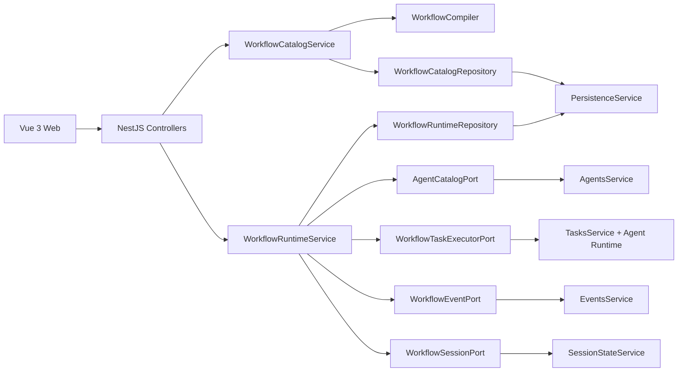

# 工作流管理与运行时系统设计 v1

## 1. 文档目标

本文档基于《工作流管理与低代码编排需求文档 v1》，给出适配当前 Agent Cluster 模块化单体、Vue 3、NestJS 和 file/PostgreSQL JSONB collection 的系统设计。

设计覆盖：

- 工作流定义、草稿、发布版本和归档。
- Agent、人工确认、机器人确认三类节点。
- 三栏低代码工作流创建器。
- 群聊确认需求后的工作流选择。
- 工作流运行、节点推进、返工、失败、取消和恢复。
- Session、Task、Event、Execution 与 Workflow 的模块边界。
- 幂等、版本快照、审计和旧数据迁移。

本文档描述 Agent Cluster 业务系统能力，不把 Workflow 或 Harness Engineering 产品化为彼此的实现。

## 实施状态（2026-07-14）

本设计的线性 V1 已落地：共享合同、`WorkflowsService` Catalog、不可变 `WorkflowVersion`、`WorkflowRuntimeService`、运行/节点/审批/effect 持久化、Session/Task/Event/Execution/Recovery 适配、Vue Flow 三栏编辑器以及群聊工作流选择弹窗均已实现。当前代码为模块化单体内的直接服务拆分，尚未按第 6.2 节建议目录进一步拆成 domain/ports/adapters 子目录；该目录拆分不影响现有领域边界。

## 2. 已确认范围

### 2.1 目标

- v1 只支持单开始、单结束的线性流程。
- 节点类型为 `agent`、`human_approval`、`robot_approval`。
- 只有显式人工确认节点暂停用户操作。
- 人工确认人固定为会话发起人。
- 机器人确认由指定评审 Agent 输出结构化结论，默认最多返工 `2` 次，异常后转人工。
- 草稿可变，发布版本不可变，运行绑定完整版本快照。
- 工作流模块从 Session 业务中抽离，但仍部署在当前 NestJS 模块化单体内。
- 不引入 Temporal、Camunda 等独立工作流引擎。

### 2.2 非目标

- 条件、并行、汇聚、循环和子工作流。
- Tool、MCP、定时器、Webhook 和外部事件节点。
- 多人会签、审批委托、候选用户组和超时升级。
- 工作流模板市场和跨组织共享。
- 动态 Agent 能力槽位。

## 3. 当前系统分析

### 3.1 已有能力

- `WorkflowsModule` 已提供工作流 CRUD、名称唯一性、线性节点规范化和 `workflows` collection 持久化。
- `WorkflowManager.vue` 已有列表、Agent 搜索、线性节点添加、重排、撤销/重做和保存能力。
- Task Brief 确认后可进入 `WAIT_WORKFLOW_SELECT`。
- `SessionsService` 已能创建线性 Agent Task、记录 `workflowRun`、暂停确认和恢复执行。
- `TasksService`、`EventsService`、`ExecutionService` 和 `RecoveryService` 已提供任务、事件、后台执行和重启恢复基础设施。
- file 和 PostgreSQL 后端都通过 `PersistenceService` 暴露 JSONB collection 接口。

### 3.2 当前主要问题

- `WorkflowDefinition` 只支持 Agent 节点，边由服务端按数组顺序重建。
- 草稿和已发布版本共用一个对象，普通更新直接增加 `version`，没有不可变版本快照。
- `WorkflowRunState` 作为 `SessionDetail` 内嵌字段，只能表示当前步骤和任务 ID 列表。
- `SessionsService` 同时承担选流、任务创建、节点推进、确认、返工和 Session 状态更新。
- `OrchestratorService` 通过检查 `session.workflowRun` 识别节点完成，工作流语义泄漏到通用执行管线。
- 每个 Agent 节点完成后都隐式进入 `WAIT_WORKFLOW_STEP_CONFIRM`，与新需求的显式确认节点冲突。
- 运行、节点运行和确认没有独立持久化模型，难以实现精确恢复、重试计数和幂等决策。
- 当前 collection 写入不支持跨 `sessions`、`tasksBySession`、`eventsBySession` 和 workflow 状态的单事务提交。

## 4. 方案选型

### 4.1 方案 A：继续扩展 SessionsService

做法：在现有 `WorkflowDefinition` 和 `SessionDetail.workflowRun` 上增加节点类型与判断分支。

优点：

- 改动量较小。
- 可以复用现有流程测试。

缺点：

- Session 和 Workflow 继续强耦合。
- 人工/机器人确认、版本快照和恢复逻辑会进一步扩大 `SessionsService`。
- 后续分支、并行或独立运行详情难以演进。

结论：不采用。

### 4.2 方案 B：模块化单体内建立独立 Workflow Domain + Runtime

做法：在 `WorkflowsModule` 内建立定义管理、编译校验、运行状态机、持久化和适配器，通过端口与 Session、Task、Event、Agent 和 Execution 集成。

优点：

- 与当前 NestJS 部署方式一致。
- 可以复用已有 Agent 执行、事件和持久化设施。
- 工作流状态机可独立测试和恢复。
- 为后续 DAG 预留模型，而 v1 仍严格限制为线性流程。

缺点：

- 需要抽离部分 Session 状态管理和任务级执行能力。
- 需要兼容迁移已有 `workflowRun` 和隐式逐步确认。

结论：采用。

### 4.3 方案 C：接入外部工作流引擎

做法：引入 Temporal、Camunda 或同类引擎负责持久化执行。

优点：

- 长期运行、恢复、定时器和复杂流程能力成熟。

缺点：

- 增加部署、身份、数据同步、监控和本地开发成本。
- 与当前 JSONB collection、Session 事件账本和 Agent 执行模型重复。
- 超出 v1 线性工作流范围。

结论：v1 不采用；当流程需要跨天 SLA、复杂并行和外部事件时再评估。

## 5. 设计原则

1. 定义与运行分离：草稿、发布版本和运行实例使用不同模型。
2. 发布版本不可变：运行只消费版本快照，不读取可变草稿。
3. 显式节点语义：确认由节点表达，不从 Agent 节点属性隐式推导。
4. 单一推进者：只有 `WorkflowRuntimeService` 可以改变工作流运行位置。
5. 至少一次投递、幂等消费：跨 collection 副作用不假设分布式事务。
6. 状态先于副作用：先持久化状态和待投递 effect，再创建 Task 或 Event。
7. 失败关闭：定义不合法、评审结果不合法或身份不匹配时不得自动继续。
8. 审计可见：保存结论、原因和证据，不保存隐藏推理链。
9. 兼容渐进迁移：旧运行继续完成，新运行通过功能开关进入 v2 Runtime。

## 6. 总体架构



### 6.1 模块依赖方向

```text
SessionsModule ------> WorkflowsModule
                           |
                           +--> AgentsModule
                           +--> TasksModule
                           +--> EventsModule
                           +--> ExecutionModule / task executor adapter
                           +--> SessionCoreModule
                           +--> PersistenceModule

RecoveryModule ------> WorkflowsModule.recoverActiveRuns()
```

`WorkflowsModule` 禁止反向依赖 `SessionsService`。现有 Session 实体缓存、状态修改和持久化能力需要从 `SessionsService` 抽成中立的 `SessionStateService`，放入 `SessionCoreModule`，供 Sessions 和 Workflow 共同使用。

### 6.2 推荐目录结构

```text
apps/server/src/modules/workflows/
  api/
    workflows.controller.ts
    workflow-runs.controller.ts
    workflow.dto.ts
  application/
    workflow-catalog.service.ts
    workflow-publish.service.ts
    workflow-runtime.service.ts
    workflow-recovery.service.ts
  domain/
    workflow-definition.ts
    workflow-run.ts
    workflow-state-machine.ts
    workflow-compiler.ts
    workflow-errors.ts
  ports/
    agent-catalog.port.ts
    workflow-task-executor.port.ts
    workflow-event.port.ts
    workflow-session.port.ts
  adapters/
    agents-service.adapter.ts
    tasks-service.adapter.ts
    events-service.adapter.ts
    session-state.adapter.ts
  infrastructure/
    workflow-catalog.repository.ts
    workflow-runtime.repository.ts
    workflow-migration.ts
  workflows.module.ts
```

## 7. 领域模型

### 7.1 工作流元数据

```ts
type Workflow = {
  id: string
  name: string
  description?: string
  status: 'draft' | 'published' | 'archived'
  draftRevision: number
  currentPublishedVersion?: number
  createdAt: string
  updatedAt: string
  archivedAt?: string
}
```

`draftRevision` 用于草稿乐观并发控制，不等同于发布版本号。

### 7.2 节点定义

```ts
type WorkflowNode = AgentNode | HumanApprovalNode | RobotApprovalNode

type WorkflowNodeBase = {
  id: string
  name: string
  order: number
  ui?: {
    x: number
    y: number
  }
}

type AgentNode = WorkflowNodeBase & {
  type: 'agent'
  agentId: string
  stageDescription?: string
  inputContract: string[]
  outputContract: string[]
}

type HumanApprovalNode = WorkflowNodeBase & {
  type: 'human_approval'
  title: string
  instruction?: string
  assignee: 'session_owner'
  allowedDecisions: Array<'approve' | 'revise' | 'cancel'>
}

type RobotApprovalNode = WorkflowNodeBase & {
  type: 'robot_approval'
  reviewerAgentId: string
  reviewPrompt: string
  criteria: string[]
  maxRevisionAttempts: number
  fallback: 'human_approval'
}

type WorkflowEdge = {
  id: string
  sourceNodeId: string
  targetNodeId: string
}
```

虽然 v1 仅允许线性流程，定义仍保存节点和边，避免未来升级 DAG 时再次迁移模型。`order` 是服务端编译后的稳定展示顺序，边是拓扑关系的权威来源。

### 7.3 发布版本

```ts
type WorkflowVersion = {
  id: string
  workflowId: string
  version: number
  name: string
  description?: string
  nodes: WorkflowNode[]
  edges: WorkflowEdge[]
  involvedAgentIds: string[]
  definitionHash: string
  publishedBy: string
  publishedAt: string
}
```

- `definitionHash` 由规范化后的节点和边计算，用于判断是否存在实质变更。
- `involvedAgentIds` 包含业务 Agent 和机器人评审 Agent，用于列表摘要和发布校验。
- 发布后不允许更新或删除版本内容。

### 7.4 工作流运行

```ts
type WorkflowRunStatus =
  | 'running'
  | 'waiting_human'
  | 'completed'
  | 'failed'
  | 'cancelled'

type WorkflowRun = {
  id: string
  workflowId: string
  workflowVersion: number
  workflowName: string
  sessionId: string
  briefId: string
  ownerId: string
  definitionSnapshot: WorkflowVersion
  status: WorkflowRunStatus
  currentNodeId?: string
  revision: number
  startIdempotencyKey: string
  createdAt: string
  updatedAt: string
  completedAt?: string
  failure?: {
    code: string
    message: string
    nodeId?: string
  }
}
```

`SessionDetail` 只保留 `workflowRunId` 和必要的摘要投影，不再内嵌完整运行状态。

### 7.5 节点运行

```ts
type WorkflowNodeRunStatus =
  | 'pending'
  | 'running'
  | 'waiting'
  | 'approved'
  | 'revision_requested'
  | 'completed'
  | 'failed'
  | 'skipped'

type WorkflowNodeRun = {
  id: string
  workflowRunId: string
  nodeId: string
  nodeType: WorkflowNode['type']
  attempt: number
  status: WorkflowNodeRunStatus
  inputRefs: string[]
  outputSummary?: string
  outputRefs: string[]
  relatedTaskId?: string
  startedAt?: string
  completedAt?: string
  error?: {
    code: string
    message: string
    retryable: boolean
  }
}
```

返工时不覆盖旧的 NodeRun，而是为同一 `nodeId` 创建新的 `attempt`，保留每次输出和确认记录。

### 7.6 确认记录

```ts
type WorkflowApprovalRecord = {
  id: string
  workflowRunId: string
  nodeRunId: string
  confirmationId?: string
  actor: { type: 'user' | 'agent'; id: string }
  decision: 'approve' | 'revise' | 'reject' | 'cancel'
  reason: string
  revisionInstruction?: string
  evidenceRefs: string[]
  createdAt: string
}
```

人工确认使用 `user` actor；机器人确认使用评审 Agent。记录只保存可审计的结论、原因和证据引用。

## 8. 定义编译与发布

### 8.1 草稿保存

- 草稿允许配置不完整，但基础数据必须可解析。
- 请求携带 `expectedDraftRevision`。
- 服务端只在 revision 匹配时更新，否则返回 `409 WORKFLOW_DRAFT_CONFLICT`。
- UI 保留本地未保存状态，冲突时提供重新加载，不进行静默覆盖。

### 8.2 编译流程

```text
读取草稿
  -> 规范化名称、描述和节点字段
  -> 验证节点 ID 与 Agent 引用
  -> 验证单开始、单结束和线性拓扑
  -> 验证确认节点存在上游 Agent
  -> 验证机器人评审配置
  -> 生成稳定 order 和 involvedAgentIds
  -> 计算 definitionHash
  -> 输出 CompiledWorkflowDefinition
```

### 8.3 v1 发布校验

- 至少包含一个 Agent 节点。
- 每个节点 ID 唯一。
- 除首尾外，每个节点入度和出度都必须为 `1`。
- 不允许环路、断链、孤立节点和分支。
- Agent 和评审 Agent 必须存在且处于可用状态。
- 人工/机器人确认前必须能找到上游 Agent 节点。
- `maxRevisionAttempts` 必须为 `0..10`，默认 `2`。
- 机器人确认的 prompt 和 criteria 不能为空。

### 8.4 发布

- 发布命令同时携带 `expectedDraftRevision` 和操作者 ID。
- 若 `definitionHash` 与当前发布版本一致，返回当前版本，不重复创建。
- 否则以 `currentPublishedVersion + 1` 创建不可变版本。
- 工作流状态更新为 `published`。
- 正在运行的实例继续使用原有 `definitionSnapshot`。

## 9. 运行状态机

### 9.1 Run 状态转换

| 当前状态 | 命令/结果 | 下一状态 |
| --- | --- | --- |
| 不存在 | 选择已发布工作流 | `running` |
| `running` | 激活人工确认节点 | `waiting_human` |
| `waiting_human` | 人工通过 | `running` |
| `waiting_human` | 人工退回 | `running` |
| `waiting_human` | 人工终止 | `cancelled` |
| `running` | 机器人拒绝或不可恢复错误 | `failed` |
| `running` | 最后节点完成 | `completed` |
| `running/waiting_human` | 用户取消会话 | `cancelled` |

终态 `completed/failed/cancelled` 不接受任何推进命令。

### 9.2 Session 状态投影

| Workflow 状态 | Session 状态 |
| --- | --- |
| 未选择 | `WAIT_WORKFLOW_SELECT` |
| `running` | `EXECUTING` |
| `waiting_human` | `WAIT_WORKFLOW_STEP_CONFIRM` |
| `completed` | 进入现有 Post Review/最终交付流程 |
| `failed` | `FAILED` 或现有可恢复决策状态 |
| `cancelled` | `CANCELLED` |

`WAIT_WORKFLOW_STEP_CONFIRM` 在 v2 Runtime 中只表示显式人工确认节点，不再表示每个 Agent 节点的隐式确认。

### 9.3 节点推进算法

```text
advance(runId, command)
  1. 读取 WorkflowRuntimeState 和 run.revision
  2. 校验运行非终态、命令目标为当前节点
  3. 应用纯状态机转换
  4. 生成待投递 WorkflowEffect
  5. 原子写回 workflowRuntime collection
  6. 投递 effects
  7. 标记 effects completed
```

状态机核心应实现为无 I/O 的 reducer，输入 `run + nodeRuns + command`，输出 `nextState + effects`，便于穷举测试。

## 10. 节点执行设计

### 10.1 Agent 节点

激活步骤：

1. 创建新的 `WorkflowNodeRun`。
2. 使用确定性 ID 创建 Agent Task：`wf-task:{runId}:{nodeId}:{attempt}`。
3. 第一个 Agent 输入 Task Brief；后续 Agent 输入 Task Brief、最近有效上游输出和返工说明。
4. 通过 `WorkflowTaskExecutorPort` 执行单个 Agent Task。
5. 完成后保存输出摘要和证据引用。
6. 直接激活下一个节点，不生成用户确认。

当前 `ExecutionService.start()` 面向整个 Session 执行阶段。为避免单节点执行后提前进入 Post Review，需要从 `OrchestratorService` 抽出任务级执行入口：

```ts
interface WorkflowTaskExecutorPort {
  execute(input: {
    sessionId: string
    briefId: string
    taskId: string
    workflowRunId: string
    nodeRunId: string
  }): Promise<AgentNodeExecutionResult>

  cancel(taskId: string, reason: string): Promise<void>
}
```

`ExecutionService` 和普通 Session 执行可以继续使用原有批次入口；Workflow Runtime 只依赖任务级端口。

### 10.2 人工确认节点

激活步骤：

1. 创建状态为 `waiting` 的 NodeRun。
2. 创建唯一 `confirmationId` 和 `user_confirmation_requested` 事件。
3. 将 Run 置为 `waiting_human`，Session 投影为 `WAIT_WORKFLOW_STEP_CONFIRM`。
4. 校验提交者 ID 等于 Run 中固化的 `ownerId`。
5. 处理 `approve/revise/cancel`。

决策行为：

- `approve`：写 ApprovalRecord，完成当前节点，激活下一节点。
- `revise`：写 ApprovalRecord，定位最近的上游 Agent 节点并创建新 attempt。
- `cancel`：写 ApprovalRecord，终止 Run 并取消未完成 Task。

人工确认不设置返工次数上限，但每次返工都必须形成独立 NodeRun 和事件。

### 10.3 机器人确认节点

机器人确认使用现有 Agent Runtime，但通过只读评审任务执行：

- 输入只包含 Task Brief、上游有效输出、评审 prompt 和 criteria。
- 不授予写文件、高风险 Tool 或外部副作用权限。
- 使用 AJV 校验固定 JSON Schema。
- 不接受自然语言兜底解析，格式错误视为评审失败。

结构：

```ts
type RobotApprovalResult = {
  decision: 'approve' | 'revise' | 'reject'
  reason: string
  revisionInstruction?: string
  evidenceRefs: string[]
}
```

决策行为：

- `approve`：记录机器人 ApprovalRecord 并进入下一节点。
- `revise`：增加该 gate 的 revision count，返回最近的上游 Agent。
- `reject`：Run 进入 `failed`。
- Runtime 调用失败、Schema 校验失败或 revision count 超过 `maxRevisionAttempts`：创建临时人工确认请求，Run 进入 `waiting_human`。

临时人工确认是运行时回退，不修改发布版本定义；其 NodeRun 关联原机器人确认节点，并记录 `fallbackFromRobot=true`。

### 10.4 工作流完成

最后节点完成后：

1. Run 进入 `completed`。
2. 写入 `workflow_run_completed` 事件。
3. 将所有有效 Agent 输出引用交给现有 Post Review/最终交付入口。
4. Session 进入现有复盘与交付流程。

Workflow Runtime 不自行拼接最终答案，最终交付仍由现有 Orchestrator 负责。

## 11. 持久化设计

### 11.1 Collection 布局

当前 `PersistenceService.setCollection()` 以 collection 为写入单位。为保证同一工作流操作内部原子，使用两个聚合 collection：

```ts
type WorkflowCatalogState = {
  schemaVersion: 2
  revision: number
  workflows: Record<string, Workflow>
  drafts: Record<string, {
    workflowId: string
    draftRevision: number
    nodes: WorkflowNode[]
    edges: WorkflowEdge[]
  }>
  versionsByWorkflowId: Record<string, WorkflowVersion[]>
}

type WorkflowRuntimeState = {
  schemaVersion: 2
  revision: number
  runs: Record<string, WorkflowRun>
  nodeRunsByRunId: Record<string, WorkflowNodeRun[]>
  approvalsByRunId: Record<string, WorkflowApprovalRecord[]>
  effectsByRunId: Record<string, WorkflowEffect[]>
}
```

- `workflowCatalog`：定义、草稿和发布版本一次写入。
- `workflowRuntime`：运行、节点运行、确认和待投递 effect 一次写入。
- 旧 `workflows` collection 在迁移期只读，用于初始化 `workflowCatalog`。

### 11.2 Effect Outbox

跨 Task、Event 和 Session 的写入无法与 workflow collection 组成单事务，因此在 `workflowRuntime` 内记录 effect：

```ts
type WorkflowEffect = {
  id: string
  workflowRunId: string
  type:
    | 'create_agent_task'
    | 'execute_agent_task'
    | 'emit_event'
    | 'update_session_projection'
    | 'cancel_task'
    | 'start_post_review'
  payload: Record<string, unknown>
  status: 'pending' | 'processing' | 'completed' | 'failed'
  attempts: number
  lastError?: string
}
```

- effect ID 由 `runId/nodeId/attempt/effectType` 确定性生成。
- Task 创建使用确定性 task ID；重复 `add` 返回已存在 Task。
- EventsService 增加 `createOnce(idempotencyKey, input)`。
- Session 投影更新携带 `run.revision`，旧 revision 不得覆盖新状态。
- effect 投递采用至少一次语义，每个消费者必须幂等。

## 12. 并发与幂等

### 12.1 幂等键

| 操作 | 幂等键 |
| --- | --- |
| 选择工作流 | `sessionId + confirmationId` |
| 创建 Agent Task | `runId + nodeId + attempt` |
| 人工决策 | `confirmationId` |
| 机器人结果 | `nodeRunId + runtimeInvocationId` |
| 节点完成 | `nodeRunId + attempt` |
| Run 终态 | `runId + terminalStatus` |

### 12.2 乐观并发

- 草稿使用 `draftRevision`。
- Run 使用 `revision`。
- 决策请求携带 `expectedRunRevision`。
- revision 不匹配返回 `409 WORKFLOW_RUN_CONFLICT`，前端重新加载运行状态。
- 单进程内使用按 `workflowId`、`runId` 的串行命令队列降低竞争；PostgreSQL 多实例部署前需要进一步增加数据库 compare-and-swap 或分布式锁。

## 13. API 设计

### 13.1 定义管理

```text
GET    /api/workflows?q=&status=
GET    /api/workflows/:workflowId
POST   /api/workflows
PATCH  /api/workflows/:workflowId/draft
POST   /api/workflows/:workflowId/publish
POST   /api/workflows/:workflowId/archive
DELETE /api/workflows/:workflowId
GET    /api/workflows/:workflowId/versions
GET    /api/workflows/:workflowId/versions/:version
```

草稿更新：

```ts
type UpdateWorkflowDraftInput = {
  expectedDraftRevision: number
  name?: string
  description?: string
  nodes?: WorkflowNode[]
  edges?: WorkflowEdge[]
}
```

发布：

```ts
type PublishWorkflowInput = {
  expectedDraftRevision: number
}
```

### 13.2 运行管理

```text
POST /api/sessions/:sessionId/workflow/select
GET  /api/workflow-runs/:runId
GET  /api/workflow-runs/:runId/nodes
POST /api/workflow-runs/:runId/nodes/:nodeRunId/decision
POST /api/workflow-runs/:runId/cancel
```

选择工作流：

```ts
type SelectWorkflowInput = {
  workflowId: string
  workflowVersion: number
  confirmationId: string
}
```

人工决策：

```ts
type WorkflowHumanDecisionInput = {
  confirmationId: string
  expectedRunRevision: number
  decision: 'approve' | 'revise' | 'cancel'
  instruction?: string
}
```

旧的 `/sessions/:sessionId/workflow/steps/:taskId/decision` 在迁移期转发到新 API，并在旧运行结束后弃用。

### 13.3 错误码

```text
WORKFLOW_NOT_FOUND
WORKFLOW_NAME_CONFLICT
WORKFLOW_DRAFT_CONFLICT
WORKFLOW_NOT_PUBLISHED
WORKFLOW_VERSION_NOT_FOUND
WORKFLOW_VALIDATION_FAILED
WORKFLOW_RUN_NOT_FOUND
WORKFLOW_RUN_CONFLICT
WORKFLOW_RUN_TERMINAL
WORKFLOW_NODE_NOT_CURRENT
WORKFLOW_CONFIRMATION_FORBIDDEN
WORKFLOW_CONFIRMATION_ALREADY_RESOLVED
WORKFLOW_ROBOT_RESULT_INVALID
```

## 14. 事件设计

### 14.1 新增业务事件

```text
workflow_published
workflow_run_started
workflow_node_started
workflow_node_completed
workflow_gate_requested
workflow_gate_decided
workflow_node_revision_requested
workflow_run_completed
workflow_run_failed
workflow_run_cancelled
```

所有 workflow 事件至少包含：

```ts
type WorkflowEventRef = {
  workflowId: string
  workflowVersion: number
  workflowRunId?: string
  workflowNodeId?: string
  workflowNodeRunId?: string
  attempt?: number
}
```

### 14.2 用户确认事件

- 选流继续使用 `user_confirmation_requested`，reason 为 `select_workflow`。
- 人工确认节点使用 reason `confirm_workflow_human_gate`。
- 迁移期前端继续识别 `confirm_workflow_step`。
- 机器人确认不创建用户确认事件，只有失败转人工时创建。
- `user_confirmation_resolved` 必须引用原 `confirmationId` 和 `nodeRunId`。

## 15. Session、Task、Execution 集成

### 15.1 Session

新增或抽离 `SessionStateService`：

- 管理 Session 实体缓存和持久化。
- 校验状态转换。
- 写入 `workflowRunId` 和工作流摘要。
- 根据 Workflow Run 投影 `EXECUTING/WAIT_WORKFLOW_STEP_CONFIRM/FAILED/CANCELLED`。

`SessionsService` 保留：

- Task Brief 生成、确认和修订。
- 进入 `WAIT_WORKFLOW_SELECT`。
- 调用 Workflow Runtime 启动、决策和取消用例。
- 普通非工作流会话的现有编排。

### 15.2 Task

- Agent 节点和机器人确认节点都可以创建 AgentTask。
- Task 增加可选引用：`workflowRunId`、`workflowNodeId`、`workflowNodeRunId`、`workflowNodeType`、`attempt`。
- 机器人确认 Task 标记 `executionPurpose='workflow_review'`，上下文和权限按只读评审收紧。
- `TasksService.add` 支持按确定性 ID 幂等返回。

### 15.3 Execution

- 抽出单任务执行接口供 Workflow Runtime 使用。
- 普通 Session 批次执行接口保持兼容。
- 单任务执行返回结构化完成、失败或取消结果，不直接改变 Workflow Run。
- Workflow Runtime 是任务结果进入下一节点的唯一消费者。

### 15.4 Recovery

`RecoveryService` 启动时调用 `WorkflowRuntimeService.recoverActiveRuns()`：

- `running + Agent NodeRun`：若 Task 已完成则推进；若 running 已失效则重置并重投执行 effect。
- `running + Robot NodeRun`：按 runtime invocation 和 NodeRun 状态恢复或重试。
- `waiting_human`：确认是否已有未解决 confirmation；缺失时按确定性 ID 补发。
- 终态 Run：不恢复。
- 恢复后再执行 pending/failed-retryable effects。

启用 BullMQ 时，任务执行恢复继续由现有队列能力负责；Workflow Runtime 只负责节点和 effect 对账。

## 16. 前端设计

### 16.1 组件拆分

```text
WorkflowManager.vue
  WorkflowListView.vue
  WorkflowEditorView.vue
    WorkflowEditorHeader.vue
    WorkflowResourcePanel.vue
    WorkflowCanvas.vue
      WorkflowAgentNode.vue
      WorkflowHumanApprovalNode.vue
      WorkflowRobotApprovalNode.vue
      WorkflowInsertEdge.vue
    WorkflowNodeInspector.vue
    WorkflowValidationPanel.vue
  WorkflowSelectionDialog.vue
```

避免继续把列表、编辑器、画布和属性表单堆入一个组件。

### 16.2 画布技术

新增 `@vue-flow/core`，使用其节点拖拽、选择、缩放、平移、自定义节点和自定义边能力；使用 Background 和 Controls 组件实现点阵背景和稳定工具栏。Vue Flow 只负责交互和视图状态，服务端领域模型仍是事实来源。

画布适配层负责：

```text
WorkflowDraft <-> VueFlow Node[] / Edge[]
```

- Vue Flow `position` 保存到节点 `ui`，不参与执行顺序。
- 线性执行顺序由服务端按 edges 编译。
- 前端可以即时提示分支或断链，但发布校验以服务端为准。
- 连接线 `+` 使用自定义 edge，在指定 edge 中插入新节点并重连。

Vue Flow 官方能力说明见：[Vue Flow](https://vueflow.dev/)。

### 16.3 编辑器状态

```ts
type WorkflowEditorState = {
  workflowId?: string
  draftRevision: number
  name: string
  description: string
  nodes: WorkflowNode[]
  edges: WorkflowEdge[]
  selectedNodeId?: string
  dirty: boolean
  validationIssues: WorkflowValidationIssue[]
  undoStack: WorkflowDraftSnapshot[]
  redoStack: WorkflowDraftSnapshot[]
}
```

- Undo/Redo 只操作本地草稿快照。
- 每次成功保存后清空 dirty，并更新 `draftRevision`。
- 发布前调用服务端校验；错误同时映射到节点和右侧校验区。
- 切换工作流或离开编辑器时，dirty 状态触发离开确认。

### 16.4 工作流选择弹窗

- Task Brief 确认成功后自动打开。
- 只加载 `published` 且未归档工作流。
- 不默认选择第一项。
- 展示版本、Agent 顺序和两类确认节点数量。
- 用户提交后按钮进入 loading，防止重复启动。
- 关闭弹窗后 Session 保持 `WAIT_WORKFLOW_SELECT`。

## 17. 安全与权限

- 工作流草稿修改、发布、归档和删除需要工作流管理权限；当前单用户环境映射为本地用户。
- 人工确认必须校验当前用户 ID 等于 Run 固化的 `ownerId`。
- 机器人确认使用评审专用上下文，不继承上游 Agent 的写入权限。
- 工作流定义不得直接保存密钥、Runtime token 或未脱敏环境变量。
- 删除只允许无版本、无运行引用的草稿。
- 所有管理操作和运行决策写入审计事件。

## 18. 可观测性

### 18.1 日志字段

```text
workflowId
workflowVersion
workflowRunId
workflowNodeId
workflowNodeRunId
attempt
effectId
sessionId
taskId
```

### 18.2 指标

- `workflow_run_total{status}`
- `workflow_node_duration_ms{nodeType}`
- `workflow_human_wait_duration_ms`
- `workflow_robot_decision_total{decision}`
- `workflow_robot_fallback_total{reason}`
- `workflow_revision_total{gateType}`
- `workflow_effect_retry_total{effectType}`
- `workflow_recovery_total{result}`

### 18.3 运行详情

运行详情从 Workflow Runtime 聚合读取，不依赖从聊天事件反推当前状态。事件用于审计和 UI 时间线，Runtime State 是推进权威。

## 19. 迁移与发布

### 19.1 功能开关

```text
WORKFLOW_RUNTIME_V2_ENABLED=false
```

- 关闭：旧工作流和旧 Session 执行路径保持不变。
- 开启：新启动的工作流使用 v2 Runtime。
- Run 创建后保存 `runtimeVersion='v1' | 'v2'`，恢复时按版本路由。

### 19.2 定义迁移

旧 `WorkflowDefinition` 转换：

1. 每个旧 Agent node 转为新 AgentNode。
2. 按旧顺序生成 edges。
3. 为保持旧行为，在相邻 Agent 之间插入 HumanApprovalNode。
4. 生成 `WorkflowVersion 1` 和 `definitionHash`。
5. 原工作流状态为 archived 时保持归档；其余生成草稿或首个发布版本。
6. 迁移记录写入 audit，原 `workflows` collection 不删除。

迁移命令默认 dry-run；真实 apply 继续遵守仓库现有 maintenance、目标后端确认和备份规则。

### 19.3 运行迁移

- 已存在的 `SessionDetail.workflowRun` 继续由旧路径完成。
- 不尝试把运行中的 v1 run 转换为 v2 NodeRun。
- 所有 v1 活跃运行结束后，停止创建新的旧 run。
- 观察期结束后再移除 `confirm_workflow_step` 和旧 step decision API。

## 20. 影响范围

| 范围 | 主要变更 |
| --- | --- |
| Shared contracts | 节点 union、版本、Run、NodeRun、Approval、Effect 和错误码 |
| WorkflowsModule | 从 CRUD 扩展为 Catalog、Compiler、Runtime、Repository 和 Adapters |
| SessionsModule | 抽离 SessionStateService，委托选流、决策和取消 |
| Orchestrator/Execution | 提供任务级执行和 Post Review 接口 |
| TasksModule | workflow refs、确定性 ID、幂等 add、评审任务 |
| EventsModule | workflow 事件、createOnce 和确认 reason |
| RecoveryModule | 委托 Workflow Runtime 对账和恢复 |
| Persistence | workflowCatalog、workflowRuntime 和迁移 |
| Web | 组件拆分、Vue Flow 画布、节点 Inspector、选流弹窗 |
| Contracts/docs | API、Data、Event、Runtime、UI 状态合同同步 |
| Tests | 状态机、发布、幂等、恢复、迁移和浏览器主链路 |

## 21. 风险与应对

### 21.1 跨 collection 部分成功

风险：Run 已推进但 Task/Event/Session 写入失败。

应对：WorkflowEffect outbox、确定性 ID、至少一次投递和启动恢复对账。

### 21.2 重复决策或重复任务完成

风险：用户双击、网络重试或 Runtime 重复回调导致推进两次。

应对：confirmationId、NodeRun attempt、Run revision 和终态保护。

### 21.3 机器人确认不稳定

风险：LLM 输出不符合 Schema、判断漂移或无限返工。

应对：AJV 严格校验、固定 criteria、最大返工次数、只读权限和转人工。

### 21.4 Session 与 Workflow 状态不一致

风险：Session 显示执行中，但 Run 已等待人工或失败。

应对：Run 为权威，Session 只做投影；恢复时按 run.revision 对账投影。

### 21.5 多实例并发

风险：当前内存 Map 和 collection upsert 不足以支撑多实例同时推进同一 Run。

应对：v1 明确单推进实例假设；多实例生产化前增加 PostgreSQL CAS/锁或将推进命令串行化到 BullMQ。

## 22. 实施计划

### 阶段 1：合同和纯领域模型

1. 更新 shared、API、Data、Event、Runtime 和 UI 合同。
2. 实现 WorkflowNode union、Compiler 和纯状态机 reducer。
3. 补齐定义校验、状态迁移和机器人结果 Schema 单元测试。

### 阶段 2：Catalog 与低代码创建器

1. 实现 workflowCatalog repository、草稿 revision 和不可变发布版本。
2. 增加发布、版本和归档 API。
3. 拆分 WorkflowManager，接入 Vue Flow 和三类节点 Inspector。
4. 完成列表、草稿、发布和发布校验浏览器测试。

### 阶段 3：Runtime 与节点执行

1. 实现 workflowRuntime repository、Run/NodeRun/Approval/Effect。
2. 抽出 SessionStateService 和任务级执行端口。
3. 实现 Agent、人工确认、机器人确认和返工处理器。
4. 实现 effect dispatcher、确定性 Task/Event 和 Session 投影。

### 阶段 4：群聊、恢复和取消

1. 将确认需求后的工作流下拉改为选择弹窗。
2. 接入 start、decision、cancel 和 run detail API。
3. 让 RecoveryService 委托 v2 Runtime 恢复和对账。
4. 覆盖重启、重复请求、取消和失败转人工测试。

### 阶段 5：迁移与切换

1. 实现旧定义 dry-run/apply 迁移。
2. 使用 `WORKFLOW_RUNTIME_V2_ENABLED` 在受控环境开启新运行。
3. 验证 file/PostgreSQL、BullMQ 开关和真实 Agent Runtime。
4. 等待 v1 活跃运行清零后移除旧隐式 step confirm 路径。

## 23. 测试方案

### 23.1 单元测试

- 线性图编译、环路、断链、分支和失效 Agent 校验。
- 草稿 revision 冲突和重复发布 hash。
- 三类节点所有状态转换。
- 机器人 approve/revise/reject/invalid/fallback。
- 人工重复确认、错误用户和终态保护。
- effect dispatcher 幂等与重试。

### 23.2 集成测试

- Workflow Catalog + file/PostgreSQL 持久化。
- Runtime + Tasks + Events + Session 投影。
- Task 完成回调只推进一次。
- 服务重启恢复 Agent、机器人和人工等待节点。
- 取消会话同步取消 Run 和 Task。
- v1/v2 run 并存恢复。

### 23.3 前端测试

- 左侧三分组、Agent 搜索和确认入口可见性。
- 拖拽、点击、edge `+` 插入和重连。
- 右侧 Inspector 按节点类型切换。
- Undo/Redo、dirty、冲突和发布错误定位。
- 选流弹窗不默认选中、重复提交防护和空状态。

### 23.4 E2E

- Agent -> Agent 自动推进。
- Agent -> Human -> Agent 通过、返工、取消。
- Agent -> Robot -> Agent 通过、返工、拒绝和转人工。
- 发布新版本不影响旧 Run。
- 重启和重复请求不重复创建 Task/Event。
- 旧工作流迁移后保持逐步人工确认行为。

最终验证命令：

```bash
npm run typecheck
npm run test
npm run test:harness
npm run build
npm run test:e2e:workflow-managed-execution
npm run test:e2e:recovery
npm run test:e2e:cancel
```

## 24. Q&A 结果

- 结果标准：需求文档第 16 节全部验收项通过。
- 流程范围：v1 线性；模型预留 DAG，不实现分支执行。
- 确认语义：只有显式人工节点暂停；机器人结构化判断，异常转人工。
- 审批范围：人工确认人为会话发起人。
- 版本策略：草稿可变，发布版本不可变，Run 绑定快照。
- 部署策略：当前模块化单体内自研轻量状态机，不引入外部工作流引擎。
- 剩余开放问题：无。

## 25. 关联文档

- [工作流管理与低代码编排需求文档 v1](../product/workflow-management-and-low-code-builder-requirements-v1.md)
- [工作流编排与 Agent 能力画像路线 v1](../roadmap/workflow-builder-and-agent-capability-plan-v1.md)
- [Agent Cluster 系统设计 v1](./agent-cluster-system-design-v1.md)
- [Coordinator 中心流转设计 v1](./coordinator-controlled-routing-design-v1.md)
- [Execution Termination Model v1](./execution-termination-model-v1.md)
- [UI State Contract v0.1](../contracts/ui-state-contract-v0.1.md)
- [API Contract v0.1](../contracts/api-contract-v0.1.md)
- [Data Contract v0.1](../contracts/data-contract-v0.1.md)
- [Event Contract v0.1](../contracts/event-contract-v0.1.md)
- [UI Style Guide v1](./ui-style-guide-v1.md)
