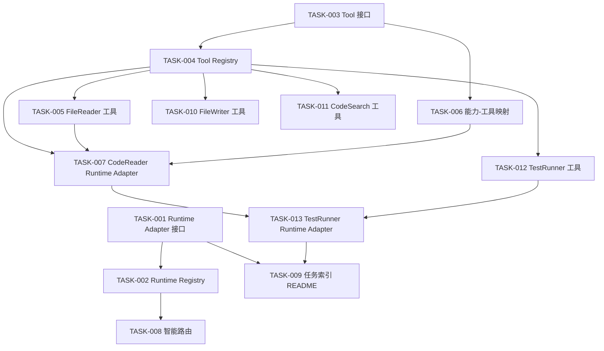

# Agent Cluster 任务清单

> 基于执行方案文档拆分的可执行任务。
> 每个任务控制在 15-30 分钟内完成，默认采用测试先行（TDD）。

## 📊 任务统计
- **总任务数**：13
- **已完成**：8
- **进行中**：0
- **待开始**：5
- **预估总时间**：250 分钟（约 4.2 小时）

---

## 任务总表

| 任务ID | 任务名称 | 时间 | 依赖 | 状态 |
| --- | --- | --- | --- | --- |
| [TASK-001](./TASK-001-runtime-adapter-interface.md) | 定义 Runtime Adapter 统一接口 | 15min | 无 | ✅ 已完成 |
| [TASK-002](./TASK-002-runtime-registry-service.md) | 实现 Runtime Registry 服务 | 20min | TASK-001 | ✅ 已完成 |
| [TASK-003](./TASK-003-tool-interface.md) | 定义 Tool 统一接口 | 15min | 无 | ✅ 已完成 |
| [TASK-004](./TASK-004-tool-registry-service.md) | 实现 Tool Registry 服务 | 15min | TASK-003 | ✅ 已完成 |
| [TASK-005](./TASK-005-file-reader-tool.md) | 实现 FileReader 工具 | 20min | TASK-003, TASK-004 | ✅ 已完成 |
| [TASK-006](./TASK-006-capability-tool-mapping.md) | 定义能力-工具映射表 | 15min | TASK-003 | ✅ 已完成 |
| [TASK-007](./TASK-007-code-reader-agent.md) | 实现 CodeReader Runtime Adapter | 30min | TASK-004, TASK-005, TASK-006 | ✅ 已完成 |
| [TASK-008](./TASK-008-runtime-smart-router.md) | 实现智能路由服务 | 20min | TASK-002 | ✅ 已完成 |
| [TASK-009](./TASK-009-task-index-readme.md) | 创建任务索引 README | 10min | TASK-001~013 | ⏸️ 待开始 |
| [TASK-010](./TASK-010-file-writer-tool.md) | 实现 FileWriter 工具 | 20min | TASK-003, TASK-004 | ⏸️ 待开始 |
| [TASK-011](./TASK-011-code-search-tool.md) | 实现 CodeSearch 工具 | 20min | TASK-003, TASK-004 | ⏸️ 待开始 |
| [TASK-012](./TASK-012-test-runner-tool.md) | 实现 TestRunner 工具 | 20min | TASK-003, TASK-004 | ⏸️ 待开始 |
| [TASK-013](./TASK-013-test-runner-agent.md) | 实现 TestRunner Runtime Adapter | 30min | TASK-007, TASK-012 | ⏸️ 待开始 |

---

## TDD 串行执行规则

每个任务可以、也应该添加测试用例，并按测试先行方式执行。实现类任务写 TypeScript 单元测试或 e2e smoke；文档类任务写结构、链接、命令和进度一致性测试。

1. 从 `progress.json` 读取第一个 `pending` 任务。
2. 阅读该任务文档，确认依赖、范围、完成标准和验证命令。
3. 先写或更新至少一组能表达验收标准的测试，并确认测试处于 RED。
4. 只实现当前任务所需的最小代码或文档修改。
5. 运行当前任务的最小测试，确认测试转为 GREEN。
6. 运行通用质量验证命令。
7. 提交当前任务改动，再更新 `progress.json`。
8. 禁止并行写代码；下一个任务必须等当前任务验证和提交完成后再开始。

推荐验证命令：

```bash
npm run typecheck
ruff check .
ruff format --check .
python check_progress.py
```

---

## 🗺️ 任务依赖关系图



---

## 快速开始

```bash
python check_progress.py
python -m unittest tests.test_task_index_readme
npm run typecheck
```

执行时以任务文档为单元推进：先补测试，再改实现，最后跑验证并提交。只改文档时可以不跑完整业务测试，但必须说明已执行的最小验证集合。

---

## 任务验收标准

- TypeScript 编译通过：`npm run typecheck`
- 当前任务测试通过：按任务文档或新增测试文件执行
- Python 质量检查通过：`ruff check .` 和 `ruff format --check .`
- 进度检查明确：`python check_progress.py`
- 公开接口和复杂逻辑有必要的 JSDoc 或说明
- README、任务文档与 `progress.json` 状态保持一致

---

## 相关文档

- [系统痛点分析](../analysis/system-pain-points-v1.md)
- [执行方案](../roadmap/execution-plan-pain-points-remediation-v1.md)
- [项目地图](../ai-agent-context/project-map.md)

---

## 更新日志

- 2026-06-22: 创建初始任务清单（TASK-001 至 TASK-009）。
- 2026-06-22: 补充 TASK-010 至 TASK-013，并将任务执行方式调整为测试先行（TDD）。
- 2026-06-22: 同步 TASK-001 至 TASK-008 完成状态，补充 TDD 串行执行规则与验证命令。
