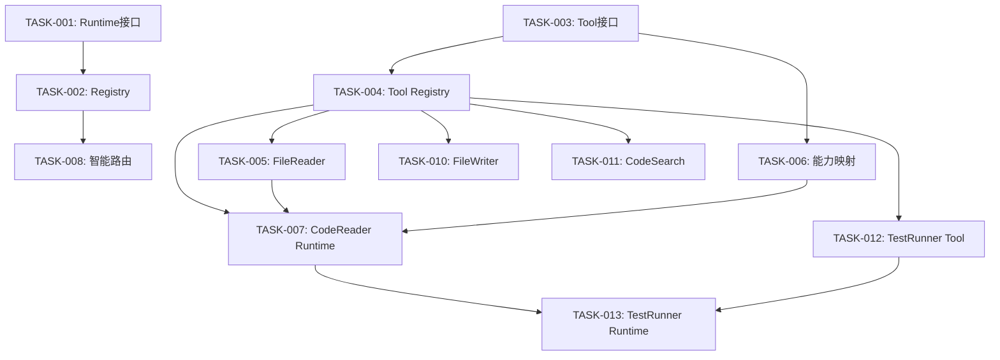

# TASK-009: 创建任务索引和README

## 元信息
- **任务 ID**: TASK-009
- **优先级**: P1
- **预估时间**: 10 分钟
- **依赖**: TASK-001 至 TASK-008
- **所属阶段**: Phase 1 - 文档整理

## 背景
已创建多个任务文档，需要一个索引文件方便查找和跟踪任务进度。

## 目标
创建任务索引 README，提供任务概览和快速导航。

## 范围

### 包含
- 创建 `docs/tasks/README.md`
- 列出所有任务及状态
- 按阶段分组
- 提供任务依赖关系图

### 不包含
- 自动化任务追踪
- 任务进度统计

## 技术方案

```markdown
# Agent Cluster 任务清单

## 任务统计
- 总任务数：13
- 已完成：0
- 进行中：0
- 待开始：13

## Phase 1: 可插拔 Runtime 架构 (Week 1-3)

### Runtime 基础设施
- [ ] [TASK-001](./TASK-001-runtime-adapter-interface.md) - 定义 Runtime Adapter 接口 (15min)
- [ ] [TASK-002](./TASK-002-runtime-registry-service.md) - 实现 Runtime Registry 服务 (20min)
- [ ] [TASK-008](./TASK-008-runtime-smart-router.md) - 实现智能路由服务 (20min)

### 工具注册表
- [ ] [TASK-003](./TASK-003-tool-interface.md) - 定义 Tool 接口 (15min)
- [ ] [TASK-004](./TASK-004-tool-registry-service.md) - 实现 Tool Registry 服务 (15min)
- [ ] [TASK-005](./TASK-005-file-reader-tool.md) - 实现 FileReader 工具 (20min)
- [ ] [TASK-006](./TASK-006-capability-tool-mapping.md) - 定义能力-工具映射 (15min)
- [ ] [TASK-010](./TASK-010-file-writer-tool.md) - 实现 FileWriter 工具 (20min)
- [ ] [TASK-011](./TASK-011-code-search-tool.md) - 实现 CodeSearch 工具 (20min)
- [ ] [TASK-012](./TASK-012-test-runner-tool.md) - 实现 TestRunner 工具 (20min)

### 内部 Runtime Adapter
- [ ] [TASK-007](./TASK-007-code-reader-agent.md) - 实现 CodeReader Runtime Adapter (30min)
- [ ] [TASK-013](./TASK-013-test-runner-agent.md) - 实现 TestRunner Runtime Adapter (30min)

## 任务依赖关系



## 预估时间
- Phase 1 总计：**250 分钟** (约 4.2 小时)

## 执行建议

### 并行执行（可同时进行）
- TASK-001 + TASK-003 (两个接口定义)
- TASK-005 + TASK-006 (工具实现和映射)
- TASK-010 + TASK-011 + TASK-012 (更多内置工具)

### 串行执行（有依赖）
1. TASK-001 → TASK-002 → TASK-008
2. TASK-003 → TASK-004 → TASK-005
3. TASK-006 → TASK-010/TASK-011/TASK-012
4. TASK-007 → TASK-013

## 快速开始

```bash
# 1. 选择一个任务
cd docs/tasks
cat TASK-001-runtime-adapter-interface.md

# 2. 阅读任务要求
# - 目标
# - 范围
# - 技术方案

# 3. 执行任务
# 按照技术方案实现代码

# 4. 测试先行并验证任务
npm --workspace @agent-cluster/server run test -- <test-file>
npm run typecheck

# 5. 标记完成
# 在 README.md 中将 [ ] 改为 [x]
```

## 注意事项

1. **时间控制**：每个任务设计为 15-30 分钟完成
2. **依赖检查**：开始前确认依赖任务已完成
3. **验证命令**：每个任务都有验证命令，必须通过
4. **测试先行**：实现类任务编写单元测试；文档类任务执行链接和结构校验
5. **文档更新**：完成后更新本 README 状态

## 问题反馈

如果任务执行遇到问题：
1. 检查依赖任务是否已完成
2. 查看任务文档的"失败策略"部分
3. 检查验证命令输出
4. 查看相关代码实现
```

## 完成标准

### 功能标准
- [ ] README.md 创建完成
- [ ] 列出所有已创建任务
- [ ] 按阶段分组
- [ ] 包含依赖关系说明
- [ ] 提供快速开始指南

### 代码质量标准
- [ ] Markdown 格式正确
- [ ] 链接可点击
- [ ] 任务编号连续

## 验证命令

```bash
npm run typecheck
```

```powershell
# 1. 检查文件是否创建
Test-Path docs/tasks/README.md

# 2. 检查所有任务链接
Get-ChildItem docs/tasks/TASK-*.md | Select-Object Name

# 3. 预览 Markdown
Get-Content -Encoding utf8 docs/tasks/README.md
```

## 失败策略

### 如果链接失败
- 确认所有任务文件都已创建
- 检查文件名拼写

### 如果格式错误
- 使用 Markdown 预览工具检查
- 确认列表缩进正确

## 风险边界

### 低风险
- 只是文档整理
- 不影响代码

### 需要注意
- 保持更新（新增任务时）
- 任务编号要连续

## 交付格式

### 代码文件
- `docs/tasks/README.md`

### 验证输出
```bash
✓ README.md 已创建
✓ 所有任务文件存在
✓ 链接可用
✓ 格式正确
```

## 后续任务
- 根据执行进度更新任务状态
- 新增任务时更新索引
